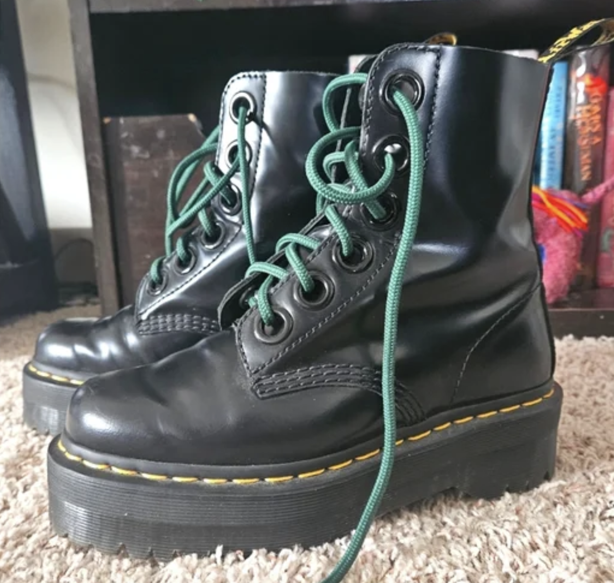
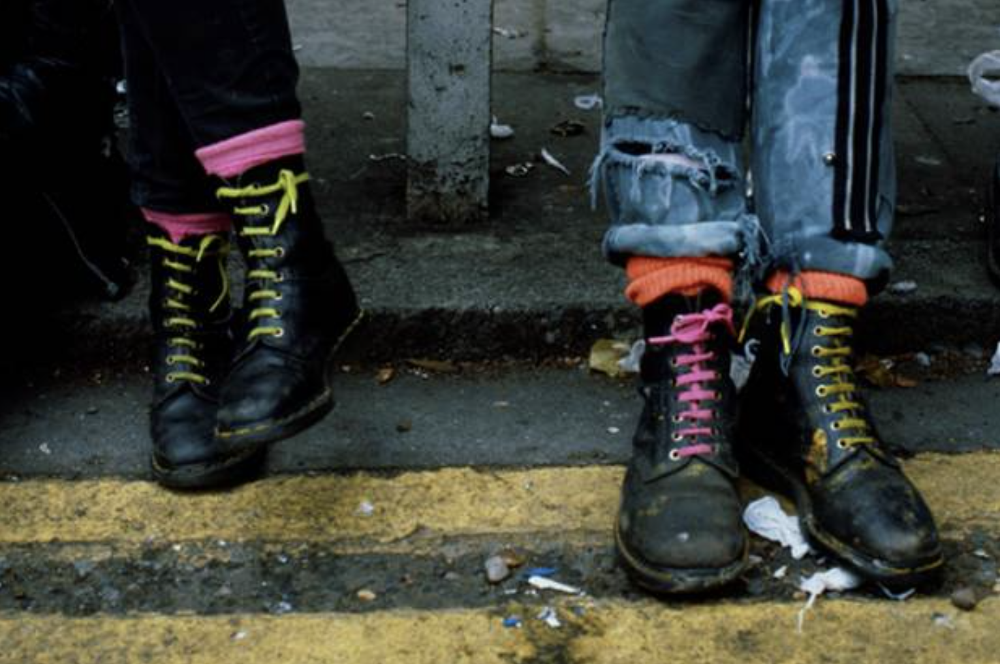
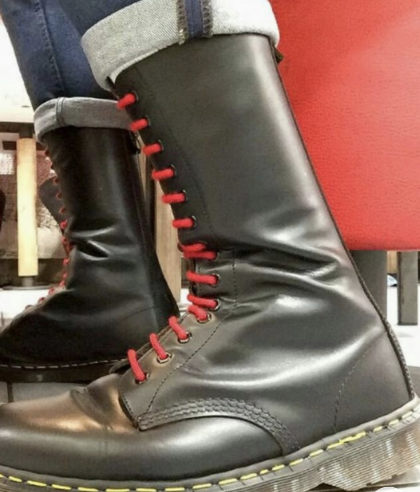
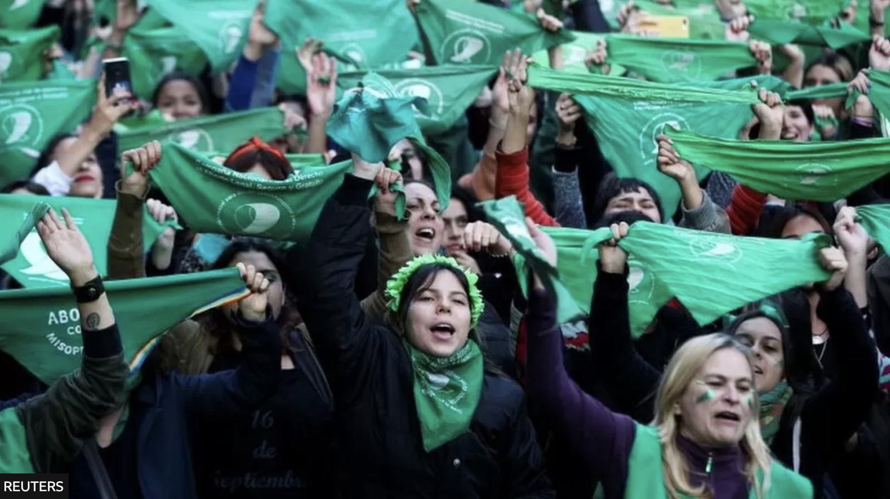
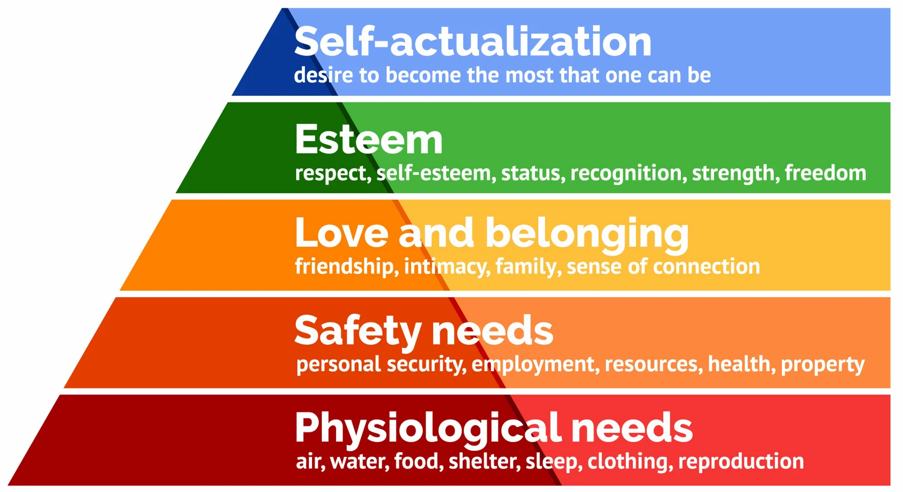
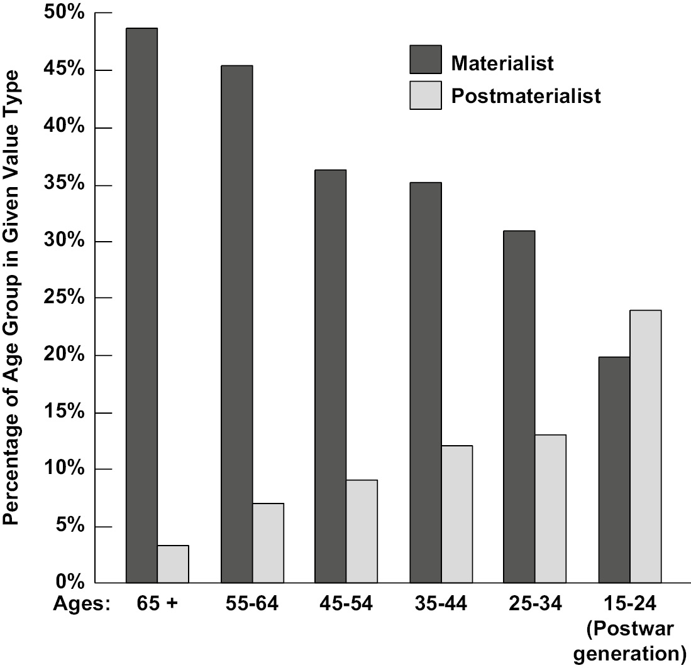
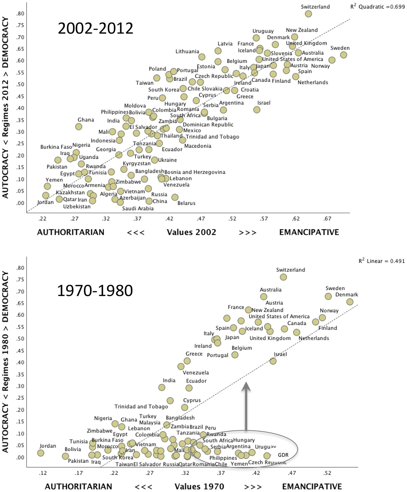
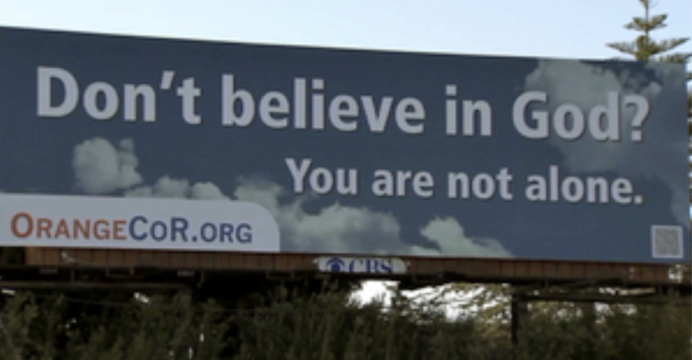
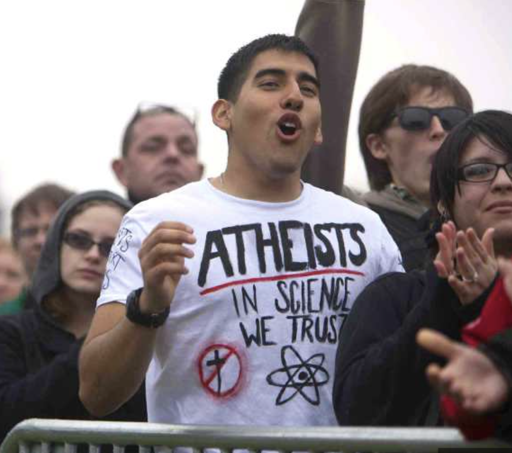

# Opening notes {background-color="#2c844c"}

::: {.tenor-gif-embed data-postid="14209777" data-share-method="host" data-aspect-ratio="1.94" data-width="70%"}
<div class="tenor-gif-embed" data-postid="14209777" data-share-method="host" data-aspect-ratio="1.94" data-width="100%"><a href="https://tenor.com/view/open-gif-14209777">Open Sticker</a>from <a href="https://tenor.com/search/open-stickers">Open Stickers</a></div> <script type="text/javascript" async src="https://tenor.com/embed.js"></script> 
:::

```{=html}
<script type="text/javascript" async src="https://tenor.com/embed.js"></script>
```

## Presentation groups

<!-- ::: panel-tabset -->
<!-- ## December -->

| Date    | Presenters                       | Method |
| -------:|:---------------------------------|:------:|
| 4 Dec:  | Daichi, Seongyeon, Jehyun        | TBD    | 
| 18 Dec: | Ayla, Tara, Theresa, Annabelle   | TBD    | 
| 15 Jan: | Luna, Emilene, Raffa, Sofia      | TBD    | 

: Presentations line-up

<!-- | 11 Dec: |                                  | TBD    |  -->


<!-- ## January -->

<!-- | Date    | Presenters                       | Method | -->
<!-- | -------:|:---------------------------------|:------:| -->
<!-- | 15 Jan: | Luna, Emilene, Raffa             | TBD    |  -->

<!-- : Presentations line-up -->

<!-- | 8 Jan:  |                                  | TBD    |  -->
<!-- | 22 Jan: |                                  | TBD    |  -->
<!-- | 29 Jan: |                                  | TBD    |  -->

<!-- ::: -->


<!-- []{style="font-size:10px;"} -->

# Klausur preview follow-up {background-color="#2c844c"}

:::: {.columns}
:::{.column width="50%"}
- structure of an essay
    1. Broad introductory response
    2. Elaborate in (sufficient) detail to answer the questions
    3. Describe examples
    4. Concluding summary

**[any follow-up questions on this? (full review in late January)]{style="color:red;"}**

:::

::: {.column width="50%" .right}
<div class="tenor-gif-embed" data-postid="21422908" data-share-method="host" data-aspect-ratio="1" data-width="100%"><a href="https://tenor.com/view/mr-bean-benestad-alvesta-exam-mr-bean-exam-gif-21422908">Mr Bean Benestad GIF</a>from <a href="https://tenor.com/search/mr+bean-gifs">Mr Bean GIFs</a></div> <script type="text/javascript" async src="https://tenor.com/embed.js"></script> 
:::
::::

# Reviewing Week 4: Mobilisation, recruitment, participation {background-color="#2c844c"}

:::: {.columns}
:::{.column width="50%"}
- Individuals in networks, summing up
- Organisations 

:::

::: {.column width="50%" .right}
<div class="tenor-gif-embed" data-postid="17864291311370015428" data-share-method="host" data-aspect-ratio="1" data-width="100%"><a href="https://tenor.com/view/review-time-gif-17864291311370015428">Review Time Sticker</a>from <a href="https://tenor.com/search/review+time-stickers">Review Time Stickers</a></div> <script type="text/javascript" async src="https://tenor.com/embed.js"></script> 
:::
::::

## Individuals in networks, summing up {.smaller}

- networks perform many (movement-related) functions
    + [socialisation]{style="color:darkred;"}
    + influencing individuals' decisions/sympathies
        * should I stay involved? should I advocate for more radical actions? should I support different leadership?

- *[weak ties]{style="color:darkorange;"}* can serve as better source for **[mobilisation]{style="color:darkred;"}** than *[strong ties]{style="color:darkorange;"}* [because weak ties are more likely to be inclusive and link to organisations/opportunities to engage]{style="color:darkorange;"} [@Granovetter1973]
    + e.g., U.S. Civil Rights Movement relied on 'weak-tie networks'; Italian *Brigate Rosse* relied on 'strong-tie networks' (i.e., family and close friends)
- networks are important, but *[not necessary and not solely sufficient]{style="color:darkorange;"}* [for mobilisation]{style="color:darkorange;"} of an individual
    + powerful combination of **strong commitment** and **strong ties to other participants** = *continued participation*
    + amenable networks and frame resonance are sufficient to mobilise individuals (without need of prior connection to an org.) [cf. @dellaPortaDiani2009, p. 125]

**[any follow-up questions on this?]{style="color:red;"}**

<!-- “Mark Granovetter (1973) has argued persuasively that weak ties can serve as better bases for mobilization than strong ones, because the latter are more likely to be exclusive and to exclude potentially useful allies. But much depends on the type of goal that links members of the network. While consensus movements such as Mothers Against Drunk Driving and broad reformist movements such as Civil Rights prospered on relatively weak networks, high-risk groups such as the Italian Red Brigades depended on the extremely strong ties of family and close friends whose ties had been hardened in the heat of combat (della Porta 1990; 1995).” ([Tarrow, 2011, p. 154](zotero://select/library/items/A8E7IGEW)) ([pdf](zotero://open-pdf/library/items/PZVS4MUM?page=154&annotation=YJI46FTV)) NETWORK TIES -->

## Organisations {.smaller}

1. orgs emerge out of [episodes of contention]{style="color:darkred;"}
2. orgs begin locally and scale up/spread through contention
3. key to org survival is [interpersonal networks]{style="color:darkorange;"} within them (cf. Ganz 2010 on organisational structure enhancing strategic capacity)

- difference between **[bureaucratic organisations]{style="color:red;"}** and **[grassroots radical organisations]{style="color:red;"}** -- one common org. type distinction

- **[Exclusive affiliations]{style="color:darkred;"}**:
    + demand long membership accession, rigid discipline, high level of commitment
    + closed off to outside
    + *examples*?
- **[Multiple affiliations]{style="color:darkred;"}**:
    + not monopolising members' commitment
    + multiple commitments is a source of strength
    + facilitates circulation of information, especially through informal/interpersonal networks 

**[any follow-up questions on this?]{style="color:red;"}**

# Collective identity {background-color="#2c844c"}

:::: {.columns}
:::{.column width="50%"}
- defining collective identity
- visible collective identity example 1
- discussion question 
- visible collective identity example 2 
- collective identity and participation 
- intersectionality 

:::

::: {.column width="50%" .right}
<div class="tenor-gif-embed" data-postid="24210857" data-share-method="host" data-aspect-ratio="1" data-width="100%"><a href="https://tenor.com/view/tc-the-collective-gif-24210857">Tc The Collective GIF</a>from <a href="https://tenor.com/search/tc-gifs">Tc GIFs</a></div> <script type="text/javascript" async src="https://tenor.com/embed.js"></script> 
:::
::::

## Defining collective identity

- **[identity]{style="color:darkred;"}** - our understanding of who we are & who other people are
    + [personal identity]{style="color:cadetblue;"}: self-definition in terms of attributes
    + [social identity]{style="color:cadetblue;"}: self-definition in social category memberships

- **[collective identity]{style="color:darkred;"}**: 
    + an *[individual’s]{style="color:red;"}* cognitive, moral and emotional connection with a broader community, category, practice, or institution’ [@PollettaJasper2001, p. 285] --- but also created *between* individuals
    + *[shared]{style="color:red;"}* definition of a [group]{style="color:red;"} derived from [members' common]{style="color:red;"} interests, experience, and solidarity; these are communities, held together by common action and shared identity discourse
        * visible in a group's shared symbols, rituals, narratives/stories, beliefs, values, clothing

## Visible collective identity, example

<!-- https://www.laceter.com/en/laces-simulator/dr-martens-1460-doc.html -->
<!-- https://www.adl.org/resources/hate-symbol/boots-and-laces -->

<!-- .absolute top=200 left=0 width="350" height="300" -->

::: {.r-stack}
{.fragment .absolute top=100 left=0 height="300"}

{.fragment .absolute bottom=10 left=150 height="400"}

{.fragment .absolute top=50 right=100 height="300"}

{.fragment .absolute bottom=10 right=10 height="350"}

:::


## Visible collective identity, example


:::: {.columns}
:::{.column width="50%"}
{height="300"}  
{height="300"}  

:::

::: {.column width="50%"}
{height="300"}    

'creation of strong identity can lead to backlash' $\rightarrow$ countering identities with different symbols, rituals, beliefs, etc.

(we will return to this in Class 10 on counter-mobilisation)
 
:::
::::

## Discussion question

::: {style="text-align: center;"}
[Is *collective identity* a '**process**' or a '**product**'? (What about in cases you know of?)]{style="color:indigo; font-size:80px;"}
:::

## Visible collective identity, example

[anyone know what's going on here?]{style="color:indigo;"}



::: {.fragment .custom .blur}
- pro-abortion rights movement in Argentina -- an item that helps identification in the public space 
    + tactic: get celebrities to hold a green scarf

:::

## Collective identity and participation

- **[group identification]{style="color:darkred;"}** bridges *[social identity]{style="color:cadetblue;"}* (i.e., membership in social category) with *[collective identity]{style="color:darkred;"}* (i.e., membership in a conscious collective)
    + the social psychological answer to why people participate in protest
    + *[the more people identify with a group, the more inclined they are to protest on behalf of that group]{style="color:darkorange;"}*

## Collective identity and participation

- **[group identification]{style="color:darkred;"}** bridges *[social identity]{style="color:cadetblue;"}* (i.e., membership in social category) with *[collective identity]{style="color:darkred;"}* (i.e., membership in a conscious collective)
    + the social psychological answer to why people join in protest
    + *[the more people identify with a group, the more inclined they are to protest on behalf of that group]{style="color:darkorange;"}* 
- Key distinction:
    + *ascribed* group membership - difficult to change
    + *acquired* group membership - adopted by choice
    + [examples?]{style="color:indigo;"}

<!-- black/civil rights movement vs. animal lover/vegan movement -->

## Collective identity and participation

- **[group identification]{style="color:darkred;"}** bridges *[social identity]{style="color:cadetblue;"}* (i.e., membership in social category) with *[collective identity]{style="color:darkred;"}* (i.e., membership in a conscious collective)
    + the social psychological answer to why people join in protest
    + *[the more people identify with a group, the more inclined they are to protest on behalf of that group]{style="color:darkorange;"}* 
- **Components of [collective identity]{style="color:darkred;"}**
    1. [Boundaries]{style="color:red;"}: where does *we* stop and *everyone else* begin
    2. [Consciousness]{style="color:red;"}: (a) awareness of group membership and (b) recognition of group's position within society
    3. [Negotiation]{style="color:red;"}: changing thinking, framing, understanding of life --- *politicisation* 

## Intersectionality

- people typically hold many different identities, simultaneously
    + i.e., many different identities overlap, interweave, ... _**intersect**_

- [dual identity]{style="color:red;"} - one can feel impelled to protest due to some [group identification]{style="color:darkred;"}, but also loyal to an overarching system of which they are a part
    + *healthy for protest participation in a democracy*

> Activists may define their identities in different ways **[depending on the strategic situation]{style="color:darkorange;"}**. If they are representing their group to a public audience, they may cast themselves as more unified and more homogeneous than they would in a setting of fellow activists.

# Cleavages - one grand theory to explain it all... {background-color="#2c844c"}

:::: {.columns}
:::{.column width="50%"}
- turning identity into action 
- values and attitudes 
- materialist and post-materialist values 
- silent (counter-)revolution
- cleavages and collective identity 

:::

::: {.column width="50%" .right}
<div class="tenor-gif-embed" data-postid="26243216" data-share-method="host" data-aspect-ratio="0.846875" data-width="90%"><a href="https://tenor.com/view/i-feel-the-conflict-in-you-its-tearing-you-apart-rey-daisy-ridley-star-wars-gif-26243216">I Feel The Conflict In You Its Tearing You Apart GIF</a>from <a href="https://tenor.com/search/i+feel+the+conflict+in+you-gifs">I Feel The Conflict In You GIFs</a></div> <script type="text/javascript" async src="https://tenor.com/embed.js"></script> 
:::
::::

<!-- <div class="tenor-gif-embed" data-postid="5620600590471969620" data-share-method="host" data-aspect-ratio="1.88636" data-width="100%"><a href="https://tenor.com/view/finger-quotes-drevil-austin-powers-gif-5620600590471969620">Finger Quotes GIF</a>from <a href="https://tenor.com/search/finger-gifs">Finger GIFs</a></div> <script type="text/javascript" async src="https://tenor.com/embed.js"></script> -->

## What turns identity into action?

- group-based conflict within society can stimulate group identification

## What turns identity into action?

- group-based conflict within society can stimulate group identification

:::: {.columns}
:::{.column width="35%"}

:::

::: {.column width="30%"}
$\downarrow$ 

:::
::::

- **[cleavages]{style="color:darkred;"}** are the most solid basis of group-based conflict
    + fault lines of opposing identities, e.g., 
        * *[class]{style="color:cadetblue;"}* - 'I'm working class and you're aristocracy'
        * *[ethnicity]{style="color:cadetblue;"}* - 'I'm Roma and you're Hungarian'
        * *[religion]{style="color:cadetblue;"}* - 'I'm Catholic and you're Protestant'
        * *[region/urban-rural]{style="color:cadetblue;"}* - 'I'm from the (northern) city and you're from the (southern) countryside'
        * (newer) *[postmaterialism/materialism]{style="color:cadetblue;"}*, *[globalisation winners/ losers]{style="color:cadetblue;"}*


## It's all about... {auto-animate=true}

::: {style="margin-top: 10px;"}
Values
:::

Attitudes

## It's all about... {auto-animate=true}

Attitudes

::: {style="margin-top: 100px; font-size: 4em; color: darkred;"}
Values
:::

- broad, deep-seated beliefs about what is important in life
- stable over time, typically long-term and more abstract
- influenced by socialisation (e.g., family, culture, education)
- e.g., societies of survival vs. self-expression

## It's all about... {auto-animate=true}

Values

::: {style="margin-top: 10px;"}
Attitudes
:::

## It's all about... {auto-animate=true}

Values

::: {style="margin-top: 100px; font-size: 4em; color: darkred;"}
Attitudes
:::

- specific and short-term predispositions or opinions that individuals hold toward specific objects, issues, or policies
- situational, influenced by context (e.g., economic conditions, political events) and personal experiences

## It's all about... {auto-animate=true}

Values

Attitudes

::: {style="margin-top: 100px; font-size: 3em"}
[values]{style="color:darkred;"} *shape* [attitudes]{style="color:darkred;"}
:::

## values & attitudes in brief (Inglehart, Norris, Welzel)

<!-- Pippa Norris on Ezra Klein podcast: <https://podcasts.apple.com/us/podcast/the-ezra-klein-show/id1548604447?i=1000584624028> -->

- Inglehart magnifies Maslow's [hierarchy of needs]{style="color:darkred;"} to societal (macro-) level of analysis &rarr; aligns with groups and their socio-political values and attitudes



- basic material needs satisfied enables seeking non-material needs

## values & attitudes in brief (Inglehart, Norris, Welzel)

- [materialist values]{style="color:darkorange;"}
    + economic growth (maintaining stability and order)
    + security and material needs safeguarded
    + traditional morality
- [post-materialist values]{style="color:darkorange;"} (evidence: decline in religious values; effect: rise of green parties and new social movements)
    + freedoms, liberties, rights --- autonomy and expression
    + gender and racial equality
    + environmental protection
- societal groups (existing [cleavages]{style="color:cadetblue;"}) show tendencies for these values groups: generationally, regionally, class-based, religiously

## values & attitudes in brief (Inglehart, Norris, Welzel)

:::: {.columns}
:::{.column width="60%"}


:::

::: {.column width="40%"}
- values shift ('[silent revolution]{style="color:darkorange;"}') from materialist to post-materialist---results in cleavage shift ('[silent counter-revolution]{style="color:darkorange;"}') [cf. @schaferCulturalBacklashHow2022]
    + [materialist]{style="color:cadetblue;"} [cleavages]{style="color:darkred;"} around class and economics 
    + [post-materialist]{style="color:cadetblue;"} [cleavages]{style="color:darkred;"} around cultural issues

:::
::::

## Welzel 2021 - transformative power of values



## Cleavages and collective identity

- This matters...
    + because **[cleavages]{style="color:darkred;"}** (macro-level) form common basis for **[social identity]{style="color:darkred;"}** and **[group identification]{style="color:darkred;"}** (micro-level), which in turn fuels **[collective identity]{style="color:darkred;"}**

- Materialist - Post-materialist [cleavage]{style="color:darkred;"}, for example, may be the root of 
    + movements of ethno-nationalists opposing migration rights movements
    + climate preservation movements opposing economic development movements

# Collective identity in action {background-color="#2c844c"}

:::: {.columns}
:::{.column width="50%"}
- humour in social movements 
- summarising collective identity

:::

::: {.column width="50%" .right}
<div class="tenor-gif-embed" data-postid="16965490" data-share-method="host" data-aspect-ratio="1.77778" data-width="100%"><a href="https://tenor.com/view/action-clapperboard-slate-director-lights-camera-action-gif-16965490">Action Clapperboard GIF</a>from <a href="https://tenor.com/search/action-gifs">Action GIFs</a></div> <script type="text/javascript" async src="https://tenor.com/embed.js"></script> 
:::
::::

## Humour in 'new atheist movement' [Guenther et al. -@Guenther2015]

:::: {.columns}
:::{.column width="60%"}
- 3 years of fieldwork in southern California on movement activities 
- humour used to... 
    + form/maintain [collective identity]{style="color:darkred;"}, including establish [boundaries]{style="color:darkred;"} ('we're funny; the religious are dull and dour')
    + manage stigma of being 'unbeliever'
    + [mobilise]{style="color:darkred;"} ('come join our fun, jokey group')
    + perform actions [cf. @Bogad2016 on 'tactical frivolity']

:::

::: {.column width="40%"}



:::
::::

## Humour in 'new atheist movement' [Guenther et al. -@Guenther2015]

:::: {.columns}
:::{.column width="60%"}
- 3 years of fieldwork in southern California on movement activities 
- humour as [collective identity]{style="color:darkred;"}
    + reflected in framing: e.g., opponents represented as ridiculous
    + tactics: humour as less confrontational mode of opposition [cf. @Bogad2016]

:::

::: {.column width="40%"}

<!-- {height="300"}   -->

:::
::::

<!-- ([Guenther et al., 2015, p. 213](zotero://select/library/items/VTTZXUQ4)) A core contribution humor can make is to building and maintaining collective identity, or the cognitive, moral, and emotional connections between individuals and a broader community (Polletta & Jasper, 2001) -->
<!-- 2. helps individual atheists manage stigma -->
<!-- 3. being funny is an identity the movement can appeal to -->
<!-- 4. humour helps to establish *boundaries* of movement -->

## Collective identity, summary notes 

```{r, echo=FALSE, message=FALSE, warning=FALSE, engine = 'tikz'}

\begin{tikzpicture}[node distance=4cm]

\tikzstyle{BOX} = [rectangle, rounded corners, minimum width=2cm, minimum height=0.5cm,text centered, text width=3cm, draw=black, fill=red!30]
\tikzstyle{TRAPE} = [rectangle, minimum width=2cm, minimum height=0.5cm, text centered, text width=7cm, draw=black, fill=blue!30]
\tikzstyle{RECT} = [rectangle, minimum width=1cm, minimum height=0.5cm, text centered, text width=8cm, draw=black, fill=orange!30]
\tikzstyle{arrow} = [thick,->,>=stealth]

\node (macro) [BOX] {macro level};
\node (meso)  [BOX, below of=macro] {meso level};
\node (micro) [BOX, below of=meso] {micro level};

\node (macro1) [RECT, right of=macro, xshift=3cm] {cleavages and other divisions in society \linebreak political/discursive opportunity structures for collective action};
\node (meso1) [TRAPE, right of=meso, xshift=3cm] {collective identity \linebreak (boundaries, consciousness, negotiation)};
\node (micro1) [RECT, right of=micro, xshift=3cm] {personal and social identities, bases of group identification};

\draw[line width=0.5mm, ->] (macro1) to [bend right=30] (meso1) node [midway, left, xshift=6.0cm, yshift=-1.7cm] (Text1) {contextual impact};
\draw[line width=0.5mm, ->] (macro1) to [bend right=30] (meso1) node [midway, left, xshift=6.0cm, yshift=-2.3cm] (Text2) {on identity};
\draw[line width=0.5mm, ->] (meso1) to [bend right=30] (macro1) node [midway, right, xshift=8.0cm, yshift=-2.0cm] (Text3) {action mobilisation};

\draw[line width=0.5mm, ->] (meso1) to [bend right=30] (micro1) node [midway, left, xshift=6.0cm, yshift=-5.75cm] (Text4) {consensus};
\draw[line width=0.5mm, ->] (meso1) to [bend right=30] (micro1) node [midway, left, xshift=6.0cm, yshift=-6.25cm] (Text5) {mobilisation};
\draw[line width=0.5mm, ->] (micro1) to [bend right=30] (meso1) node [midway, right, xshift=8.0cm, yshift=-5.75cm] (Text6) {group identfication};
\draw[line width=0.5mm, ->] (micro1) to [bend right=30] (meso1) node [midway, right, xshift=8.0cm, yshift=-6.25cm] (Text7) {and participation};

\end{tikzpicture}

```

## Collective identity, summary notes

[collective identity]{style="color:darkred;"} is...

- both an individual-level and group-level phenomenon
- composed of **[boundaries]{style="color:darkred;"}**, **[consciousness]{style="color:darkred;"}**, and **[negotiation]{style="color:darkred;"}**
- *fluid*, *adaptable*, and *relational* -- not fixed
- a result and part of continually developing **[intersecting identities]{style="color:cadetblue;"}**
- not same as 'ideological commitment'
    + one can join a movement for ideological reasons without identifying with members, and vice versa

# Any questions, concerns, feedback for this class? {background-color="#2c844c"}

Anonymous feedback here: <https://forms.gle/AjHt6fcnwZxkSg4X8>

Alternatively, please send me an email: [m.zeller\@lmu.de]{style="color:red;"}


```{r echo=FALSE, message=FALSE, warning=FALSE}
pagedown::chrome_print(file.path("..", "docs/slides", "slides_05.html"))
```


## References

