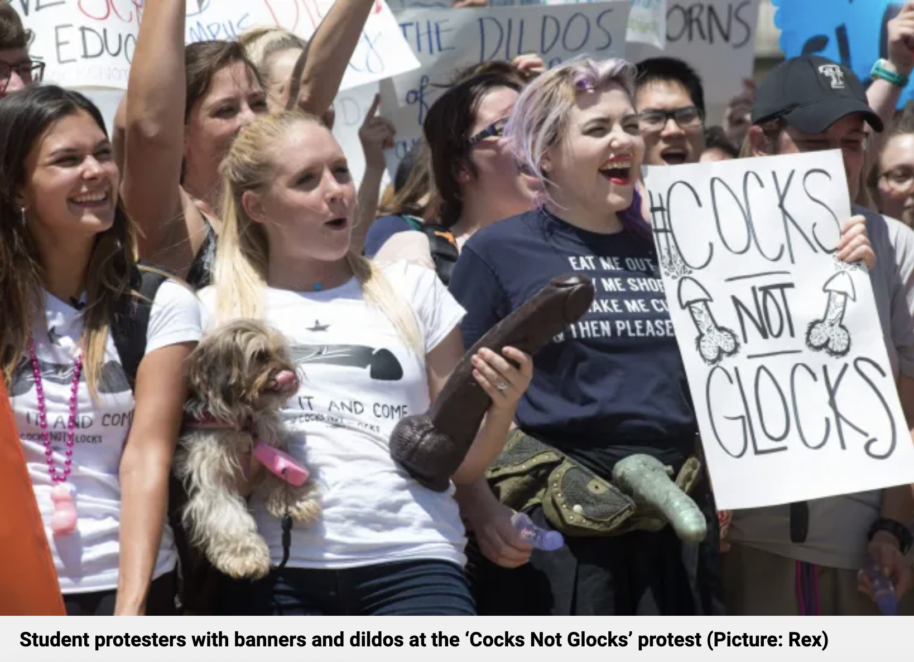

# Opening notes {background-color="#2c844c"}

::: {.tenor-gif-embed data-postid="14209777" data-share-method="host" data-aspect-ratio="1.94" data-width="70%"}
<div class="tenor-gif-embed" data-postid="14209777" data-share-method="host" data-aspect-ratio="1.94" data-width="100%"><a href="https://tenor.com/view/open-gif-14209777">Open Sticker</a>from <a href="https://tenor.com/search/open-stickers">Open Stickers</a></div> <script type="text/javascript" async src="https://tenor.com/embed.js"></script> 
:::

```{=html}
<script type="text/javascript" async src="https://tenor.com/embed.js"></script>
```

## Presentation groups

<!-- ::: panel-tabset -->
<!-- ## December -->

| Date    | Presenters                       | Method |
| -------:|:---------------------------------|:------:|
| 4 Dec:  | Daichi, Seongyeon, Jehyun        | TBD    | 
| 18 Dec: | Ayla, Tara, Theresa, Annabelle   | discourse analysis | 
| 15 Jan: | Luna, Emilene, Raffa, Sofia      | TBD    | 

: Presentations line-up

<!-- | 11 Dec: |                                  | TBD    |  -->


<!-- ## January -->

<!-- | Date    | Presenters                       | Method | -->
<!-- | -------:|:---------------------------------|:------:| -->
<!-- | 15 Jan: | Luna, Emilene, Raffa             | TBD    |  -->

<!-- : Presentations line-up -->

<!-- | 8 Jan:  |                                  | TBD    |  -->
<!-- | 22 Jan: |                                  | TBD    |  -->
<!-- | 29 Jan: |                                  | TBD    |  -->

<!-- ::: -->


<!-- []{style="font-size:10px;"} -->

# A conceptual framework of *strategy* {background-color="#2c844c"}

:::: {.columns}
:::{.column width="50%"}
- strategy defined
- elements of strategy
- drivers of strategy selection
- example from a non-violent but disruptive group
- example from a violent group

:::

::: {.column width="50%" .right}
<div class="tenor-gif-embed" data-postid="14201105381996209314" data-share-method="host" data-aspect-ratio="1.62745" data-width="100%"><a href="https://tenor.com/view/strategery-snl-skit-will-ferrell-strategy-gw-bush-gif-14201105381996209314">Strategery Snl Skit GIF</a>from <a href="https://tenor.com/search/strategery-gifs">Strategery GIFs</a></div> <script type="text/javascript" async src="https://tenor.com/embed.js"></script> 
:::
::::

## Basic, intuitive definition of *strategy*

[strategy]{style="color:darkred;"} refers to the approach of an actor(s) to achieve their (political) objectives---connecting [actions]{style="color:red;"} to [goals]{style="color:red;"} (*means* to an *end*)

. . . 

- extant definitions identify some elements, e.g.,
    + "a combination of a claim (or demand), a tactic, and a site (or venue)" (Meyer 2007, 82)
    + @Ganz2010[p. 9]: targeting, tactics, timing

. . . 

- many groups use [mixed strategies]{style="color:goldenrod;"} of [violence]{style="color:violet;"} and [non-violence]{style="color:seagreen;"}

## Elements of strategy 

- informative element: [objective(s)]{style="color:cadetblue;"} (*why*): what are the actor(s) goals? [minimalist]{style="color:darkred;"} vs. [maximalist]{style="color:darkred;"} objectives

. . . 

- [target]{style="color:cadetblue;"} (what/who) - what entity is being acted upon? 
    + involves choice to commit resources to specific outcomes

. . . 

- [tactics]{style="color:cadetblue;"} (how) - types of collective action and their form
    + attempt to deploy *strengths*, exploit target's *weaknesses*

. . . 

- [site/venue]{style="color:cadetblue;"} (where) - what place or what forum type is action taken? 

. . . 

- [timing]{style="color:cadetblue;"} (when) - when are tactics employed against targets
    + 'some moments, often fleeting, promise greater opportunity than others' ... [cf. @Grzymala-Busse2011]

## Elements of strategy 

- informative element: [objective(s)]{style="color:cadetblue;"} (*why*): what are the actor(s) goals? [minimalist]{style="color:darkred;"} vs. [maximalist]{style="color:darkred;"} objectives
- [target]{style="color:cadetblue;"} (what/who) - what entity is being acted upon? 
- [tactics]{style="color:cadetblue;"} (how) - types of collective action and their form
- [site/venue]{style="color:cadetblue;"} (where) - what place or what forum type is action taken? 
- [timing]{style="color:cadetblue;"} (when) - when are tactics employed against targets

::: {style="text-align: center;"}
**[What are the strategic elements of social movements that you know of?]{style="color:indigo; font-size:60px;"}** 
:::

## Drivers of strategy selection 

- [strategy]{style="color:darkred;"} is be a product of (rational) choice

BUT...

. . . 

- it is also a part [collective identity]{style="color:darkred;"} [cf. @PollettaJasper2001]
    + strategy also involves *moral and emotional committments* 

## An example from the news...

::: {style="text-align: center;"}
**[How can we characterise the group's *strategy* here?]{style="color:indigo; font-size:40px;"}** 
:::

<!-- Aspect ratios include 1x1, 4x3, 16x9 (the default), and 21x9. -->
<!-- aspect-ratio="21x9"  -->


*Tagesschau*   
<https://www.youtube.com/watch?v=eT9nr9_em0k&pp=ygUebGFzdCBnZW5lcmF0aW9uIHByb3Rlc3QgYmVybGlu>

## An example from 'the 43 Group'

<video src="slide_files/06/43Group_vid.mp4" width="99%" 
controls controlslist="nodownload"
poster="slide_files/06/43Group.png"></video>

## An example from 'the 43 Group'

post-war Labour government, witnessing low-level fascist-party organising and agitation...

@Beckman2013: 

> On Tuesday May 21st [1946], [James] Chuter Ede, the Home Secretary, received a deputation from the JDC [Jewish Defence Committee, part of the Board of Deputies of British Jews] led by the Chairman, Gordon Liverman ... They listened to the deputation and said they would consider all the points raised, but nothing tangible happened.

[documentary about 43 Group: <https://www.youtube.com/watch?v=oBusQBSCAHY>]{style="font-size:23px;"} 

# Open data - ACLED protest repertoires {background-color="#ffe0b2"}


::: panel-tabset
### Visualisation

```{r warning=FALSE, message=FALSE}
library(data.table)
library(dplyr)
library(tidyr)
library(lubridate)
library(xts)
library(dygraphs)
library(htmlwidgets)
library(tidyverse)

# acled <- fread("../resources/data/acled/ACLEDdata.csv", select = c("event_date", "event_type"))

# acled <- fread("../resources/data/acled/ACLEDdata.csv", select = c("event_date", "event_type", "country"))
# acled <- acled[country == "Germany"]
# 
# write.csv(acled, file = "acled_de.csv")

acled <- fread("../resources/data/acled/acled_de.csv", select = c("event_date", "event_type", "country"))

acled[, event_date := as.Date(event_date)]
acled[, month := floor_date(event_date, "month")]

monthly <- acled[, .N, by = .(month, event_type)] |>
  as_tibble() |>
  pivot_wider(names_from = event_type, values_from = N, values_fill = 0) |>
  arrange(month)

event_types <- setdiff(names(monthly), "month")

monthly_xts <- xts(monthly[, event_types], order.by = monthly$month)

# dygraph(monthly_xts, main = "Repertoires of contention in Europe, 2016-2025 (ACLED)") %>%
#   dyOptions(stackedGraph = TRUE, colors = RColorBrewer::brewer.pal(length(event_types), "Set2")) %>%
#   dyRangeSelector(dateWindow = c("2018-01-01", "2025-03-01")) %>%
#   dyAxis("x", axisLabelFormatter = JS("function(d){ return d.getFullYear() }")) %>%
#   dyLegend(width = 500)

dygraph(monthly_xts, main = "Repertoires of contention in Germany, 2020-2025 (ACLED)") %>%
  dyRangeSelector(dateWindow = c("2019-12-01", "2025-03-01")) %>%
  dyMultiColumnGroup(c("Strategic developments", "Explosions/Remote violence", "Riots", "Battles", "Violence against civilians")) %>% 
  dySeries("Protests", color="black", strokeWidth=2.5, axis='y2') %>% 
  dyAxis("x", axisLabelFormatter = JS("function(d){ return d.getFullYear() }")) %>%
  dyLegend(width = 500)

# dygraph(monthly_xts, main = "Pegida and counter-mobilisation events, 2014-2018") %>%
#   dyRangeSelector(dateWindow = c("2014-10-01", "2018-02-01")) %>%
#   dyMultiColumnGroup(c("Pegida", "Anti-Pegida")) %>% 
#   dyFilledLine("Total", color = "black", strokeWidth = 2.5) %>%
#   dyAxis("x", axisLabelFormatter = JS("function(d){ return d.getFullYear() }")) %>%
#   dyLegend(width = 400) %>%
#   dyOptions(fillGraph = FALSE)

```

### Explanatory note

Data source: ACLED (Armed Conflict Location & Event Data Project, <https://acleddata.com/>). Coverage is thin for 2016-2017 (ACLED expanded its European monitoring progressively), so the early part of the series should be read with caution. The plot area shows monthly counts of ACLED’s six event_type categories, with a line for protests which is by far the most common type in Germany.

### Data table 

```{r}
library(reactable)

reactable::reactable(monthly,
  defaultPageSize = 5,
  style = list(fontSize = "25px"),
  defaultColDef = colDef(
    align = "left",
    minWidth = 50,
    headerStyle = list(background = "#fabf68", fontWeight = "bold") # #f7f7f8
  )
  # ,
  # columns=list(
  #   iyear=colDef(name="Year", align="center", minWidth=50),
  #   gname=colDef(name="Group", minWidth=300), # , maxWidth=200
  #   attacks=colDef(name="Attacks", minWidth=100)
  # )
)
  
```

::: {.callout-note collapse="true" style="margin-top: -15px;"}
#### Data download

```{r echo = F, collapse = TRUE, comment = "#>", message = FALSE, warning=FALSE}
library(downloadthis)

monthly %>% download_this(
    output_name = "ACLED_monthly",
    output_extension = ".csv",
    button_label = "Download dataset as csv",
    button_type = "warning",
    has_icon = TRUE,
    icon = "fa fa-save"
  )
```

:::

::: 

# Open data - POLDEM protest repertoires {background-color="#ffe0b2"}

::: panel-tabset
### Visualisation

```{r warning=FALSE, message=FALSE}
library(dplyr)
library(tidyr)
library(lubridate)
library(xts)
library(dygraphs)
library(htmlwidgets)

poldem <- read.csv("../resources/data/poldem/poldem-protest_30.csv", stringsAsFactors = FALSE)
poldem$date <- as.Date(poldem$date)
poldem$month <- floor_date(poldem$date, "month")

action_form_labels <- c(
  "demonstrations"              = "Demonstrations",
  "violent protest"             = "Violent protest",
  "strikes"                     = "Strikes",
  "confrontations, blockades"   = "Blockades/confrontations",
  "petitions, symbolic actions" = "Petitions/symbolic",
  "other protest"               = "Other"
)
poldem$action_form <- recode(poldem$action_form, !!!action_form_labels)

form_monthly <- poldem %>%
  count(month, action_form) %>%
  pivot_wider(names_from = action_form, values_from = n, values_fill = 0) %>%
  arrange(month)

radical_monthly <- poldem %>%
  group_by(month) %>%
  summarise(pct_radical = 100 * mean(radical_action != "not radical"), .groups = "drop")

combined <- left_join(form_monthly, radical_monthly, by = "month")
action_forms <- setdiff(names(form_monthly), "month")

combined_xts <- xts(combined[, c(action_forms, "pct_radical")], order.by = combined$month)

dygraph(combined_xts, main = "Protest repertoires and radicalisation, 30 European countries (2000-2015)") %>%
  dyRangeSelector(dateWindow = c("2000-01-01", "2015-12-01")) %>%
  dyMultiColumnGroup(action_forms) %>%
  dyFilledLine("pct_radical", axis = "y2", color = "black", strokeWidth = 2) %>%
  dyAxis("y2", label = "% radical (confrontational + violent)", valueRange = c(0, 100)) %>%
  dyAxis("x", axisLabelFormatter = JS("function(d){ return d.getFullYear() }")) %>%
  dyLegend(width = 500, labelsSeparateLines = TRUE)

```

### Explanatory note

Data source: Kriesi et al. 2020, [PolDem-Protest Dataset](https://poldem.eui.eu/) 30 European Countries, Version 1. The stacked bars show the monthly composition of `action_form` (the protest repertoire), and the black line (right-hand axis) overlays the share of events per month coded as `radical_action` (confrontational or violent, vs. not radical). You can see both which tactics are used and how confrontational the overall repertoire is at any point in time.

### Data table 

```{r}
library(reactable)

reactable::reactable(combined,
  defaultPageSize = 4,
  style = list(fontSize = "19px"),
  defaultColDef = colDef(
    align = "left",
    minWidth = 50,
    headerStyle = list(background = "#fabf68", fontWeight = "bold") # #f7f7f8
  )
  # ,
  # columns=list(
  #   iyear=colDef(name="Year", align="center", minWidth=50),
  #   gname=colDef(name="Group", minWidth=300), # , maxWidth=200
  #   attacks=colDef(name="Attacks", minWidth=100)
  # )
)
  
```

::: {.callout-note collapse="true" style="margin-top: -15px;"}
#### Data download

```{r echo = F, collapse = TRUE, comment = "#>", message = FALSE, warning=FALSE}
library(downloadthis)

combined %>% download_this(
    output_name = "POLDEM_monthly",
    output_extension = ".csv",
    button_label = "Download dataset as csv",
    button_type = "warning",
    has_icon = TRUE,
    icon = "fa fa-save"
  )
```

:::

::: 


# Poll: strategy formation and effect {background-color="#2c844c"}

:::: {.columns}
:::{.column width="35%"}
{fig-alt="A QR code for the survey."}

:::

::: {.column width="65%" .center}
<!-- go to <https://www.qr-code-generator.com/>, add the link, and screen shot the QR code -->
Take the survey at **<https://forms.gle/6aVSF54HyFR2iNpDA>**

::: {style="margin-top: -20px; font-size: 0.8em;"} 
- most important factor shaping strategy?
- maximalist goals require extreme strategies?
- is popular support necessary for strategic success?
- political engagement necessary for big impact?
- disruptive tactics an effective way of generating awareness?


:::

:::
:::: 

::: {style="margin-top: -30px;"}
[[Questions about movements]{style="color:violet;"}: (1) movement's organisational form? (2) movement relies on formal coordination structures (meetings, committees, roles)? (3) leadership plays a visible and strategic role in guiding the movement? (4) movement's main strategic orientation? (5) movement mainly uses conventional, legally permitted forms of protest? (6) movement's primary tactic of mobilisation?]{style="font-size: 0.8em;"}

:::

--- 

```{ojs}
md`## Poll results (Respondents: ${respondentCount})`
```


```{ojs}

import { liveGoogleSheet } from "@jimjamslam/live-google-sheet";
import { aq, op } from "@uwdata/arquero";

// UPDATE THE LINK FOR A NEW POLL
surveyResults = liveGoogleSheet(
  "https://docs.google.com/spreadsheets/d/e/" +
    "2PACX-1vTvRa6dxxU7hLkg1jNGxxfk0KrQkR7urqaW96X9Mo70ZJWYsYI5UKUztMRDQj8H5otQgMzJ2U4hMcmo/" +
    "pub?gid=2069282497&single=true&output=csv",
  10000, 1, 13); // adjust the last number to select all relevant columns 

respondentCount = surveyResults.length;

likertOrder = [
  "Strongly disagree",
  "Disagree",
  "Neutral",
  "Agree",
  "Strongly agree"
];

ynmOrder = [
  "Yes",
  "No",
  "Maybe"
];

movementOrder = [
  "Antifa",
  "FFF",
  "LG",
  "PEGIDA",
  "Identitarians",
  "Querdenker"
];

movementColors = [
  "black",
  "green",
  "darkorange",
  "red",
  "gold",
  "purple"
];

```

:::: {.columns}
:::{.column width="50%"}

most important factor shaping movement org. strategy?

```{ojs}
shapingCounts = aq.from(surveyResults)
  .select("shaping")
  .groupby("shaping")
  .count()
  .derive({ measure: d => "" })

// Calculate the maximum count from your dataset
shaping_maxCountRE = Math.max(...shapingCounts.objects().map(d => d.count));

plot_shaping = Plot.plot({
  marks: [
    Plot.barY(shapingCounts, {
      x: "shaping",
      y: "count",
      fill: "shaping",
      stroke: "black",
      strokeWidth: 1
    }),
    Plot.ruleY([respondentCount], { stroke: "#ffffff99" })
  ],
  color: {
    domain: [
      "ideology",
      "resources",
      "state posture/character",
      "public support",
      "other"
    ],
    range: [
      "goldenrod",
      "cadetblue",
      "darkorange",
      "forestgreen",
      "violet"
    ]
  },
  marginBottom: 400,
  x: { label: "", tickSize: 2, tickRotate: -40, padding: 0.2,
    domain: ["ideology", "resources", "state posture/character", "public support", "other"]
  },  
  y: {
    label: "",
    tickSize: 10,
    tickFormat: d => d,
    tickValues: Array.from(
      new Set(shapingCounts.objects().map(d => d.count))
    ).sort((a, b) => a - b),
    domain: [0, shaping_maxCountRE]
  },
  facet: { data: shapingCounts, x: "measure", label: "" },
  marginLeft: 60,
  style: {
    width: 1600,
    height: 500,
    fontSize: 40,
  },
});

```
 
:::

::: {.column width="50%"}
 
do maximalist goals require more extreme strategies?

```{ojs}
max_goalsCounts = aq.from(surveyResults)
  .select("max_goals")
  .groupby("max_goals")
  .count()
  .derive({ measure: d => "" })

// Calculate the maximum count from your dataset
max_goals_maxCountRE = Math.max(...max_goalsCounts.objects().map(d => d.count));

plot_max_goals = Plot.plot({
  marks: [
    Plot.barY(max_goalsCounts, {
      x: "max_goals",
      y: "count",
      fill: "max_goals",
      stroke: "black",
      strokeWidth: 1
    }),
    Plot.ruleY([respondentCount], { stroke: "#ffffff99" })
  ],
  color: {
    domain: [
      "Yes",
      "No",
      "Maybe"
    ],
    range: [
      "forestgreen",
      "darkred",
      "goldenrod"
    ]
  },
  marginBottom: 80,
  x: { label: "", tickSize: 2, tickRotate: -1, padding: 0.2,
    domain: ["Yes", "No", "Maybe"]
  },  
  y: {
    label: "",
    tickSize: 10,
    tickFormat: d => d,
    tickValues: Array.from(
      new Set(max_goalsCounts.objects().map(d => d.count))
    ).sort((a, b) => a - b),
    domain: [0, max_goals_maxCountRE]
  },
  facet: { data: max_goalsCounts, x: "measure", label: "" },
  marginLeft: 60,
  style: {
    width: 1600,
    height: 500,
    fontSize: 40,
  },
});

```
 
:::
::::

## Poll results

:::: {.columns}
:::{.column width="33%"}

popular support necessary for strategic success?

```{ojs}
pop_supportCounts = aq.from(surveyResults)
  .select("pop_support")
  .groupby("pop_support")
  .count()
  .derive({ measure: d => "" })

// Calculate the maximum count from your dataset
pop_support_maxCountRE = Math.max(...pop_supportCounts.objects().map(d => d.count));

plot_pop_support = Plot.plot({
  marks: [
    Plot.barY(pop_supportCounts, {
      x: "pop_support",
      y: "count",
      fill: "pop_support",
      stroke: "black",
      strokeWidth: 1
    }),
    Plot.ruleY([respondentCount], { stroke: "#ffffff99" })
  ],
  color: {
    domain: [
      "Yes",
      "No",
      "Maybe"
    ],
    range: [
      "forestgreen",
      "darkred",
      "goldenrod"
    ]
  },
  marginBottom: 80,
  x: { label: "", tickSize: 2, tickRotate: -1, padding: 0.2,
    domain: ["Yes", "No", "Maybe"]
  },  
  y: {
    label: "",
    tickSize: 10,
    tickFormat: d => d,
    tickValues: Array.from(
      new Set(pop_supportCounts.objects().map(d => d.count))
    ).sort((a, b) => a - b),
    domain: [0, pop_support_maxCountRE]
  },
  facet: { data: pop_supportCounts, x: "measure", label: "" },
  marginLeft: 60,
  style: {
    width: 1600,
    height: 500,
    fontSize: 40,
  },
});

```

:::

:::{.column width="33%"}

engagement in politics necessary for long-term impact?

```{ojs}
engagementCounts = aq.from(surveyResults)
  .select("engagement")
  .groupby("engagement")
  .count()
  .derive({ measure: d => "" })

// Calculate the maximum count from your dataset
engagement_maxCountRE = Math.max(...engagementCounts.objects().map(d => d.count));

plot_engagement = Plot.plot({
  marks: [
    Plot.barY(engagementCounts, {
      x: "engagement",
      y: "count",
      fill: "engagement",
      stroke: "black",
      strokeWidth: 1
    }),
    Plot.ruleY([respondentCount], { stroke: "#ffffff99" })
  ],
  color: {
    domain: [
      "Strongly disagree",
      "Disagree",
      "Neutral",
      "Agree",
      "Strongly agree"
    ],
    range: [
      "red",
      "pink",
      "lightgrey",
      "lightgreen",
      "forestgreen"
    ]
  },
  marginBottom: 180,
  x: { label: "", tickSize: 2, tickRotate: -45,
    domain: ["Strongly disagree", "Disagree", "Neutral", "Agree", "Strongly agree"]
  },  
  y: {
    label: "",
    tickSize: 10,
    tickFormat: d => d,
    tickValues: Array.from(
      new Set(engagementCounts.objects().map(d => d.count))
    ).sort((a, b) => a - b),
    domain: [0, engagement_maxCountRE]
  },
  facet: { data: engagementCounts, x: "measure", label: "" },
  marginLeft: 140,
  style: {
    width: 1350,
    height: 500,
    fontSize: 30,
  }
});

```

:::

::: {.column width="33%"}

disrupting is effective for building awareness?

```{ojs}
disruptiveCounts = aq.from(surveyResults)
  .select("disruptive")
  .groupby("disruptive")
  .count()
  .derive({ measure: d => "" })

// Calculate the maximum count from your dataset
disruptive_maxCountRE = Math.max(...disruptiveCounts.objects().map(d => d.count));

plot_disruptive = Plot.plot({
  marks: [
    Plot.barY(disruptiveCounts, {
      x: "disruptive",
      y: "count",
      fill: "disruptive",
      stroke: "black",
      strokeWidth: 1
    }),
    Plot.ruleY([respondentCount], { stroke: "#ffffff99" })
  ],
  color: {
    domain: [
      "Strongly disagree",
      "Disagree",
      "Neutral",
      "Agree",
      "Strongly agree"
    ],
    range: [
      "red",
      "pink",
      "lightgrey",
      "lightgreen",
      "forestgreen"
    ]
  },
  marginBottom: 180,
  x: { label: "", tickSize: 2, tickRotate: -45,
    domain: ["Strongly disagree", "Disagree", "Neutral", "Agree", "Strongly agree"]
  },  
  y: {
    label: "",
    tickSize: 10,
    tickFormat: d => d,
    tickValues: Array.from(
      new Set(disruptiveCounts.objects().map(d => d.count))
    ).sort((a, b) => a - b),
    domain: [0, disruptive_maxCountRE]
  },
  facet: { data: disruptiveCounts, x: "measure", label: "" },
  marginLeft: 140,
  style: {
    width: 1350,
    height: 500,
    fontSize: 30,
  }
});

```

:::
::::

## Tactical frivolity [@Bogad2016]

more of a humanities/dramaturgical perspective on movements and their tactics

<!-- Aspect ratios include 1x1, 4x3, 16x9 (the default), and 21x9. -->
<!-- aspect-ratio="21x9"  -->



# Temporality {background-color="#2c844c"}

:::: {.columns}
:::{.column width="50%"}
- @Grzymala-Busse2011 on temporality
    + overview
    + definitions and examples 
    + tempo and duration 

:::

::: {.column width="50%" .right}
<div class="tenor-gif-embed" data-postid="12086181" data-share-method="host" data-aspect-ratio="1" data-width="100%"><a href="https://tenor.com/view/timing-good-timing-on-time-clock-looking-at-the-clock-gif-12086181">Timing GIF</a>from <a href="https://tenor.com/search/timing-gifs">Timing GIFs</a></div> <script type="text/javascript" async src="https://tenor.com/embed.js"></script> 
:::
::::

## @Grzymala-Busse2011 - overview

- [mechanisms]{style="color:blue;"}: "recurrent causal links between specified initial conditions and outcomes. Specific sequences (orderings) of mechanisms and events then constitute processes."

- Fundamentals of temporality: how long events take (**[duration]{style="color:darkred;"}**), how quickly they change (**[tempo]{style="color:darkred;"}**), whether they speed up or slow down (**[acceleration]{style="color:darkred;"}**), and when they occur (**[timing]{style="color:darkred;"}**)

## @Grzymala-Busse2011 - definitions and examples

```{r}
library(kableExtra)
library(tibble)

data <- tribble(
  ~Aspect, ~Definition, ~Examples,
  "Duration", 
  "Temporal length of an event; how much time elapses between the start and end of an action or event", 
  "Time elapsed between the announcement that a new agency is founded and its demise, or the period between the takeoff of popular literacy and its full attainment",

  "Tempo", 
  "Amount of change per unit of time (dist./time interval); frequency of the 'subevents' in a larger event, or between events in a process.", 
  "How much time elapses before each new state institution is established, between each new person gaining literacy",

  "Acceleration (and deceleration)", 
  "Derivative of velocity with respect to time (direction vector/direction tempo); rate of change", 
  "Postcommunist privatization started to unfold very quickly, with a great deal of entrepreneurial activity and privatization auctions at the outset. In several countries, it then slowed down",

  "Timing", 
  "Position on a temporal timeline (itself composed of some units of time, such as electoral cycles or years)", 
  "18th-century revolutions had pamphlets and word of mouth as their mobilizing techniques; 20th-century revolutions had television, radio, email, and cell phones at their disposal"
)

kable(data, "html", escape = FALSE, align = c("r", "l", "l")) %>%
  kable_styling(full_width = FALSE, bootstrap_options = c("striped", "hover"),
                font_size = 22)

```

## @Grzymala-Busse2011 - tempo and duration

```{r}
library(kableExtra)
library(tibble)

data <- tribble(
  ~` `, ~Faster, ~Slower,
  "Shorter", 
  "Radical processes: coups, revolutions, shock therapy, regime replacement, and some institutional creation (free elections)", 
  "Abruptly ending processes: threshold effects, bargaining, establishing some institutions (cf. postcommunist clientelism)",

  "Longer", 
  "Lengthy instability: revolutions and wars, cascades, predation, postcommunist civil society growth, political party fission", 
  "Gradual processes: demographic change, spread of literacy and nationalism, linguistic transformations, quasiparameter change"
)

kable(data, "html", escape = FALSE, align = c("r", "l", "l")) %>%
  kable_styling(full_width = FALSE, bootstrap_options = c("striped", "hover"),
                font_size = 34)

```

<!-- ## Group discussion: -->

<!-- \Large -->

<!-- \begin{itemize} -->
<!--     \item<1-> what \textbf{targets} and \textbf{tactics} has your group used? -->
<!--     \item<1-> are there any conspicuous \textbf{timing} factors (e.g., around elections, connected to events, regularity/frequency)? -->
<!--     \item<2-> now, some \textcolor{red}{\textbf{typology-forming}} work: what categories might help us form a comparative framework for groups' strategy/tactics? -->
<!--     \begin{itemize} -->
<!--         \item<2-> what are the key dimensions that help differentiate? -->
<!--     \end{itemize} -->
<!-- \end{itemize} -->

<!-- @dellaPortaDiani2009, chapter 6 -->
<!-- - hierarchical vs. horizontal -->
<!-- - challenging vs. service provision -->
<!--     + 'putting the goal into practice' (e.g., prefiguration) -->

# Tactics and effecting change {background-color="#2c844c"}

:::: {.columns}
:::{.column width="50%"}
- connecting tactics to outcomes 
- tactical innovation 
- Spaßguerrillas 
- Gene Sharp and nonviolence 
- some fun examples 

:::

::: {.column width="50%"}
<div class="tenor-gif-embed" data-postid="22419743" data-share-method="host" data-aspect-ratio="2.5" data-width="100%"><a href="https://tenor.com/view/talladega-nights-tactics-cal-gif-22419743">Talladega Nights GIF</a>from <a href="https://tenor.com/search/talladega-gifs">Talladega GIFs</a></div> <script type="text/javascript" async src="https://tenor.com/embed.js"></script> 
:::
::::


## Connecting tactics to outcomes

- @Gamson1990 found that violent social movements (incl. 'strikes and disruptive techniques') are more likely than nonviolent to achieve their goal
    + more effective in attracting attention and imposing costs on targets/opponents
    + similarly found by @Cress2000
    + BUT... opposite found on regime-challenging movements by @Chenoweth2011
    + Opposite also found in U.S. campus policy by @Rojas2006

## Connecting tactics to outcomes

- **[social control hypothesis]{style="color:cadetblue;"}** [e.g., @Piven1979]
    + disruptive protests/tactics allow movements to win concessions in exchange for ending protests/tactics (*coercion* mechanism)
- **[mass mobilisation/social pressure hypothesis]{style="color:cadetblue;"}** [e.g., @Chenoweth2011]
    + gaining enough (visible) support to pressure decision-makers into concessions (*consensus/demonstrative/persuasion* mechanisms)
        * implicit appeal to democratic norms

## (necessity of) tactical innovation

- @McAdam1983: tactical interaction
    + movements *[disrupt]{style="color:violet;"}* as they mount a challenge
    + authorities/targets *[adapt]{style="color:violet;"}* to tactics, dulling their impact
    + movements *[innovate]{style="color:violet;"}* tactics to maintain effective strategy

- With responsive authorities/targets, **this cycle places high demands on movements**
    + (@McAdam1983 writes that by the end of the 1960s, U.S. black rights movement(s) had been made '*tactically impotent*')

## Spaßguerrillas

- problem in student movement of unexciting and/or intimidating modes of activism
- Wolfgang Lefèvre (SDS leader):

> ‘Every event or demonstration should be inventively planned so that it is exciting and fun for students.’

- the 'fun-fighters' emerged from the *Sozialistischen Deutschen Studentenbund*
    + Fritz Teufel, Rainer Langhans advocate **playful tactics**
    + long legacy in German activism (e.g., 'Front Deutscher Äpfel')

## Gene Sharp and nonviolence [@Sharp1973]

- ‘*political ju-jitsu*’ (using opponents' strength against them): violent repression of nonviolent resistance strengthens resistance by creating sympathy for resisters

:::: {.columns}
:::{.column width="40%"}

:::

::: {.column width="20%"}

$\downarrow$

:::
::::


- accumulation of [198 methods of nonviolent action](https://www.brandeis.edu/peace-conflict/pdfs/198-methods-non-violent-action.pdf), e.g.:
    + [many famous types]{style="color:goldenrod;"}: demonstrations, strikes, pickets
    + [some less known options]{style="color:forestgreen;"}: prisoners' strike, slow compliance, 'Lysistratic nonaction'
        * **[any ideas what these mean / examples?]{style="color:indigo;"}**

- check out the list for more types of tactics: <https://nvdatabase.swarthmore.edu/browse-methods>

## Tactics in practice, example

- off and on since 1988, German neo-Nazi groups had organised 'memorial marches' in **Wunsiedel** [@Virchow2013a; @Zeller2021_hess]  
- in 2014, anti-far-right activists organised 'involuntary walkathon'

<!-- Aspect ratios include 1x1, 4x3, 16x9 (the default), and 21x9. -->
<!-- aspect-ratio="21x9"  -->


(German version: <https://www.youtube.com/watch?v=mMrQge9hP5o>)

## Tactics in practice, example

:::: {.columns}
:::{.column width="50%"}
- 2016: U.S. state of Texas passes law allowing carrying handguns on university campuses
- at the same time, state 'obsenity laws' forbid bringing dildoes onto campus
- the 'cocks not glocks' campaign was born...

:::

::: {.column width="50%"}



:::
::::

## Tactics in practice, example

'We're fighting absurdity with absurdity.'

<!-- Aspect ratios include 1x1, 4x3, 16x9 (the default), and 21x9. -->
<!-- aspect-ratio="21x9"  -->


<!-- - dildoes in Texas to protest gun laws (daily show: <https://www.youtube.com/watch?v=UbJKhvmshGs&pp=ygUYZGFpbHkgc2hvdyBkaWxkb2VzIHRleGFz>; <https://www.theguardian.com/us-news/2016/aug/25/cocks-not-glocks-texas-campus-carry-gun-law-protest>) -->
<!-- - overloading abortion reporting (vigilante law) system in southern U.S.: <https://apnews.com/article/technology-health-media-texas-social-media-c76b1dc146ede0b2f1bac70e6b18f39f> -->

## Movement responses - org. form

movement's organisational form?

```{ojs}
// need to replace 'm_org_form'

m_org_formCounts = aq.from(surveyResults)
  .groupby("m_org_form", "movement")
  .count()
  .objects();

plot_m_org_form = Plot.plot({
  marks: [
    Plot.frame({
      fill: "#f7f7f7",
      stroke: "black",
      strokeWidth: 1
    }),
    
    Plot.barY(m_org_formCounts, {
      fx: "m_org_form",
      x: "movement",
      y: "count",
      fill: "movement",
      stroke: "white"
    })
  ],

  color: {
    domain: movementOrder,
    range: movementColors,
    legend: true,
    style: { fontSize: "20px" }
  },

  fx: {
    // domain: likertOrder,
    label: "",
    tickRotate: -45
  },

  x: {
    domain: movementOrder,
    axis: null, // clears the entire x-axis (ticks and labels)
    // tickFormat: () => "",
    label: ""
  },

  y: {
    label: ""
  },

  marginBottom: 250,
  style: {
    width: 900,
    height: 500,
    fontSize: 20
  }
});


```


## Movement responses - structure and leaders

:::: {.columns}
:::{.column width="48%"}

movement relies on formal structures? 

```{ojs}
// need to replace 'm_formal_coord_structures'

m_formal_coord_structuresCounts = aq.from(surveyResults)
  .groupby("m_formal_coord_structures", "movement")
  .count()
  .objects();

plot_m_formal_coord_structures = Plot.plot({
  marks: [
    Plot.frame({
      fill: "#f7f7f7",
      stroke: "black",
      strokeWidth: 1
    }),
    
    Plot.barY(m_formal_coord_structuresCounts, {
      fx: "m_formal_coord_structures",
      x: "movement",
      y: "count",
      fill: "movement",
      stroke: "white"
    })
  ],

  color: {
    domain: movementOrder,
    range: movementColors,
    legend: true,
    style: { fontSize: "20px" }
  },

  fx: {
    domain: ynmOrder,
    label: "",
    tickRotate: 0
  },

  x: {
    domain: movementOrder,
    axis: null, // clears the entire x-axis (ticks and labels)
    // tickFormat: () => "",
    label: ""
  },

  y: {
    label: ""
  },

  marginBottom: 130,
  style: {
    width: 900,
    height: 500,
    fontSize: 20
  }
});

``` 

:::

:::{.column width="4%"}
<div style="height: 600px; border-left: 2px solid #999; margin: 0 auto;"></div>
:::

::: {.column width="48%"}

leadership has visible and strategic role? 

```{ojs}
// need to replace 'm_leadership_visible_strategic'

m_leadership_visible_strategicCounts = aq.from(surveyResults)
  .groupby("m_leadership_visible_strategic", "movement")
  .count()
  .objects();

plot_m_leadership_visible_strategic = Plot.plot({
  marks: [
    Plot.frame({
      fill: "#f7f7f7",
      stroke: "black",
      strokeWidth: 1
    }),
    
    Plot.barY(m_leadership_visible_strategicCounts, {
      fx: "m_leadership_visible_strategic",
      x: "movement",
      y: "count",
      fill: "movement",
      stroke: "white"
    })
  ],

  color: {
    domain: movementOrder,
    range: movementColors,
    legend: true,
    style: { fontSize: "20px" }
  },

  fx: {
    domain: likertOrder,
    label: "",
    tickRotate: -55
  },

  x: {
    domain: movementOrder,
    axis: null, // clears the entire x-axis (ticks and labels)
    // tickFormat: () => "",
    label: ""
  },

  y: {
    label: ""
  },

  marginBottom: 140,
  style: {
    width: 900,
    height: 500,
    fontSize: 20
  }
});

```

:::
::::

## Movement responses - strategy 

movement's main strategic orientation? 

```{ojs}
// need to replace 'm_strategic_orientation'

m_strategic_orientationCounts = aq.from(surveyResults)
  .groupby("m_strategic_orientation", "movement")
  .count()
  .objects();

plot_m_strategic_orientation = Plot.plot({
  marks: [
    Plot.frame({
      fill: "#f7f7f7",
      stroke: "black",
      strokeWidth: 1
    }),
    
    Plot.barY(m_strategic_orientationCounts, {
      fx: "m_strategic_orientation",
      x: "movement",
      y: "count",
      fill: "movement",
      stroke: "white"
    })
  ],

  color: {
    domain: movementOrder,
    range: movementColors,
    legend: true,
    style: { fontSize: "20px" }
  },

  fx: {
    // domain: likertOrder,
    label: "",
    tickRotate: -45
  },

  x: {
    domain: movementOrder,
    axis: null, // clears the entire x-axis (ticks and labels)
    // tickFormat: () => "",
    label: ""
  },

  y: {
    label: ""
  },

  marginBottom: 250,
  style: {
    width: 900,
    height: 500,
    fontSize: 20
  }
});


```


## Movement responses - legal protest

movement mainly uses legally permitted protest? 

```{ojs}
// need to replace 'm_legal_protest'

m_legal_protestCounts = aq.from(surveyResults)
  .groupby("m_legal_protest", "movement")
  .count()
  .objects();

plot_m_legal_protest = Plot.plot({
  marks: [
    Plot.frame({
      fill: "#f7f7f7",
      stroke: "black",
      strokeWidth: 1
    }),
    
    Plot.barY(m_legal_protestCounts, {
      fx: "m_legal_protest",
      x: "movement",
      y: "count",
      fill: "movement",
      stroke: "white"
    })
  ],

  color: {
    domain: movementOrder,
    range: movementColors,
    legend: true,
    style: { fontSize: "20px" }
  },

  fx: {
    domain: likertOrder,
    label: "",
    tickRotate: -55
  },

  x: {
    domain: movementOrder,
    axis: null, // clears the entire x-axis (ticks and labels)
    // tickFormat: () => "",
    label: ""
  },

  y: {
    label: ""
  },

  marginBottom: 140,
  style: {
    width: 900,
    height: 500,
    fontSize: 20
  }
});

```


## Movement responses - tactics

movement's primary tactic of mobilisation?

```{ojs}
// need to replace 'm_primary_tactic'

m_primary_tacticCounts = aq.from(surveyResults)
  .groupby("m_primary_tactic", "movement")
  .count()
  .objects();

plot_m_primary_tactic = Plot.plot({
  marks: [
    Plot.frame({
      fill: "#f7f7f7",
      stroke: "black",
      strokeWidth: 1
    }),
    
    Plot.barY(m_primary_tacticCounts, {
      fx: "m_primary_tactic",
      x: "movement",
      y: "count",
      fill: "movement",
      stroke: "white"
    })
  ],

  color: {
    domain: movementOrder,
    range: movementColors,
    legend: true,
    style: { fontSize: "20px" }
  },

  fx: {
    // domain: likertOrder,
    label: "",
    tickRotate: -45
  },

  x: {
    domain: movementOrder,
    axis: null, // clears the entire x-axis (ticks and labels)
    // tickFormat: () => "",
    label: ""
  },

  y: {
    label: ""
  },

  marginBottom: 250,
  style: {
    width: 900,
    height: 500,
    fontSize: 20
  }
});


```


# Any questions, concerns, feedback for this class? {background-color="#2c844c"}

Anonymous feedback here: <https://forms.gle/AjHt6fcnwZxkSg4X8>

Alternatively, please send me an email: [m.zeller\@lmu.de]{style="color:red;"}


```{r echo=FALSE, message=FALSE, warning=FALSE}
pagedown::chrome_print(file.path("..", "docs/slides", "slides_06.html"))
```

<hr>

[Questions about movements next meeting]{style="color:violet;"}: (1) Which type of media is most important for the movement’s visibility? (2) Does the movement strategically plan actions to generate media coverage? (3) Is media coverage of the movement generally favourable? (4) Which audience is the movement mainly trying to influence? (5) Does the movement often succeed in getting its narratives spread through the media?  (6) How successful has the movement been at influencing public debate?

## References

