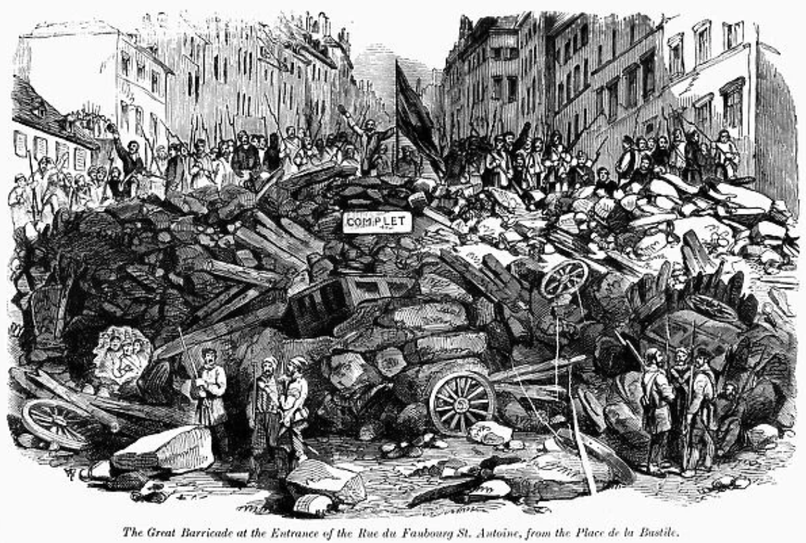
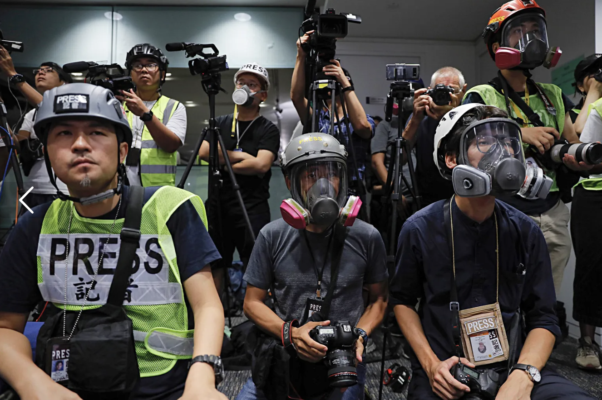
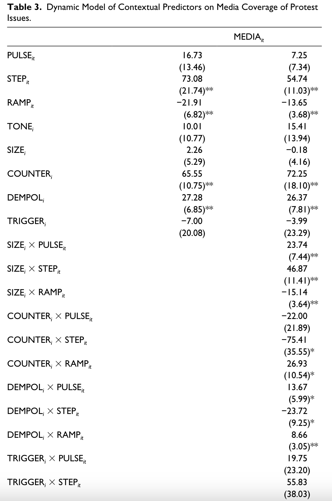
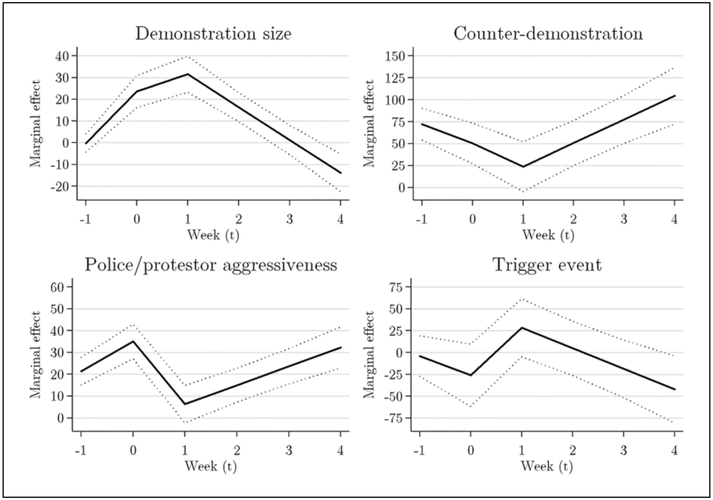
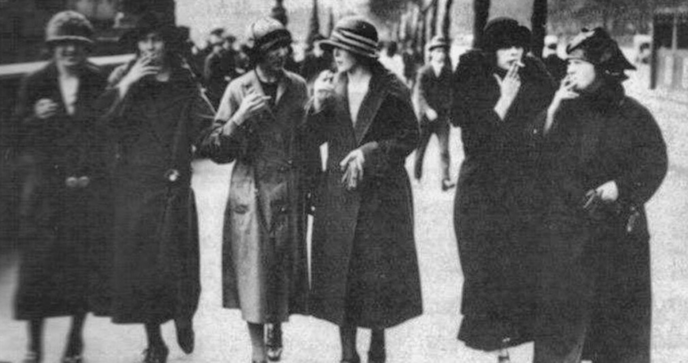
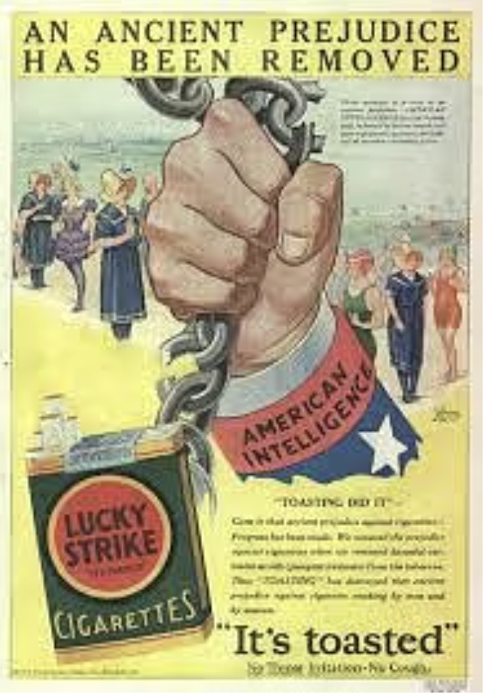
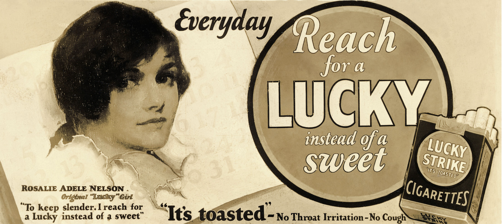

# Opening notes {background-color="#2c844c"}

::: {.tenor-gif-embed data-postid="14209777" data-share-method="host" data-aspect-ratio="1.94" data-width="70%"}
<div class="tenor-gif-embed" data-postid="14209777" data-share-method="host" data-aspect-ratio="1.94" data-width="100%"><a href="https://tenor.com/view/open-gif-14209777">Open Sticker</a>from <a href="https://tenor.com/search/open-stickers">Open Stickers</a></div> <script type="text/javascript" async src="https://tenor.com/embed.js"></script> 
:::

```{=html}
<script type="text/javascript" async src="https://tenor.com/embed.js"></script>
```

## Presentation groups

::: panel-tabset
## December

| Date    | Presenters                       | Method |
| -------:|:---------------------------------|:------:|
| 4 Dec:  |                                  | TBD    | 
| 11 Dec: |                                  | TBD    | 
| 18 Dec: |                                  | TBD    | 

: Presentations line-up

## January

| Date    | Presenters                       | Method |
| -------:|:---------------------------------|:------:|
| 8 Jan:  |                                  | TBD    | 
| 15 Jan: |                                  | TBD    | 
| 22 Jan: |                                  | TBD    | 
| 29 Jan: |                                  | TBD    | 

: Presentations line-up

:::

<!-- []{style="font-size:10px;"} -->

<!-- For a course on 'social movements' and a class on 'social movements and the media', can you suggest some discussion questions to ask students? Ideally, the questions should have multiple choice responses, or yes/no/maybe responses, or strongly agree/agree/disagree/strongly disagree responses? -->

# Opening questions {background-color="#2c844c"}

:::: {.columns}
:::{.column width="50%"}
- [Where do you get your news?]{style="color:indigo;"}

- [When you read the news (thinking only of 'traditional media' for the moment), what is reported, generally?]{style="color:indigo;"}

:::

::: {.column width="50%" .right}
<div class="tenor-gif-embed" data-postid="18789236" data-share-method="host" data-aspect-ratio="1.77778" data-width="100%"><a href="https://tenor.com/view/so-many-questions-dr-roger-bentley-the-mole-people-curious-dont-understand-gif-18789236">So Many Questions Dr Roger Bentley GIF</a>from <a href="https://tenor.com/search/so+many+questions-gifs">So Many Questions GIFs</a></div> <script type="text/javascript" async src="https://tenor.com/embed.js"></script> 
:::
::::

## Media: the translator of social movements

What are the mechanisms of...

- movements advancing their **[frames]{style="color:darkred;"}** (*Class 3*),
- **[mobilisation]{style="color:darkred;"}**, **[recruitment]{style="color:darkred;"}**, **[participation]{style="color:darkred;"}** (*Class 4*),
- **[tactics]{style="color:darkred;"}** and **[strategies]{style="color:darkred;"}** achieving results (*Class 6*)?

often it is [the media]{style="color:red;"} (including social media)

. . . 

how media covers a movement is often how most people know about it

- **big practical and theoretical stakes**
- often plays a [gatekeeper]{style="color:red;"} role

## Past and present eras: a change of arena 

:::: {.columns}
:::{.column width="50%"}




:::

::: {.column width="50%" .center}

:::
:::: 

## Past and present eras: a change of arena 

:::: {.columns}
:::{.column width="35%"}


:::

::: {.column width="65%" .center}
- previous eras: direct action, confrontation between movements and authorities more common
    + here: barricade in Paris, 1848
- modern era: indirect contention filtered through [media]{style="color:red;"} more common
    + here: press pack ahead of movement press conference in Hong Kong
    + '[the whole world is watching]{style="color:indigo;"}' era
        <!-- * [anyone know when/what popularised this phrase?]{style="color:indigo;"} -->
        * the [prospect]{style="color:cadetblue;"} (for movements) and [peril]{style="color:violet;"}  (for targets/authorities) now? [the whole world may be watching]{style="color:forestgreen;"}  

:::
:::: 

# Poll: movements and media {background-color="#2c844c"}

:::: {.columns}
:::{.column width="35%"}
{fig-alt="A QR code for the survey."}

:::

::: {.column width="65%" .center}
<!-- go to <https://www.qr-code-generator.com/>, add the link, and screen shot the QR code -->
Take the survey at **<https://forms.gle/ngepuqqzaFu8nCfBA>**

- ever personally supported a movement online?
- how do media generally portray *protesters*?
- what is most likely to help a movement get media coverage?

:::
:::: 

- should movements tailor their messaging/framing to gain more attention?
- is traditional media coverage still necessary for movement success in an age of social media?
- does social media encourage 'slacktivism'?


<!-- "How do you think the media generally portrays protesters?" -->
<!-- A. dangerous -->
<!-- B. passionate -->
<!-- C. misguided -->
<!-- D. admirable -->
<!-- E. other -->


<!-- What do you think is most likely to help a social movement get media coverage? -->
<!-- - size -->
<!-- - catchy slogans  -->
<!-- - celebrity support -->
<!-- - counter-demonstration  -->
<!-- - disruptiveness/violence  -->
<!-- - topicality (coincidence with other news) -->
<!-- - other -->


<!-- "Social movements should tailor their messaging to fit traditional media formats (e.g., soundbites, clear narratives) in order to gain more mainstream attention." -->
<!-- Response type: Strongly Agree / Agree / Disagree / Strongly Disagree -->


<!-- Traditional media coverage is not necessary for the success of social movements, especially since the rise of social media platforms. -->
<!-- Strongly Agree / Agree / Disagree / Strongly Disagree -->


<!-- "Is media bias more a result of individual journalists or of institutional structures?" -->
<!-- A. Individual journalists -->
<!-- B. Institutional structures -->
<!-- C. A mix of both -->
<!-- D. Neither -->


<!-- Do you think social media encourages 'slacktivism' more than real-world action? -->
<!-- Yes / No / Maybe -->


<!-- Have you personally ever shared content online in support of a social movement? -->
<!-- Yes / No / Maybe -->


--- 

```{ojs}
md`## Poll results (Respondents: ${respondentCount})`
```


```{ojs}

import { liveGoogleSheet } from "@jimjamslam/live-google-sheet";
import { aq, op } from "@uwdata/arquero";

// UPDATE THE LINK FOR A NEW POLL
surveyResults = liveGoogleSheet(
  "https://docs.google.com/spreadsheets/d/e/" +
    "2PACX-1vRFuuWCfyZQLXsybqoVeuOX8eixlnbIKG7xp_W7e9W1FRZNtLl8pMdicFnILQhxM69f1Fn4Hxf_5jG0/" +
    "pub?gid=2143204677&single=true&output=csv",
  10000, 1, 7); // adjust the last number to select all relevant columns 

respondentCount = surveyResults.length;

```

:::: {.columns}
:::{.column width="50%"}

how do media generally portray *protesters*?

```{ojs}
portrayCounts = aq.from(surveyResults)
  .select("portray")
  .groupby("portray")
  .count()
  .derive({ measure: d => "" })

// Calculate the maximum count from your dataset
portray_maxCountRE = Math.max(...portrayCounts.objects().map(d => d.count));

plot_portray = Plot.plot({
  marks: [
    Plot.barY(portrayCounts, {
      x: "portray",
      y: "count",
      fill: "portray",
      stroke: "black",
      strokeWidth: 1
    }),
    Plot.ruleY([respondentCount], { stroke: "#ffffff99" })
  ],
  color: {
    domain: [
      "dangerous",
      "passionate",
      "misguided",
      "admirable",
      "other"
    ],
    range: [
      "goldenrod",
      "cadetblue",
      "darkorange",
      "forestgreen",
      "violet"
    ]
  },
  marginBottom: 400,
  x: { label: "", tickSize: 2, tickRotate: -40, padding: 0.2,
    domain: ["dangerous", "passionate", "misguided", "admirable", "other"]
  },  
  y: {
    label: "",
    tickSize: 10,
    tickFormat: d => d,
    tickValues: Array.from(
      new Set(portrayCounts.objects().map(d => d.count))
    ).sort((a, b) => a - b),
    domain: [0, portray_maxCountRE]
  },
  facet: { data: portrayCounts, x: "measure", label: "" },
  marginLeft: 60,
  style: {
    width: 1600,
    height: 500,
    fontSize: 40,
  },
});

```
 
:::

::: {.column width="50%"}
 
most likely to help a movement get media coverage?

```{ojs}
help_coverageCounts = aq.from(surveyResults)
  .select("help_coverage")
  .groupby("help_coverage")
  .count()
  .derive({ measure: d => "" })

// Calculate the maximum count from your dataset
help_coverage_maxCountRE = Math.max(...help_coverageCounts.objects().map(d => d.count));

plot_help_coverage = Plot.plot({
  marks: [
    Plot.barY(help_coverageCounts, {
      x: "help_coverage",
      y: "count",
      fill: "help_coverage",
      stroke: "black",
      strokeWidth: 1
    }),
    Plot.ruleY([respondentCount], { stroke: "#ffffff99" })
  ],
  color: {
    domain: [
      "protest size", 
      "catchy slogans", 
      "celebrity support", 
      "counter-protests", 
      "disruptiveness/violence", 
      "topicality (coincidence with other news)", 
      "other"
    ],
    range: [
      "darkred",
      "goldenrod",
      "cadetblue",
      "darkorange",
      "forestgreen",
      "violet",
      "gray"
    ]
  },
  marginBottom: 400,
  x: { label: "", tickSize: 2, tickRotate: -40, padding: 0.2,
    domain: ["protest size", "catchy slogans", "celebrity support", "counter-protests", "disruptiveness/violence", "topicality (coincidence with other news)", "other"]
  },  
  y: {
    label: "",
    tickSize: 10,
    tickFormat: d => d,
    tickValues: Array.from(
      new Set(help_coverageCounts.objects().map(d => d.count))
    ).sort((a, b) => a - b),
    domain: [0, help_coverage_maxCountRE]
  },
  facet: { data: help_coverageCounts, x: "measure", label: "" },
  marginLeft: 60,
  style: {
    width: 1600,
    height: 500,
    fontSize: 40,
  },
});

```

:::
::::

## Poll results - boosting media coverage

:::: {.columns}
:::{.column width="50%"}

should movements tailor their messaging/framing to gain more attention?

```{ojs}
tailorCounts = aq.from(surveyResults)
  .select("tailor")
  .groupby("tailor")
  .count()
  .derive({ measure: d => "" })

// Calculate the maximum count from your dataset
tailor_maxCountRE = Math.max(...tailorCounts.objects().map(d => d.count));

plot_tailor = Plot.plot({
  marks: [
    Plot.barY(tailorCounts, {
      x: "tailor",
      y: "count",
      fill: "tailor",
      stroke: "black",
      strokeWidth: 1
    }),
    Plot.ruleY([respondentCount], { stroke: "#ffffff99" })
  ],
  color: {
    domain: [
      "Strongly disagree",
      "Disagree",
      "Neutral",
      "Agree",
      "Strongly agree"
    ],
    range: [
      "red",
      "pink",
      "lightgrey",
      "lightgreen",
      "forestgreen"
    ]
  },
  marginBottom: 180,
  x: { label: "", tickSize: 2, tickRotate: -45,
    domain: ["Strongly disagree", "Disagree", "Neutral", "Agree", "Strongly agree"]
  },  
  y: {
    label: "",
    tickSize: 10,
    tickFormat: d => d,
    tickValues: Array.from(
      new Set(tailorCounts.objects().map(d => d.count))
    ).sort((a, b) => a - b),
    domain: [0, tailor_maxCountRE]
  },
  facet: { data: tailorCounts, x: "measure", label: "" },
  marginLeft: 140,
  style: {
    width: 1350,
    height: 500,
    fontSize: 30,
  }
});

```

:::

::: {.column width="50%"}
 
is traditional media coverage still necessary for movement success in an age of social media?

```{ojs}
traditional_mediaCounts = aq.from(surveyResults)
  .select("traditional_media")
  .groupby("traditional_media")
  .count()
  .derive({ measure: d => "" })

// Calculate the maximum count from your dataset
traditional_media_maxCountRE = Math.max(...traditional_mediaCounts.objects().map(d => d.count));

plot_traditional_media = Plot.plot({
  marks: [
    Plot.barY(traditional_mediaCounts, {
      x: "traditional_media",
      y: "count",
      fill: "traditional_media",
      stroke: "black",
      strokeWidth: 1
    }),
    Plot.ruleY([respondentCount], { stroke: "#ffffff99" })
  ],
  color: {
    domain: [
      "Strongly disagree",
      "Disagree",
      "Neutral",
      "Agree",
      "Strongly agree"
    ],
    range: [
      "red",
      "pink",
      "lightgrey",
      "lightgreen",
      "forestgreen"
    ]
  },
  marginBottom: 180,
  x: { label: "", tickSize: 2, tickRotate: -45,
    domain: ["Strongly disagree", "Disagree", "Neutral", "Agree", "Strongly agree"]
  },  
  y: {
    label: "",
    tickSize: 10,
    tickFormat: d => d,
    tickValues: Array.from(
      new Set(traditional_mediaCounts.objects().map(d => d.count))
    ).sort((a, b) => a - b),
    domain: [0, traditional_media_maxCountRE]
  },
  facet: { data: traditional_mediaCounts, x: "measure", label: "" },
  marginLeft: 140,
  style: {
    width: 1350,
    height: 500,
    fontSize: 30,
  }
});

```

:::
::::


## Poll results - online

:::: {.columns}
:::{.column width="50%"}

ever personally supported a movement online?

```{ojs}
personally_sharedCounts = aq.from(surveyResults)
  .select("personally_shared")
  .groupby("personally_shared")
  .count()
  .derive({ measure: d => "" })

// Calculate the maximum count from your dataset
personally_shared_maxCountRE = Math.max(...personally_sharedCounts.objects().map(d => d.count));

plot_personally_shared = Plot.plot({
  marks: [
    Plot.barY(personally_sharedCounts, {
      x: "personally_shared",
      y: "count",
      fill: "personally_shared",
      stroke: "black",
      strokeWidth: 1
    }),
    Plot.ruleY([respondentCount], { stroke: "#ffffff99" })
  ],
  color: {
    domain: [
      "Yes",
      "No",
      "Maybe"
    ],
    range: [
      "forestgreen",
      "darkred",
      "goldenrod"
    ]
  },
  marginBottom: 80,
  x: { label: "", tickSize: 2, tickRotate: -1, padding: 0.2,
    domain: ["Yes", "No", "Maybe"]
  },  
  y: {
    label: "",
    tickSize: 10,
    tickFormat: d => d,
    tickValues: Array.from(
      new Set(personally_sharedCounts.objects().map(d => d.count))
    ).sort((a, b) => a - b),
    domain: [0, personally_shared_maxCountRE]
  },
  facet: { data: personally_sharedCounts, x: "measure", label: "" },
  marginLeft: 60,
  style: {
    width: 1600,
    height: 500,
    fontSize: 40,
  },
});

```
 
:::

::: {.column width="50%"}
 
does social media encourage 'slacktivism'?

```{ojs}
slacktivismCounts = aq.from(surveyResults)
  .select("slacktivism")
  .groupby("slacktivism")
  .count()
  .derive({ measure: d => "" })

// Calculate the maximum count from your dataset
slacktivism_maxCountRE = Math.max(...slacktivismCounts.objects().map(d => d.count));

plot_slacktivism = Plot.plot({
  marks: [
    Plot.barY(slacktivismCounts, {
      x: "slacktivism",
      y: "count",
      fill: "slacktivism",
      stroke: "black",
      strokeWidth: 1
    }),
    Plot.ruleY([respondentCount], { stroke: "#ffffff99" })
  ],
  color: {
    domain: [
      "Yes",
      "No",
      "Maybe"
    ],
    range: [
      "forestgreen",
      "darkred",
      "goldenrod"
    ]
  },
  marginBottom: 80,
  x: { label: "", tickSize: 2, tickRotate: -1, padding: 0.2,
    domain: ["Yes", "No", "Maybe"]
  },  
  y: {
    label: "",
    tickSize: 10,
    tickFormat: d => d,
    tickValues: Array.from(
      new Set(slacktivismCounts.objects().map(d => d.count))
    ).sort((a, b) => a - b),
    domain: [0, slacktivism_maxCountRE]
  },
  facet: { data: slacktivismCounts, x: "measure", label: "" },
  marginLeft: 60,
  style: {
    width: 1600,
    height: 500,
    fontSize: 40,
  },
});

```

:::
::::


# Movements and (traditional) media coverage {background-color="#2c844c"}

:::: {.columns}
:::{.column width="50%"}
- (some) factors influencing media coverage 
- @JenningsSaunders2019
    + research questions, importance
    + data and methods 
    + hypotheses
    + results

:::

::: {.column width="50%" .right}
<div class="tenor-gif-embed" data-postid="21167178" data-share-method="host" data-aspect-ratio="1.74863" data-width="100%"><a href="https://tenor.com/view/kaa-snake-jungle-book-mowgli-hypnosis-gif-21167178">Kaa Snake GIF</a>from <a href="https://tenor.com/search/kaa-gifs">Kaa GIFs</a></div> <script type="text/javascript" async src="https://tenor.com/embed.js"></script> 

:::
::::

<!-- <div class="tenor-gif-embed" data-postid="20075420" data-share-method="host" data-aspect-ratio="1.77778" data-width="100%"><a href="https://tenor.com/view/news-mass-media-manipulation-fake-news-gif-20075420">News Mass Media GIF</a>from <a href="https://tenor.com/search/news-gifs">News GIFs</a></div> <script type="text/javascript" async src="https://tenor.com/embed.js"></script>  -->


## Movements and (traditional) media coverage

*[Factors that may affect media coverage]{style="color:cadetblue;"}*

- day of the week [@McCarthy1996]

. . . 

- other news events (set number of 'column inches')

. . . 

- weather [@Madestam2013]

. . . 

- celebrities [@Atkinson2018]

. . . 

- size of event, violence/disruptiveness, whether there is a counterdemonstration [@Denardo1985; @McCarthy1996; @Biggs2018]

## Movements and (traditional) media coverage

*[Factors that may affect media coverage]{style="color:cadetblue;"}*

- size of event, violence/disruptiveness, whether there is a counterdemonstration [@Denardo1985; @McCarthy1996; @Biggs2018]
    + larger protests get reported -- duh!
    + **media attention cycles** (*topicality*) [McCarthy et al. -@McCarthy1996]
        * if Germany's energy is in the news, then energy/climate protests may get more attention
    + **counterdemonstrations** may help attract more attention (media bias for '*both sides*')

## @JenningsSaunders2019 - RQs

- Why do some protests get reported on and others not?
- What protests get covered over the long term and why?

. . . 

- Why? What's at stake?
    + **[demonstrations]{style="color:cadetblue;"}** are **[effective]{style="color:cadetblue;"}** when they not only hit newspaper headlines, but create a "**[sustained shift in media focus, onto the issues that the demonstration raises]{style="color:darkorange;"}**" (p. 2287)

## @JenningsSaunders2019 - data and methods 

- **48 street demonstrations** in **nine countries** between **2009 - 2013**
    + [surveys]{style="color:blue;"} -- how do you think this is done?
    + Belgium, Czechia, Denmark, Germany, Netherlands, Spain, Sweden, Switzerland, and United Kingdom
    + any important contextual considerations?

. . . 

> The design of our study is **[large-N]{style="color:blue;"}** (based on a sample of demonstrations, avoiding the tautology endemic to many studies of media attention to protest, which **select cases based on their being reported in the media**), at the same time as putting protest in context. (pp. 2293-4)

## @JenningsSaunders2019 - data and methods 

- **48 street demonstrations** in **nine countries** between **2009 - 2013**
    + [surveys]{style="color:blue;"} -- how do you think this is done?
    + Belgium, Czechia, Denmark, Germany, Netherlands, Spain, Sweden, Switzerland, and United Kingdom

- **[DV]{style="color:blue;"}**: level of national media attention to related issue *over time*
- **[IVs]{style="color:blue;"}**: 
    + number of participants
    + presence of counterdemo
    + extent of violence
    + presence of trigger event
    + **any '[omitted variables]{style="color:blue;"}' problems**

## @JenningsSaunders2019 - hypotheses

```{r}
library(kableExtra)
library(dplyr)

table_data <- data.frame(
  Feature = c("Number of participants", "Contentiousness", "Exhibit violence", "Trigger event"),
  Static = c("larger = more coverage", "high = more coverage", "violence = more coverage", "trigger = more coverage"),
  Dynamic = c("short- and long-term coverage", "short- and long-term coverage", "short-term coverage, long-term losses/costs", "short-term coverage")
)

# Generate the kable table
kable(table_data, col.names = c("Feature", "Static", "Dynamic")) %>%
  kable_styling(latex_options = c("striped", "hold_position"))

```

[do these expectations make sense to you? do you disagree with any?]{style="color:indigo;"}

## @JenningsSaunders2019 - reg table



## Reading a regression table

<!-- http://svmiller.com/blog/2014/08/reading-a-regression-table-a-guide-for-students/ -->

Remember: regression is a tool for understanding a phenomenon as a linear function (generally) &rarr; (y = mx + b)

1. Numbers not in parentheses next to a variable: __[regression coefficient]{style="color:blue;"}__: expected change in DV for a one-unit increase in IV. NB: ositive or negative relationship?

2. Numbers inside parentheses next to a variable: __[standard error]{style="color:blue;"}__: estimate of the standard deviation of the coefficient

3. Asterisks/'stars': __[statistical significance]{style="color:blue;"}__: probability of results as extreme as observed result, under the assumption that the null hypothesis is correct. Smaller p-value means such an observation would be less likely under null hypothesis; hence, significance. Statistical significance suggests more precise estimates---NOT necessarily that one IV is more important than another.


## @JenningsSaunders2019 - reg table {.smaller}

:::: {.columns}
:::{.column width="50%"}
{width="400"} 

:::

::: {.column width="50%"}
- Numbers not in parentheses next to a variable: [regression coefficient]{style="color:blue;"}: expected change in DV for a one-unit increase in IV. 
- Numbers inside parentheses next to a variable: [standard error]{style="color:blue;"}: estimate of the standard deviation of the coefficient
- Asterisks/'stars': [statistical significance]{style="color:blue;"}: probability of results as extreme as observed result, under the assumption that the null hypothesis is correct. Smaller p-value means such an observation would be less likely under null hypothesis; hence, significance. Statistical significance suggests more precise estimates.

:::
:::: 

## @JenningsSaunders2019 - marginal effects 



## @JenningsSaunders2019 - conclusions

- [demos increase media coverage]{style="color:darkorange;"}, **but** [effect decays quickly]{style="color:darkorange;"}
    + practical importance? '**strike while the iron is hot**'
- [large size and police aggressiveness]{style="color:darkorange;"} **increase** media coverage
- [counterdemos *significantly reduced media coverage* of protest issues in longer term]{style="color:darkorange;"}
    + puzzling finding

# Social movements and social media {background-color="#2c844c"}

:::: {.columns}
:::{.column width="50%"}
- from #hashtag to mobilisation
    + BLM example
- Slacktivism 

:::

::: {.column width="50%" .right}
<div class="tenor-gif-embed" data-postid="26956119" data-share-method="host" data-aspect-ratio="1" data-width="100%"><a href="https://tenor.com/view/social-icons-gif-26956119">Social Icons Sticker</a>from <a href="https://tenor.com/search/social+icons-stickers">Social Icons Stickers</a></div> <script type="text/javascript" async src="https://tenor.com/embed.js"></script> 

:::
::::

## From #hashtag to mobilisation

(USA Today on BLM)

<!-- Aspect ratios include 1x1, 4x3, 16x9 (the default), and 21x9. -->
<!-- aspect-ratio="21x9"  -->


## From #hashtag to mobilisation

(USA Today on BLM)

social media breaks down traditional media [gatekeeper]{style="color:red;"} roles

- helped BLM form [coalition]{style="color:darkred;"} of K-Pop fans, Anonymous, celebrities, etc.
- enhanced BLM's 'narrative capacity' (i.e., efficacy in advancing [frames]{style="color:darkred;"}, shifting status quo)
    + cf. '[disruptive capacity]{style="color:cadetblue;"}' and '[institutional/political capacity]{style="color:cadetblue;"}'

## Movements and social media - revisiting a debate

*Class 4*: we listened to Tufecki and social media mobilisation and 'old-school organisation' - *can attract more participants, but perhaps with less commitment*

- "Slacktivism" & network structure of protest media coverage 

<!-- Aspect ratios include 1x1, 4x3, 16x9 (the default), and 21x9. -->
<!-- aspect-ratio="21x9"  -->


# Movements, media, and astroturfing {background-color="#2c844c"}

:::: {.columns}
:::{.column width="50%"}
- Torches of Freedom
- astroturfing 
- knock-on effects 

:::

::: {.column width="50%" .right}
<div class="tenor-gif-embed" data-postid="26783173" data-share-method="host" data-aspect-ratio="2.16216" data-width="100%"><a href="https://tenor.com/view/turf-war-turf-war-gif-26783173">Turf War Turf GIF</a>from <a href="https://tenor.com/search/turf+war-gifs">Turf War GIFs</a></div> <script type="text/javascript" async src="https://tenor.com/embed.js"></script> 

:::
::::

## Torches of Freedom

1929, Easter Sunday Parade: a Tabubruch? more emancipation for women?



## Movements, media, and astroturfing

**[astroturfing]{style="color:darkred;"}** - manipulation of public sphere (media, information, movement scene) 

- fake 'grassroots movements' are a common form of astroturfing
    + a way of harnessing the 'power of movement'
    + e.g., 'Tea Party movement' - a '*people's*' movement funded by Koch Industries

- **[any examples, instances of this in/around your case?]{style="color:indigo;"}**

## Torches of Freedom {.smaller}

:::: {.columns}
:::{.column width="50%"}
- [Edward Bernays]{style="color:goldenrod;"} ('father of PR')
- working for American Tobacco Company from 1927 
    + 'smoke instead of eating'/thinness advertising
    + medical experts enlisted to promote smoking over eating sweets
- Easter Day Parade, 1929 
    + Bernays paid [feminist movement]{style="color:violet;"} members to smoke on the parade
    + '*while [the women] should be good looking, they should not look too model-y*'
- [1923]{style="color:forestgreen;"}: women accounted for [5 per cent]{style="color:red;"} of cigarette sales; [1929]{style="color:forestgreen;"}: [12 per cent]{style="color:red;"}; [1935]{style="color:forestgreen;"}: [18 per cent]{style="color:red;"}

:::

::: {.column width="50%"}
{width="250"}

{width="500"} 

:::
::::

## Astroturfing: knock-on effects

- when movements are sometimes faked/manufactured, it undermines potential credibility of other movements
    + are people being 'paid to protest'? who is 'behind' this protest?
    + questioning motives/genuineness of movements
        * **Letzte Generation**: funding from Climate Emergency Fund (U.S.), including Aileen Getty, heir of Getty Oil company
        * **Just Stop Oil** (U.K.): large amounts of funding from Climate Emergency Fund, from Dale Vince (green energy industrialist)
    + examples of conspiracy beliefs in U.S. (George Soros, Sandy Hook, etc.)

see further, on the theory: Herman, E. S., & Chomsky, N. (1988). *Manufacturing consent: The political economy of the mass media*. Random House.

# Any questions, concerns, feedback for this class? {background-color="#2c844c"}

Anonymous feedback here: <https://forms.gle/AjHt6fcnwZxkSg4X8>

Alternatively, please send me an email: [m.zeller\@lmu.de]{style="color:red;"}


```{r echo=FALSE, message=FALSE, warning=FALSE}
pagedown::chrome_print(file.path("..", "docs/slides", "slides_07.html"))
```


## References

