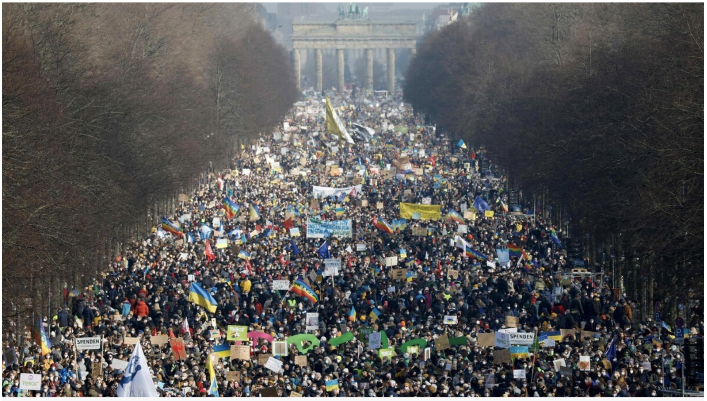
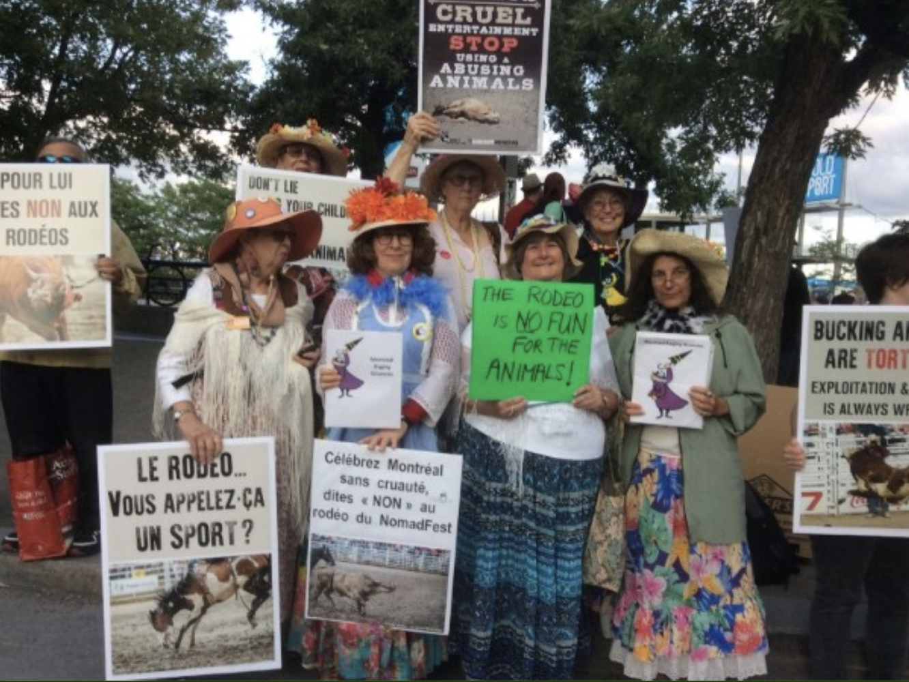
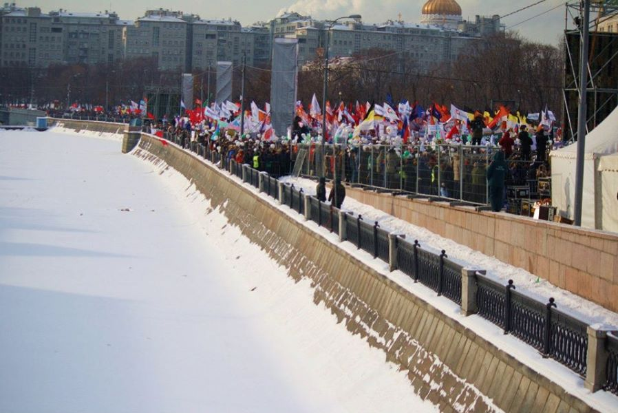
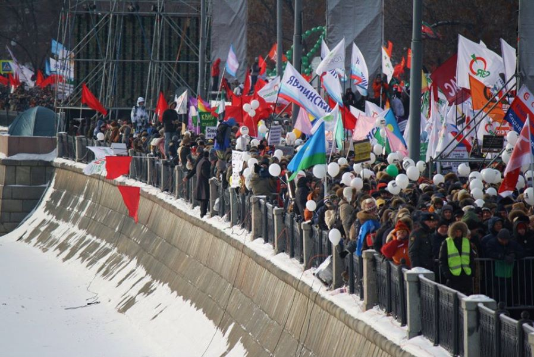
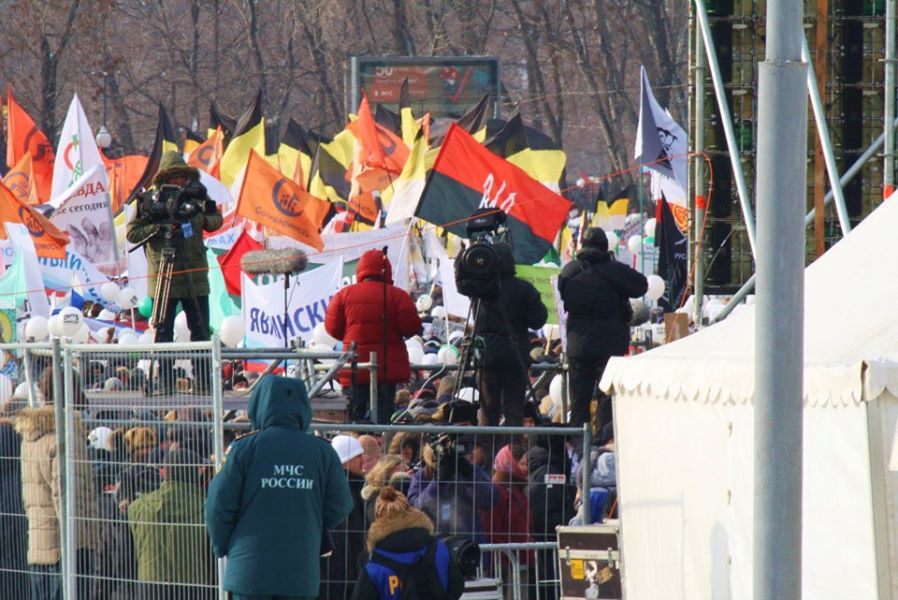
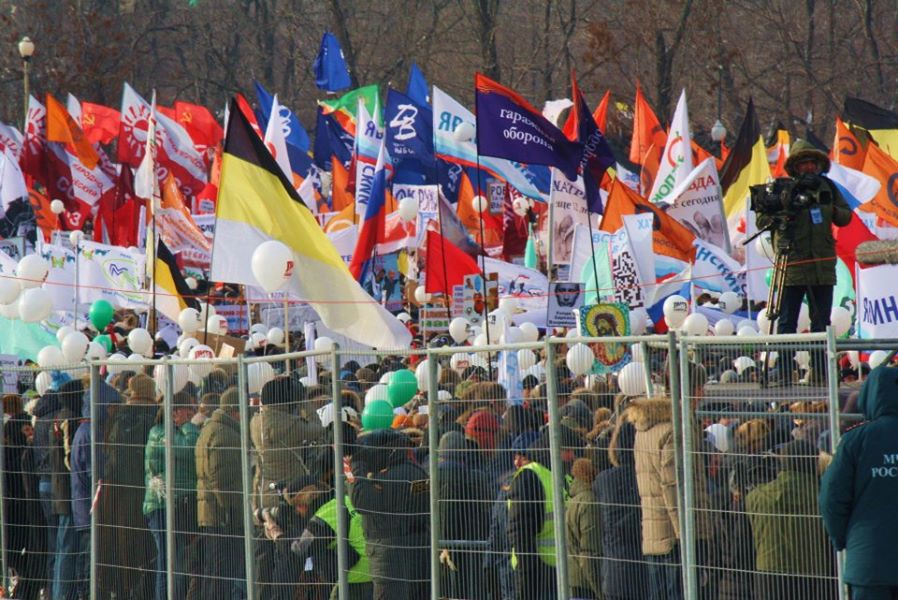
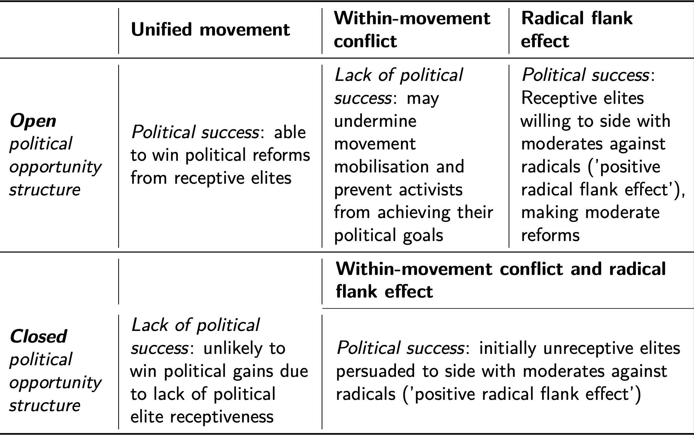

# Opening notes {background-color="#2c844c"}

::: {.tenor-gif-embed data-postid="14209777" data-share-method="host" data-aspect-ratio="1.94" data-width="70%"}
<div class="tenor-gif-embed" data-postid="14209777" data-share-method="host" data-aspect-ratio="1.94" data-width="100%"><a href="https://tenor.com/view/open-gif-14209777">Open Sticker</a>from <a href="https://tenor.com/search/open-stickers">Open Stickers</a></div> <script type="text/javascript" async src="https://tenor.com/embed.js"></script> 
:::

```{=html}
<script type="text/javascript" async src="https://tenor.com/embed.js"></script>
```

## Presentation groups

<!-- ::: panel-tabset -->
<!-- ## December -->

| Date    | Presenters                       | Method |
| -------:|:---------------------------------|:------:|
| 4 Dec:  | Daichi, Seongyeon, Jehyun        | TBD    | 
| 18 Dec: | Ayla, Tara, Theresa, Annabelle   | TBD    | 
| 15 Jan: | Luna, Emilene, Raffa             | TBD    | 

: Presentations line-up

<!-- | 11 Dec: |                                  | TBD    |  -->


<!-- ## January -->

<!-- | Date    | Presenters                       | Method | -->
<!-- | -------:|:---------------------------------|:------:| -->
<!-- | 15 Jan: | Luna, Emilene, Raffa             | TBD    |  -->

<!-- : Presentations line-up -->

<!-- | 8 Jan:  |                                  | TBD    |  -->
<!-- | 22 Jan: |                                  | TBD    |  -->
<!-- | 29 Jan: |                                  | TBD    |  -->

<!-- ::: -->

<!-- []{style="font-size:10px;"} -->

<!-- For a course on 'social movements' and a class on 'social movement coalitions', can you suggest some discussion questions to ask students? Ideally, the questions should have multiple choice responses, or yes/no/maybe responses, or strongly agree/agree/disagree/strongly disagree responses? -->

# Poll: SM coalitions opening questions {background-color="#2c844c"}

:::: {.columns}
:::{.column width="35%"}
{fig-alt="A QR code for the survey."}

:::

::: {.column width="65%" .center}
<!-- go to <https://www.qr-code-generator.com/>, add the link, and screen shot the QR code -->
Take the survey at **<https://forms.gle/qmXcNdhWNN3eNNPC8>**

- are coalitions helpful to achieve goals?
- short-term, limited coalitions more likely to achieve goals?
- factor most important in facilitating coalition formation?

:::
:::: 

- most important benefit for a movement in forming a coalition?
- identity-based movements struggle more to form coalitions?


<!-- - generally, coalitions with other movements/organisations are helpful to achieve goals -->
<!--     + strongly agree, agree, neutral, disagree, strongly disagree -->

<!-- - Temporary coalitions formed to address specific issues/events (e.g., election campaigns) are more likely to achieve quick, tangible outcomes than long-term coalitions focused on broader goals -->
<!--     + strongly agree, agree, neutral, disagree, strongly disagree -->

<!-- - what factor do you think is most important in facilitating coalition formation between two movements -->
<!--     + social ties, organisational structures, compatible ideologies, shared threats/opportunities, other -->

<!-- - What do you think is the most important benefit for a movement of forming a coalition? -->
<!--     + more resources, broader inclusion, more media attention, more political influence, other -->

<!-- - identity-based movements (e.g., Black Lives Matter, LGBTQ+ rights) often struggle to find common ground with more universal movements (e.g., environmentalism, anti-austerity). -->
<!--     + strongly agree, agree, neutral, disagree, strongly disagree -->


--- 

```{ojs}
md`## Poll results (Respondents: ${respondentCount})`
```


```{ojs}

import { liveGoogleSheet } from "@jimjamslam/live-google-sheet";
import { aq, op } from "@uwdata/arquero";

// UPDATE THE LINK FOR A NEW POLL
surveyResults = liveGoogleSheet(
  "https://docs.google.com/spreadsheets/d/e/" +
    "2PACX-1vSRrm-ab4dEZFOsXW186NEQVq8lVRTNif4EMM89t5v1p025myMQQUhw1XqyyKfi75ar-_WLv2zIQz7M/" +
    "pub?gid=1902471768&single=true&output=csv",
  10000, 1, 6); // adjust the last number to select all relevant columns 

respondentCount = surveyResults.length;

```


:::: {.columns}
:::{.column width="50%"}

Are coalitions helpful to achieve goals?

```{ojs}
helpfulCounts = aq.from(surveyResults)
  .select("helpful")
  .groupby("helpful")
  .count()
  .derive({ measure: d => "" })

// Calculate the maximum count from your dataset
helpful_maxCountRE = Math.max(...helpfulCounts.objects().map(d => d.count));

plot_helpful = Plot.plot({
  marks: [
    Plot.barY(helpfulCounts, {
      x: "helpful",
      y: "count",
      fill: "helpful",
      stroke: "black",
      strokeWidth: 1
    }),
    Plot.ruleY([respondentCount], { stroke: "#ffffff99" })
  ],
  color: {
    domain: [
      "Strongly disagree",
      "Disagree",
      "Neutral",
      "Agree",
      "Strongly agree"
    ],
    range: [
      "red",
      "pink",
      "lightgrey",
      "lightgreen",
      "forestgreen"
    ]
  },
  marginBottom: 180,
  x: { label: "", tickSize: 2, tickRotate: -45,
    domain: ["Strongly disagree", "Disagree", "Neutral", "Agree", "Strongly agree"]
  },  
  y: {
    label: "",
    tickSize: 10,
    tickFormat: d => d,
    tickValues: Array.from(
      new Set(helpfulCounts.objects().map(d => d.count))
    ).sort((a, b) => a - b),
    domain: [0, helpful_maxCountRE]
  },
  facet: { data: helpfulCounts, x: "measure", label: "" },
  marginLeft: 140,
  style: {
    width: 1350,
    height: 500,
    fontSize: 30,
  }
});

```

:::

::: {.column width="50%"}

[What are the advantages and disadvantages for movements of forming a coalition/collaborating with other actors?]{style="color:indigo;"}

:::
::::

## Poll results - why coalition

:::: {.columns}
:::{.column width="50%"}

short-term, limited coalitions more likely to achieve goals?

```{ojs}
temporaryCounts = aq.from(surveyResults)
  .select("temporary")
  .groupby("temporary")
  .count()
  .derive({ measure: d => "" })

// Calculate the maximum count from your dataset
temporary_maxCountRE = Math.max(...temporaryCounts.objects().map(d => d.count));

plot_temporary = Plot.plot({
  marks: [
    Plot.barY(temporaryCounts, {
      x: "temporary",
      y: "count",
      fill: "temporary",
      stroke: "black",
      strokeWidth: 1
    }),
    Plot.ruleY([respondentCount], { stroke: "#ffffff99" })
  ],
  color: {
    domain: [
      "Strongly disagree",
      "Disagree",
      "Neutral",
      "Agree",
      "Strongly agree"
    ],
    range: [
      "red",
      "pink",
      "lightgrey",
      "lightgreen",
      "forestgreen"
    ]
  },
  marginBottom: 180,
  x: { label: "", tickSize: 2, tickRotate: -45,
    domain: ["Strongly disagree", "Disagree", "Neutral", "Agree", "Strongly agree"]
  },  
  y: {
    label: "",
    tickSize: 10,
    tickFormat: d => d,
    tickValues: Array.from(
      new Set(temporaryCounts.objects().map(d => d.count))
    ).sort((a, b) => a - b),
    domain: [0, temporary_maxCountRE]
  },
  facet: { data: temporaryCounts, x: "measure", label: "" },
  marginLeft: 140,
  style: {
    width: 1350,
    height: 500,
    fontSize: 30,
  }
});

```

:::

::: {.column width="50%"}
 
most important benefit for a movement in forming a coalition?

```{ojs}
benefitCounts = aq.from(surveyResults)
  .select("benefit")
  .groupby("benefit")
  .count()
  .derive({ measure: d => "" })

// Calculate the maximum count from your dataset
benefit_maxCountRE = Math.max(...benefitCounts.objects().map(d => d.count));

plot_benefit = Plot.plot({
  marks: [
    Plot.barY(benefitCounts, {
      x: "benefit",
      y: "count",
      fill: "benefit",
      stroke: "black",
      strokeWidth: 1
    }),
    Plot.ruleY([respondentCount], { stroke: "#ffffff99" })
  ],
  color: {
    domain: [
      "more resources", 
      "broader inclusion", 
      "more media attention", 
      "more political influence", 
      "other"
    ],
    range: [
      "goldenrod",
      "cadetblue",
      "darkorange",
      "forestgreen",
      "violet"
    ]
  },
  marginBottom: 400,
  x: { label: "", tickSize: 2, tickRotate: -40, padding: 0.2,
    domain: ["more resources", "broader inclusion", "more media attention", "more political influence", "other"]
  },  
  y: {
    label: "",
    tickSize: 10,
    tickFormat: d => d,
    tickValues: Array.from(
      new Set(benefitCounts.objects().map(d => d.count))
    ).sort((a, b) => a - b),
    domain: [0, benefit_maxCountRE]
  },
  facet: { data: benefitCounts, x: "measure", label: "" },
  marginLeft: 60,
  style: {
    width: 1600,
    height: 500,
    fontSize: 40,
  },
});

```

:::
::::

## Poll results - coalition how

::: {style="text-align: center;"}
**[What factors enable/hinder coalition formation?]{style="color:indigo; font-size:90px;"}** 
:::

## Poll results - coalition how

:::: {.columns}
:::{.column width="50%"}

factor most important in facilitating coalition formation?

```{ojs}
facilitatingCounts = aq.from(surveyResults)
  .select("facilitating")
  .groupby("facilitating")
  .count()
  .derive({ measure: d => "" })

// Calculate the maximum count from your dataset
facilitating_maxCountRE = Math.max(...facilitatingCounts.objects().map(d => d.count));

plot_facilitating = Plot.plot({
  marks: [
    Plot.barY(facilitatingCounts, {
      x: "facilitating",
      y: "count",
      fill: "facilitating",
      stroke: "black",
      strokeWidth: 1
    }),
    Plot.ruleY([respondentCount], { stroke: "#ffffff99" })
  ],
  color: {
    domain: [
      "social ties", 
      "organisational structures", 
      "compatible ideologies", 
      "shared threats/opportunities", 
      "other"
    ],
    range: [
      "red",
      "goldenrod",
      "green",
      "orange",
      "gray"
    ]
  },
  marginBottom: 400,
  x: { label: "", tickSize: 2, tickRotate: -40, padding: 0.2,
    domain: ["social ties", "organisational structures", "compatible ideologies", "shared threats/opportunities", "other"]
  },  
  y: {
    label: "",
    tickSize: 10,
    tickFormat: d => d,
    tickValues: Array.from(
      new Set(facilitatingCounts.objects().map(d => d.count))
    ).sort((a, b) => a - b),
    domain: [0, facilitating_maxCountRE]
  },
  facet: { data: facilitatingCounts, x: "measure", label: "" },
  marginLeft: 60,
  style: {
    width: 1600,
    height: 500,
    fontSize: 40,
  },
});

```

:::

::: {.column width="50%"}

identity-based movements struggle more to form coalitions?

```{ojs}
identityCounts = aq.from(surveyResults)
  .select("identity")
  .groupby("identity")
  .count()
  .derive({ measure: d => "" })

// Calculate the maximum count from your dataset
identity_maxCountRE = Math.max(...identityCounts.objects().map(d => d.count));

plot_identity = Plot.plot({
  marks: [
    Plot.barY(identityCounts, {
      x: "identity",
      y: "count",
      fill: "identity",
      stroke: "black",
      strokeWidth: 1
    }),
    Plot.ruleY([respondentCount], { stroke: "#ffffff99" })
  ],
  color: {
    domain: [
      "Strongly disagree",
      "Disagree",
      "Neutral",
      "Agree",
      "Strongly agree"
    ],
    range: [
      "red",
      "pink",
      "lightgrey",
      "lightgreen",
      "forestgreen"
    ]
  },
  marginBottom: 180,
  x: { label: "", tickSize: 2, tickRotate: -45,
    domain: ["Strongly disagree", "Disagree", "Neutral", "Agree", "Strongly agree"]
  },  
  y: {
    label: "",
    tickSize: 10,
    tickFormat: d => d,
    tickValues: Array.from(
      new Set(identityCounts.objects().map(d => d.count))
    ).sort((a, b) => a - b),
    domain: [0, identity_maxCountRE]
  },
  facet: { data: identityCounts, x: "measure", label: "" },
  marginLeft: 140,
  style: {
    width: 1350,
    height: 500,
    fontSize: 30,
  }
});

```

:::
::::

# Movement coalitions {background-color="#2c844c"}

:::: {.columns}
:::{.column width="50%"}
- why make coalitions
- types of coalitions 
- coalition formation 
    + key factors 
        * intra-/inter-organisational
    + examples: Memorial-Sakharov Centre; Raging Grannies 
    + context (opportunities and threats) 
- risks and outcomes

:::

::: {.column width="50%" .right}
<div class="tenor-gif-embed" data-postid="13637117" data-share-method="host" data-aspect-ratio="1" data-width="100%"><a href="https://tenor.com/view/parks-and-rec-april-moon-gif-13637117">Parks And GIF</a>from <a href="https://tenor.com/search/parks-gifs">Parks GIFs</a></div> <script type="text/javascript" async src="https://tenor.com/embed.js"></script> 

:::
::::

## Why movements make coalitions 

[Coalitions]{style="color:darkred;"}... 

. . . 

- help build/enhance [networks]{style="color:darkred;"}

. . . 

- increase [resource]{style="color:darkred;"} availability 
    + boost [mobilisation]{style="color:darkred;"} potential (again, networks) 

. . . 

- expand [tactical repertoires]{style="color:darkred;"} 

## Types of coalitions 

Some coalitions may be [enduring]{style="color:cadetblue;"}; others may be [event coalitions]{style="color:violet;"}

. . . 

::: {.r-stack}



:::

## Types of coalitions 

Some coalitions may be [enduring]{style="color:teal;"}; others may be [event coalitions]{style="color:violet;"}

::: {.r-stack}


**[Peace protest, Berlin, 2022-02-27]{style="color:goldenrod; font-size:115px;"}**

:::

## Coalition formation 

@vandyke2017SocialMovementCoalitions identify five factors critical to coalition formation: 

1. **[social ties]{style="color:red;"}** - connections between organisations

. . . 

2. **[conducive organizational structures]{style="color:goldenrod;"}** - structures that enable collaboration

. . . 

3. **[ideology, culture, and identity]{style="color:green;"}** - shared ideas

. . . 

4. **[institutional environment]{style="color:orange;"}** - opportunities and threats

. . . 

5. **[resources]{style="color:violet;"}** - pooling resources or competing

## Coalition formation - intra-/inter-organisational factors

- '**[exclusive affiliations]{style="color:red;"}**' orgs. or '**[multiple affiliations]{style="color:red;"}**' orgs.
    + individuals with (other) [social ties]{style="color:red;"}: '**[coalition brokers]{style="color:cadetblue;"}**' or '**[bridge builders]{style="color:cadetblue;"}**'
- broad/multi-issue organisational goals = [more likely to form coalition]{style="color:darkorange;"} [e.g., @Borland2008]
    + fits with our discussion of framing (e.g., *[bridging frames]{style="color:darkred;"}*)
- **strong organisation** (e.g., division of labour, professional leaders) = [more likely to form coalition]{style="color:darkorange;"}
    + e.g., well organised movements can send representatives to others' meetings [@Borland2008]
    + non-hierarchical or loose organisations will struggle (e.g., OWS)
    + fits with discussion of orgs. in social media age [@Tufekci2017]

## Coalition formation - intra-/inter-organisational factors

:::: {.columns}
:::{.column width="35%"}


:::

::: {.column width="65%" .center}

- commonalities and connections between organisations
    + '[plentiful resources and congruent ideologies]{style="color:darkorange;"}' [-@McCammon2015] 
    + overlapping [collective identities]{style="color:darkred;"} (e.g., Memorial and Sakharov Centre)
- ideological compatibility (a [necessary]{style="color:red;"} condition?)
    + [splits within movement]{style="color:cadetblue;"} (e.g., TERF vs. inclusive feminist groups) by 'minor' differences
    + [others accommodate]{style="color:cadetblue;"} ...

:::
:::: 

## Coalition formation - intra-/inter-organisational factors

:::: {.columns}
:::{.column width="55%"}



:::

::: {.column width="45%"}

[others accommodate]{style="color:cadetblue;"}, e.g., Raging Grannies: a rowdy aging women's group in Canada that tempered its [strategies]{style="color:darkred;"} to [facilitate collaboration]{style="color:red;"} with indigenous environmental allies, creating space for indigenous activists at their gatherings, adopting mainstream dress, lending resources to Indigenous protests, and initiating action to ameliorate colonial abuses (Chazan 2016)

:::
:::: 

## Coalition formation - external social and political conditions

- related to **[opportunity structures]{style="color:darkred;"}**
   + [opportunities]{style="color:darkred;"} - *general or specific openings for mobilisation or movement activism*
      * e.g., northern Ireland civil rights groups found international partners in late 1960s partly due to generally high social mobilisation --- access to others'/more/shared resources
   + [threats]{style="color:darkred;"}: 
      * e.g., government repression often drives organisations to collaborate (e.g., For Fair Elections movement in Russia)


## Coalition formed amid government repression

For Fair Elections (Russia, 2011-2012) - **strange bedfellows**

::: {.r-stack}
{.fragment .absolute top=120 left=0 height="300"}

{.fragment .absolute bottom=0 left=15 height="300"}

{.fragment .absolute top=120 right=10 height="300"}

{.fragment .absolute bottom=0 right=15 height="300"}

:::

## Coalition formation - external social and political conditions 

- related to **[opportunity structures]{style="color:darkred;"}**
    + *institutional arrangements*: 
        * Obach (2010) suggests that U.S. governmental separation of labor and environmental protection into two separate policy arenas inhibits collaboration of labor and environmental groups even when issues are of interest to both.

- **[Free space]{style="color:cadetblue;"}** facilitates the organization of coalitions: 

> settings within a community or movement that are removed from the direct control of dominant groups, are voluntarily participated in, and generate the cultural challenge that precedes or accompanies political mobilization” (Polletta, 1999: 1).

## Coalition formation - summary and 'potential' 

```{r}
library(kableExtra)
library(tidyr)

table_data <- tribble(
  ~Grouping, ~Factors, ~Details,
  "Intra-org", "exclusive vs. multiple affiliations", "any bridging social ties?",
  "Intra-org", "broad organisational goals", "e.g., bridging frames",
  "Intra-org", "strong organisation", "division (and availability) of labour, professional leaders, (at least some) hierarchy",
  
  "Inter-org", "commonalities", "available resources, overlapping collective identities",
  "Inter-org", "ideological compatibility", "factions vs. willingness to accommodate",
  
  "Opportunity structure", "opportunities", "free space",
  "Opportunity structure", "threats", "",
  "Opportunity structure", "institutional arrangements", ""
)

table_data[2,3] <- cell_spec(table_data[2,3], color="darkred", bold=T)
table_data[6,1] <- cell_spec(table_data[6,1], color="darkred", bold=T)
table_data[6,2] <- cell_spec(table_data[6,2], color="darkred", bold=T)
table_data[7,2] <- cell_spec(table_data[7,2], color="darkred", bold=T)

kable(table_data, "html", escape = FALSE, 
      col.names = c("Grouping", "Factors", "")) %>%
  kable_styling(font_size = 25) %>% collapse_rows(columns = 1, valign = "top") %>% 
  column_spec(1, width = "3.5cm") %>% 
  column_spec(2, width = "9.5cm") 

```

. . . 

::: {style="text-align: center;"}
**[What's the [coalition potential]{style="color:forestgreen;"} of movement cases you know of? Have they formed _enduring_ and/or _event_ coalitions?]{style="color:indigo; font-size:35px;"}** 
:::

<!-- \begin{table} -->
<!--   \footnotesize -->
<!-- 	\addtolength{\leftskip}{-1cm} -->
<!-- 	\addtolength{\rightskip}{-1cm} -->
<!-- {\begin{tabular}{L{2cm}|L{4.5cm}|L{4.5cm}} \toprule -->
<!-- \textbf{Grouping} & \textbf{Factors} &  \\ \midrule -->
<!-- \textit{Intra-org} & \textbf{exclusive} vs. \textbf{multiple} affiliations & any bridging social ties? \\ \cmidrule{2-3} -->
<!--  & \textbf{broad organisational goals} & e.g., bridging frames \\ \cmidrule{2-3} -->
<!--  & \textbf{strong organisation} & division (and availability) of labour, professional leaders, (at least some) hierarchy \\ \midrule -->
<!-- \textit{Inter-org} & \textbf{commonalities} & available resources, overlapping collective identities \\ \cmidrule{2-3} -->
<!--  & \textbf{ideological compatibility} & tensions of \textit{factions} vs. \textit{willingness to accommodate} \\ \midrule -->
<!-- \textit{Opportunity structure} & \textbf{opportunities} & incl. \textit{free space} \\ \cmidrule{2-3} -->
<!--  & \textbf{threats} & \\ \cmidrule{2-3} -->
<!--  & \textbf{institutional arrangements} & \\  \bottomrule -->
<!-- \end{tabular}} -->
<!-- \end{table} -->

## Risks of coalition formation

- where there is *disparity*/*imbalance*...
    + **resource-rich** organisations may try to control **resource-poor** partner organisations

<!-- ## longevity and success -->

<!-- “the factors that specifically shape coalition outcomes include the form or activity of coalitions, as well as the institutional location and structure of their targets.” ([Van Dyke and Amos, 2017, p. 10](zotero://select/library/items/Q7794396)) ([pdf](zotero://open-pdf/library/items/MVVUSIPF?page=10&annotation=84Q57NLA)) -->

<!-- “when coalition partners used a division of labor, with one organization taking the lead on planning and others focused on mobilization, they were able to mobilize more participants for protest.” ([Van Dyke and Amos, 2017, p. 10](zotero://select/library/items/Q7794396)) ([pdf](zotero://open-pdf/library/items/MVVUSIPF?page=10&annotation=SC5QS4CP)) -->

## Coalitions and movement outcomes [-@McCammon2015]

**[radical flank effects]{style="color:darkred;"}** - dynamics between (relatively) moderate and (relatively) radical parts of a movement and their target(s)

. . . 

- **[positive]{style="color:red;"} radical flank effect** - activity of radical part of movement compels target/authorities to accept moderate demands 
    + e.g., Martin Luther King Jr. and moderate NAACP made more appealing to U.S. (federal) government by presence of black nationalists and Malcolm X
- **[negative]{style="color:red;"} radical flank effect** - activity of radical part of movement spooks potential elite allies
    + e.g., U.S. peace/student movement (late 1960s and 1970s) dominated by (radical) Youth International Party ('Yippies', Abby Hoffman and Jerry Rubin) more than (moderate) Students for a Democratic Society (SDS, Tom Hayden)

## Radical flanks and (non/violent) tactics [@Chenoweth2011]

Pay attention to the mechanisms that Prof. Chenoweth specifies in her brief explanation

<!-- Aspect ratios include 1x1, 4x3, 16x9 (the default), and 21x9. -->
<!-- aspect-ratio="21x9"  -->


## Radical flanks and (non/violent) tactics [@Chenoweth2011]

Pay attention to the mechanisms that Prof. Chenoweth specifies in her brief explanation

- nonviolent campaigns are better at eliciting broad and diverse support
- nonviolent campaigns create more defections among the opposition
- nonviolent campaigns have a broader set of tactics at their disposal
- nonviolent campaigns often maintain discipline even in the face of escalating oppression

<!-- These *intra-movement* dynamics play out in interaction with *opportunity structure* -->

## Coalitions and movement outcomes [-@McCammon2015] 



<!-- \begin{table} -->
<!--   \small -->
<!-- 	\addtolength{\leftskip}{-1cm} -->
<!-- 	\addtolength{\rightskip}{-1cm} -->
<!-- {\begin{tabular}{L{1.8cm}|L{3.3cm}|L{3cm}|L{3cm}} \toprule -->
<!--  & \textbf{Unified movement} & \textbf{Within-movement conflict} & \textbf{Radical flank effect} \\ \midrule -->
<!-- \textit{\textbf{Open} political opportunity structure} & \textit{Political success}: able to win political reforms from receptive elites & \textit{Lack of political success}: may undermine movement mobilisation and prevent activists from achieving their political goals & \textit{Political success}: Receptive elites willing to side with moderates against radicals ('positive radical flank effect'), making moderate reforms \\ \midrule -->
<!--  &  & \multicolumn{2}{L{6.4cm}}{\textbf{Within-movement conflict and radical flank effect}} \\ \cmidrule{3-4} -->
<!-- \textit{\textbf{Closed} political opportunity structure} & \textit{Lack of political success}: unlikely to win political gains due to lack of political elite receptiveness & \multicolumn{2}{L{6.4cm}}{\textit{Political success}: initially unreceptive elites persuaded to side with moderates against radicals ('positive radical flank effect')} \\ \bottomrule -->
<!-- \end{tabular}} -->
<!-- \end{table} -->


# Coalitions between parties and movements {background-color="#2c844c"}

:::: {.columns}
:::{.column width="50%"}
- @HeinzeWeisskricher2022
    + research questions
    + types of party responses 
    + findings 
- further questions 

:::

::: {.column width="50%" .right}
<div class="tenor-gif-embed" data-postid="13873405" data-share-method="host" data-aspect-ratio="1.77778" data-width="100%"><a href="https://tenor.com/view/do-you-want-to-form-an-alliance-with-me-alliance-the-office-jim-halpert-gif-13873405">Do You Want To Form An Alliance With Me GIF</a>from <a href="https://tenor.com/search/do+you+want+to+form+an+alliance-gifs">Do You Want To Form An Alliance GIFs</a></div> <script type="text/javascript" async src="https://tenor.com/embed.js"></script> 

:::
::::

## @HeinzeWeisskricher2022 - RQ

::: {style="text-align: center;"}
**[How have German political parties responded to anti-Corona street protests?]{style="font-size:50px;"}** 
:::

::: {style="text-align: center;"}
**[What do you recall from the height of the pandemic? How did parties (in Germany and elsewhere) respond to mobilisation?]{style="color:indigo; font-size:50px;"}** 
:::

<!-- [coalition potential]{style="color:forestgreen;"}  -->

## Types of party responses

@Heinze2018 on **party reactions** to radical **parties** (somewhat compelled to react): 

:::: {.columns}
:::{.column width="50%"}
**Disengage**  

(1) ignore 
(2) legal restrictions 
(3) cordon sanitaire (blocking coalitions)
(4) demonise 
(5) defuse 
(6) hold 

:::

::: {.column width="50%"}
**Engage**   

(7) adopt (co-opt) policies   
(8) collaborate (executive, legislative, electoral) [national, regional, local -- e.g., cooperation with AfD at lower levels]

:::
::::

```{r}
#| eval: false
#| include: false
table_data_2 <- tribble(
  ~Disengage, ~Engage,
  "(1) ignore", "(7) adopt (co-opt) policies",
  "(2) legal restrictions", "(8) collaborate (executive, legislative, electoral) [national, regional, local -- e.g., cooperation with AfD at lower levels]",
  "(3) cordon sanitaire (blocking coalitions)", "",
  "(4) demonise", "",
  "(5) defuse", "",
  "(6) hold", ""
)

kable(table_data_2, "html", escape = FALSE,
      col.names = c("Disengage", "Engage")) %>%
  kable_minimal(full_width = FALSE, font_size = 25) %>%
  row_spec(1:6, color = "white", background = "black") # %>% 
  # column_spec(1, width = "25em") %>%
  # column_spec(2, width = "25em")
```


<!-- \begin{table}[] -->
<!-- \hspace*{-4mm}\makebox[\linewidth][l]{% -->
<!-- \begin{tabular}{p{5.5cm}|p{5.5cm}} -->
<!-- \textbf{Disengage} & \textbf{Engage} \\ \hline -->
<!-- (1) ignore & (7) adopt (co-opt) policies \\ -->
<!-- (2) legal restrictions & (8) collaborate (executive, \\ -->
<!-- (3) cordon sanitaire (blocking coalitions) & legislative, electoral) [national, regional, local -- e.g., cooperation \\ -->
<!-- (4) demonise & with AfD at lower levels] \\ -->
<!-- (5) defuse & \\ -->
<!-- (6) hold & \\ \bottomrule -->
<!-- \end{tabular} -->
<!-- } -->
<!-- \end{table} -->

## Types of party responses

@HeinzeWeisskricher2022 on **party responses** to **movements** (not necessarily compelled to react):

- **[dismissive]{style="color:darkred;"}**: ignore or disregard the movement
- **[accommodative]{style="color:darkred;"}**: legitimate or even collaborate with the movement
- **[adversarial]{style="color:darkred;"}**: oppose/challenge the movement

## Heinze and Weisskricher [-@HeinzeWeisskricher2022] - response options

```{r, echo=FALSE, message=FALSE, warning=FALSE, engine = 'tikz'}

\begin{tikzpicture}[node distance=2.5cm]

\tikzstyle{BOX} = [rectangle, rounded corners, minimum width=2cm, minimum height=0.5cm,text centered, text width=2cm, draw=black, fill=red!30]
\tikzstyle{RECT} = [rectangle, minimum width=1cm, minimum height=0.5cm, text centered, text width=2cm, draw=black, fill=orange!30]
\tikzstyle{arrow} = [thick,->,>=stealth]

\node(formal)[] {formal};
\node(exclusion)[below of=formal, yshift=2.1cm] {exclusion};
\node (LR) [BOX, below of=exclusion, yshift=1.5cm] {legal \linebreak restrictions};
\node (CP) [BOX, right of=LR] {counter- \linebreak protest};
\node (T) [BOX, right of=CP] {toleration};
\node (C) [BOX, right of=T, xshift=2cm] {cooperation};
\node(formal2)[right of=formal, xshift=7cm] {formal};
\node(inclusion)[right of=exclusion, xshift=7cm] {inclusion};

\draw[line width=0.5mm] (LR) to (CP);
\draw[line width=0.5mm] (CP) to (T);
\draw[line width=0.5mm] (T) to (C);

\node (A) [RECT, above of=T, xshift=1.25cm, yshift=-0.5cm] {adopt};
\node (DEB) [RECT, below of=A, yshift=1.5cm] {debate};
\node (DEF) [RECT, below of=DEB, yshift=0.5cm] {defuse};
\node (DEM) [RECT, below of=DEF, yshift=1.5cm] {demonise};
\node (I) [RECT, below of=DEM, yshift=1.5cm] {ignore};
\node(se1)[above of=A, yshift=-1.7cm] {substantive};
\node(se2)[above of=A, yshift=-1.3cm] {engagement};
\node(sd1)[below of=I, yshift=1.8cm] {substantive};
\node(sd2)[below of=I, yshift=1.4cm] {disengagement};

\draw[line width=0.5mm] (A) to (DEB);
\draw[line width=0.5mm] (DEB) to (DEF);
\draw[line width=0.5mm] (DEF) to (DEM);
\draw[line width=0.5mm] (DEM) to (I);

\node(examples)[below of=CP, xshift=-1cm, yshift=1cm] {\Large \underline{\textbf{\textcolor{red}{examples for these}?}}};
\node(thoughts)[below of=examples, yshift=1.5cm] {\textbf{\textcolor{purple}{what do you think of this typology?}}};

\end{tikzpicture}

```

## Heinze and Weisskricher [-@HeinzeWeisskricher2022] - response options

```{r}
table_data_4 <- tribble(
  ~Level, ~Action, ~Description,
  "Formal level", "legal restrictions", "most exclusionary possibility: e.g., bans, forced dissolution, event restrictions",
  "Formal level", "counterprotest", "parties can mobilise counterdemonstrations against pariah protest",
  "Formal level", "tolerate", "neutral acceptance of the right to protest, even for those that are regarded as pariahs; passive option",
  "Formal level", "cooperate", "act cooperatively with protest group; mobilise support base",
  
  "Substantive level", "ignore", "disregard, refuse to comment on protest",
  "Substantive level", "demonise", "portray the actor as extreme, dangerous, irrational, or beyond the pale",
  "Substantive level", "defuse", "downplay protest issue importance, shift public attention to other issue(s)",
  "Substantive level", "debate", "acknowledges the importance of an issue put forward by the protestors, with parties discussing different policy positions",
  "Substantive level", "adopt", "adopting positions from protest arena becomes attractive if party considers the issue particularly relevant for competition, hoping to gain electoral advantage"
)

kable(table_data_4, "html", escape = FALSE,
      col.names = c("Level", "Action", "Description")) %>%
  kable_styling(bootstrap_options = c("striped", "hover", "responsive"), font_size = 23) %>%
  collapse_rows(columns = 1, valign = "top") 

```


<!-- \begin{table} -->
<!--   \footnotesize -->
<!-- 	\addtolength{\leftskip}{-1cm} -->
<!-- 	\addtolength{\rightskip}{-1cm} -->
<!-- {\begin{tabular}{L{1.6cm}|L{1.5cm}|L{8.5cm}} \toprule -->
<!-- \textit{formal level} & legal restrictions & most exclusionary possiblity: e.g., bans, forced dissolution, event restrictions \\ \cmidrule{2-3} -->
<!--  & counterprotest & parties can mobilise counterdemonstrations against pariah protest \\ \cmidrule{2-3} -->
<!--  & tolerate & neutral acceptance of the right to protest, even for those that are regarded as pariahs; passive option \\ \cmidrule{2-3} -->
<!--  & cooperate & act cooperatively with protest group; mobilise support base \\ \midrule -->
<!-- \textit{substantive} & ignore & disregard, refuse to comment on protest \\ \cmidrule{2-3} -->
<!-- \textit{level} & demonise & portray the actor as extreme, dangerous, irrational, or beyond the pale \\ \cmidrule{2-3} -->
<!--  & defuse & downplay protest issue importance, shift public attention to other issue(s) \\ \cmidrule{2-3} -->
<!--  & debate & acknowledges the importance of an issue put forward by the protestors, with parties discussing different policy positions \\ \cmidrule{2-3} -->
<!--  & adopt & adopting positions from protest arena becomes attractive if party consider the issue particularly relevant for competition, hope to gain electoral advantage \\ \bottomrule -->
<!-- \end{tabular}} -->
<!-- \end{table} -->

## Heinze and Weisskricher [-@HeinzeWeisskricher2022] - findings

::: {style="margin-top: -20px;"}
**[Formal level - response to _Querdenken_]{style="color:red;"}**
:::

::: {style="margin-top: -20px;"} 
```{r}
table_data_5 <- tribble(
  ~Party, ~`legal restrictions`, ~counterprotest, ~tolerate, ~cooperate,
  "CDU",    "Yes", "No",  "Yes", "No",
  "SPD",    "Yes", "Yes", "Yes", "No",
  "Greens", "Yes", "Yes", "Yes", "No",
  "Left",   "Yes", "Yes", "Yes", "No",
  "FDP",    "Yes", "No",  "Yes", "No",
  "AfD",    "No",  "No",  "Yes", "Yes"
)

kable(table_data_5, "html", escape = FALSE,
      col.names = c("Party", "Legal Restrictions", "Counterprotest", "Tolerate", "Cooperate")) %>%
  kable_styling(bootstrap_options = c("striped", "hover", "responsive"), font_size = 24) %>%
  column_spec(2, color = "white", bold = T,
              background=ifelse(table_data_5$`legal restrictions`=="Yes", "green", "red")) %>% 
  column_spec(3, color = "white", bold = T,
              background=ifelse(table_data_5$counterprotest=="Yes", "green", "red")) %>% 
  column_spec(4, color = "white", bold = T,
              background=ifelse(table_data_5$tolerate=="Yes", "green", "red")) %>% 
  column_spec(5, color = "white", bold = T,
              background=ifelse(table_data_5$cooperate=="Yes", "green", "red")) %>% 
  row_spec(0, bold = TRUE)
  
```

::: 

::: {style="margin-top: -20px;"}
**[Substantive level - response to _Querdenken_]{style="color:red;"}**
::: 

::: {style="margin-top: -20px;"}
```{r}
table_data_6 <- tribble(
  ~Party,  ~ignore, ~demonise, ~defuse, ~debate, ~adopt,
  "CDU",   "No",    "Yes",     "No",    "Yes",   "No",
  "SPD",   "No",    "Yes",     "No",    "Yes",   "No",
  "Greens","No",    "Yes",     "No",    "Yes",   "No",
  "Left",  "No",    "Yes",     "No",    "Yes",   "No",
  "FDP",   "No",    "Yes",     "No",    "Yes",   "No",
  "AfD",   "No",    "Yes",     "No",    "Yes",   "Yes"
)

kable(table_data_6, "html", escape = FALSE,
      col.names = c("Party", "Ignore", "Demonise", "Defuse", "Debate", "Adopt")) %>%
  kable_styling(bootstrap_options = c("striped", "hover", "responsive"), font_size = 24) %>%
  column_spec(2, color = "white", bold = T,
              background=ifelse(table_data_6$ignore=="Yes", "green", "red")) %>%
  column_spec(3, color = "white", bold = T,
              background=ifelse(table_data_6$demonise=="Yes", "green", "red")) %>%
  column_spec(4, color = "white", bold = T,
              background=ifelse(table_data_6$defuse=="Yes", "green", "red")) %>%
  column_spec(5, color = "white", bold = T,
              background=ifelse(table_data_6$debate=="Yes", "green", "red")) %>%
  column_spec(6, color = "white", bold = T,
              background=ifelse(table_data_6$adopt=="Yes", "green", "red")) %>%
  row_spec(0, bold = TRUE)
```
:::

## Further questions

::: {style="text-align: center;"}
[what about movement responses/approaches __*to*__ parties?]{style="color:indigo; font-size:70px;"}
::: 

(is it as relevant? does it matter? movements are not as *empowered* as parties)

. . . 

::: {style="text-align: center;"}
[is the epitome of social movement 'success' becoming a party?]{style="color:indigo; font-size:70px;"}
::: 

# Any questions, concerns, feedback for this class? {background-color="#2c844c"}

Anonymous feedback here: <https://forms.gle/AjHt6fcnwZxkSg4X8>

Alternatively, please send me an email: [m.zeller\@lmu.de]{style="color:red;"}


```{r echo=FALSE, message=FALSE, warning=FALSE}
pagedown::chrome_print(file.path("..", "docs/slides", "slides_08.html"))
```


## References

Allchorn, William. 2020. “Political Responses to Anti-Islamic Protest: Responses, Rationales and Role Evaluations.” *British Politics 15*: 393–410.

Chazan, M. (2016). Settler solidarities as praxis: Understanding ‘granny activism’ beyond the highly‐visible. *Social Movement Studies, 15*(5), 457–470.

