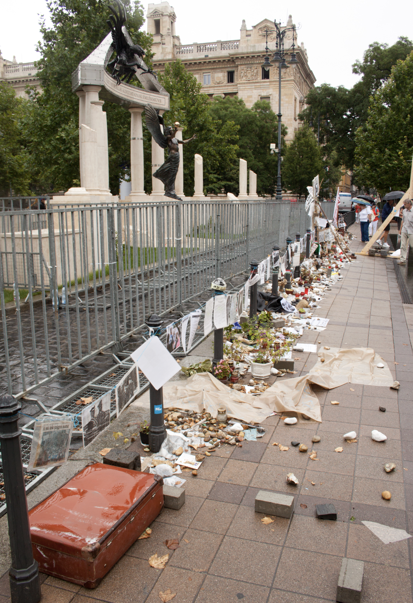
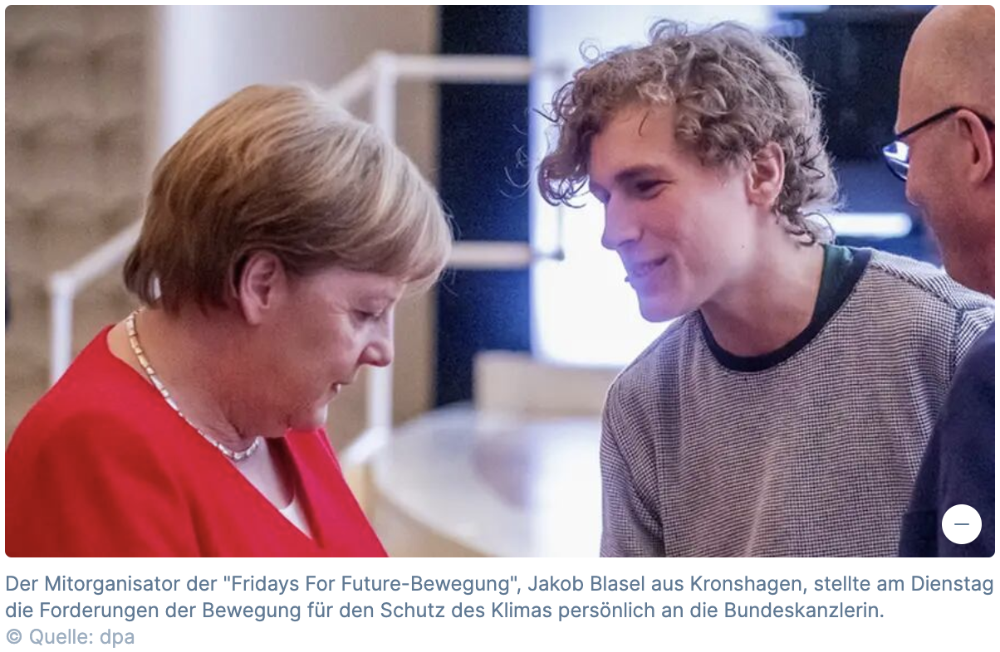
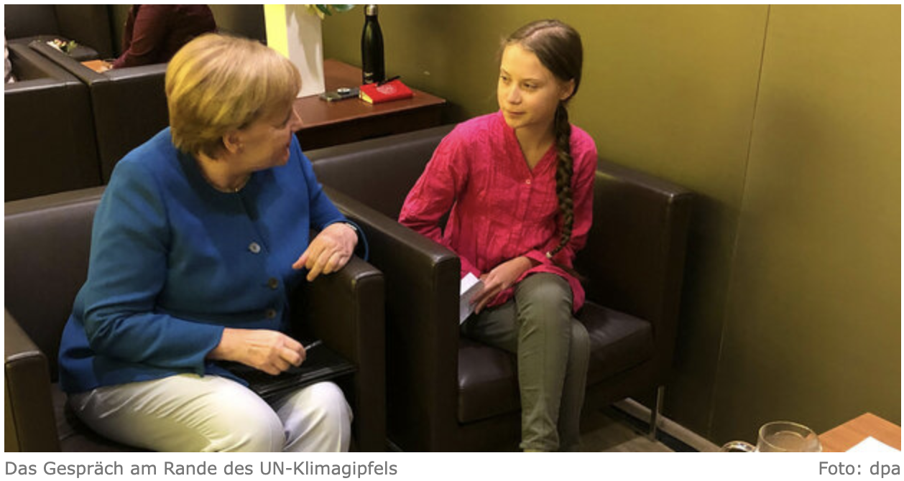
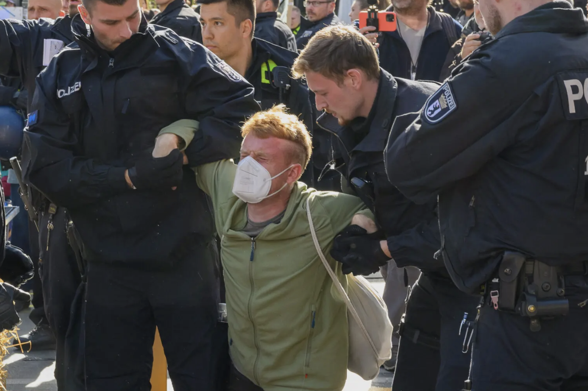
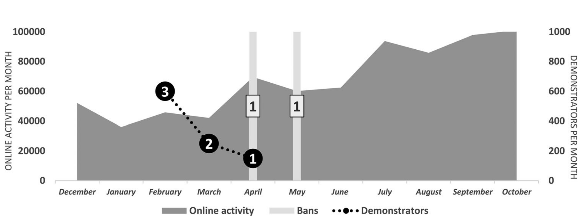
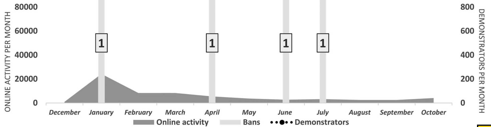
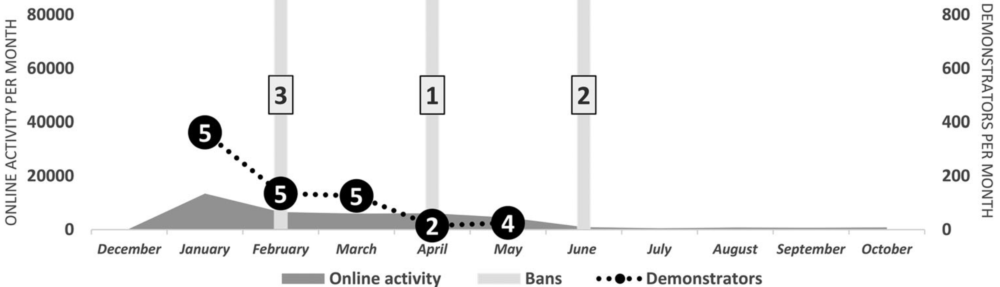
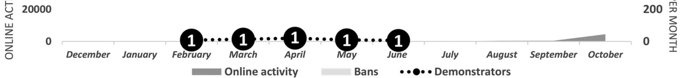
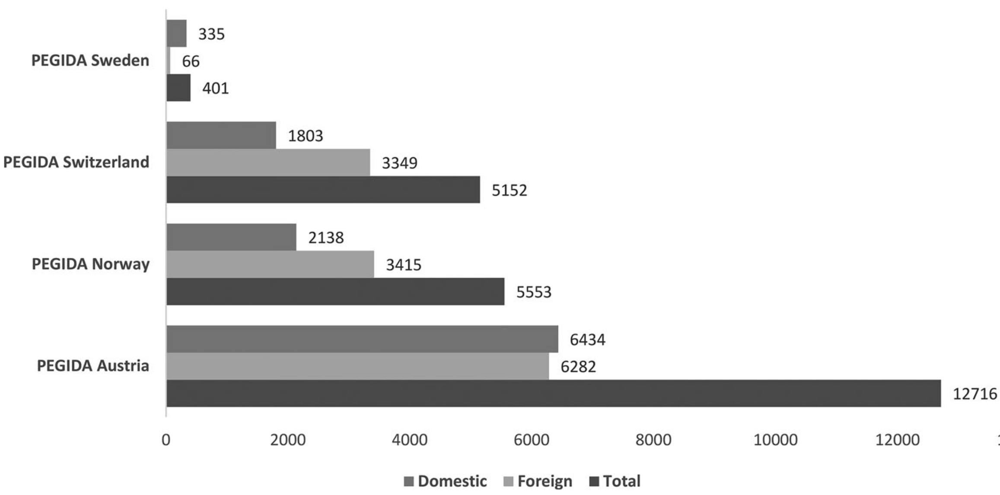
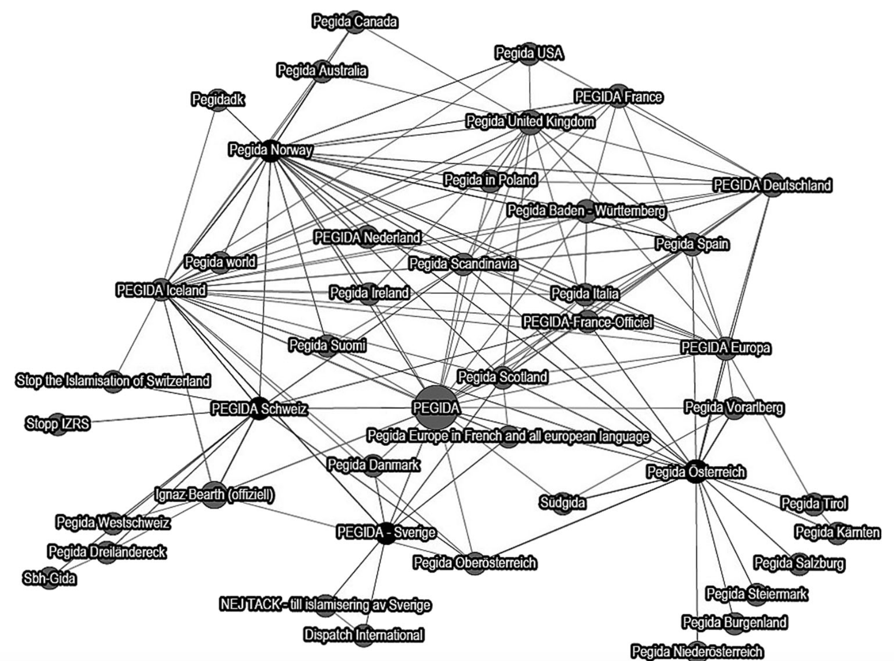

# Opening notes {background-color="#2c844c"}

::: {.tenor-gif-embed data-postid="14209777" data-share-method="host" data-aspect-ratio="1.94" data-width="70%"}
<div class="tenor-gif-embed" data-postid="14209777" data-share-method="host" data-aspect-ratio="1.94" data-width="100%"><a href="https://tenor.com/view/open-gif-14209777">Open Sticker</a>from <a href="https://tenor.com/search/open-stickers">Open Stickers</a></div> <script type="text/javascript" async src="https://tenor.com/embed.js"></script> 
:::

```{=html}
<script type="text/javascript" async src="https://tenor.com/embed.js"></script>
```

## Presentation groups

<!-- ::: panel-tabset -->
<!-- ## December -->

| Date    | Presenters                       | Method |
| -------:|:---------------------------------|:------:|
| 4 Dec:  | Daichi, Seongyeon, Jehyun        | ethnography | 
| 18 Dec: | Ayla, Tara, Theresa, Annabelle   | TBD    | 
| 15 Jan: | Luna, Emilene, Raffa, Sofia      | TBD    | 

: Presentations line-up

<!-- | 11 Dec: |                                  | TBD    |  -->


<!-- ## January -->

<!-- | Date    | Presenters                       | Method | -->
<!-- | -------:|:---------------------------------|:------:| -->
<!-- | 15 Jan: | Luna, Emilene, Raffa             | TBD    |  -->

<!-- : Presentations line-up -->

<!-- | 8 Jan:  |                                  | TBD    |  -->
<!-- | 22 Jan: |                                  | TBD    |  -->
<!-- | 29 Jan: |                                  | TBD    |  -->

<!-- ::: -->

<!-- []{style="font-size:10px;"} -->

<!-- For a course on 'social movements' and a class on 'state responses to social movements', can you suggest some discussion questions to ask students? Ideally, the questions should have multiple choice responses, or yes/no/maybe responses, or strongly agree/agree/disagree/strongly disagree responses? -->

# State responses {background-color="#2c844c"}

:::: {.columns}
:::{.column width="50%"}
- opening questions
- overview 
- one policy change example 
- repression/social control
- DE state responses to climate movement
    + FFF and LG

:::

::: {.column width="50%" .right}
<div class="tenor-gif-embed" data-postid="26121622" data-share-method="host" data-aspect-ratio="1.33333" data-width="100%"><a href="https://tenor.com/view/alf-excellent-response-good-response-good-answer-great-response-gif-26121622">Alf Excellent Response GIF</a>from <a href="https://tenor.com/search/alf-gifs">Alf GIFs</a></div> <script type="text/javascript" async src="https://tenor.com/embed.js"></script> 
:::
::::

## Opening questions

::: {style="text-align: center;"}
[How (in what different ways) can state actors respond to movements?]{style="color:indigo; font-size:70px;"}
::: 

. . . 

::: {style="text-align: center;"}
[Who/which state actor is taking action? What kind of action is it? How visible is it?]{style="color:indigo; font-size:70px;"}
::: 

## State responses overview {auto-animate=true}

- [ignore / dismiss]{style="color:darkred;"}
- [oppose]{style="color:darkred;"}
- [accommodate]{style="color:darkred;"}

## State responses overview {auto-animate=true}

- [ignore / dismiss]{style="color:darkred;"}
- [oppose]{style="color:darkred;"}
    + close opportunities ('problem depletion')
    + 'channel', restrict access to resources
    + repress, apply force
- [accommodate]{style="color:darkred;"}
    + encourage institutionalisation 
    + engage in relevant decision-making processes 
    + change policy 

## Movements and policy change [@jones2022SpanishFascistFamily]

[anyone know what this place is?]{style="color:indigo;"}


## Movements and policy change [@jones2022SpanishFascistFamily]

::: panel-tabset
## historical memory Spain

:::: {.columns}
:::{.column width="55%"}
- Valley of the Fallen (incl., Catholic basilica), outside Madrid
- monument constructed under Franco, using forced/convict labour
- burial place for Franco (exhumed 24.10.2019) and Primo de Rivera (exhumed 23.4.2023)

:::

::: {.column width="45%"}


:::
:::: 

> *Ley de Memoria Histórica*: recognises and broadens "the rights and establishes measures in favour of those who suffered persecution or violence during the civil war and the dictatorship."

## historical memory Hungary {.smaller}

:::: {.columns}
:::{.column width="40%"}
{height="550"}

:::

::: {.column width="20%"}
$\leftarrow$  
[Orban government's Memorial to the Victims of the German Occupation]{style="font-size:20px;"}   
$\leftarrow$  

::: {style="text-align: right;"}
$\rightarrow$  
[Counter-monument by independent historical memory activists]{style="font-size:20px;"}   
$\rightarrow$  
::: 

:::

::: {.column width="40%"}

{height="550"}

:::
:::: 

:::


## 3 dimensions of repression/social control [@Earl2003]

```{r}
library(tidyr)
library(kableExtra)

table_data <- tribble(
  ~a, ~b, ~c, ~d,
  "Identity of repressive agent", "State agents tightly connected with national political elites (e.g., military units)", "State agents loosely connected with national political elites (e.g., local police departments)",  "Private agents (e.g., counter-demonstrators)",
  
  "Character of repressive action", "Coercion (e.g., use of tear gas and rubber bullets)", "Channelling (e.g., restrictions on registered organisations)", "", 
  
  "Whether repressive action is observable", "Observable (i.e., overt; e.g., Tiananmen Square)", "Unobserved (i.e., covert or latent; e.g., COINTELPRO)", "",
)

kable(table_data, "html", escape = FALSE,
      col.names = c("", "", "", "")) %>%
  kable_styling(bootstrap_options = c("striped", "hover", "responsive"), font_size = 24) %>%
  column_spec(1, bold = TRUE)

```

[What sort of repression/social control in cases do you know of? Was it effective? Why/How?]{style="color:indigo;"}

## DE climate movement - FFF {.smaller}

:::: {.columns}
:::{.column width="50%"}


:::

::: {.column width="50%"}


:::
:::: 

- March 2019: Chancellor Merkel praises FFF ([link](https://www.spiegel.de/lebenundlernen/schule/angela-merkel-bekraeftigt-lob-fuer-fridays-for-future-a-1260875.html))
- April 2019: government minister (for Economy and Energy, Peter Altmeier) requests to speak at FFF demo (rejected by organisers) ([link](https://www.spiegel.de/wirtschaft/soziales/fridays-for-future-peter-altmaier-will-mit-streikenden-schuelern-reden-a-1249839.html))
- August 2020: Chancellor Merkel meets with FFF representatives ([link](https://www.bundesregierung.de/breg-de/schwerpunkte/klimaschutz/bundeskanzlerin-merkel-trifft-vertreterinnen-von-fridays-for-future-1778472?view=renderNewsletterHtml))
- March 2021: constitutional court (*Bundesverfassungsgericht*) declares federal climate protection law (*Bundes-Klimaschutzgesetz*) insufficient, requiring more goverment action
- influence on United Nations Climate Change conferences, COPs 25-28

## DE climate movement - Letzte Generation {.smaller}

:::: {.columns}
:::{.column width="50%"}
- 2022: Green party (potential elite allies) distance themselves from LG
- December 2022/May 2023: police searches of LG properties, related to prosecutions ([link](https://www.dw.com/en/german-police-launch-raids-against-last-generation-activists/a-64078503) and [link](https://www.dw.com/en/german-police-swoop-on-last-generation-climate-activists/a-65715954))

:::

::: {.column width="50%"}


:::
:::: 

- April 2023: violent police tactics to remove blockaders ([link](https://zeit.de/gesellschaft/2023-04/polizei-berlin-gewalt-letzte-generation-klimaprotest))
    + 'pain grips' (*Schmerzgriffe*): wristlocks and other 'control/restraint holds'
- use of **preventive detention** in Bayern ([link](https://voelkerrechtsblog.org/preventive-detention-under-the-convention/)) and calls for it elsewhere by police union chief ([link](https://www.theguardian.com/world/2023/apr/27/german-police-call-for-tougher-response-to-growing-climate-protests-letzte-generation))
- politicians, some from governing parties, refering to 'climate terrorists' (*Klimaterroristen*) and 'climate RAF' (*Klima-RAF*)

# Poll: State responses {background-color="#2c844c"}

:::: {.columns}
:::{.column width="35%"}
{fig-alt="A QR code for the survey."}

:::

::: {.column width="65%" .center}
<!-- go to <https://www.qr-code-generator.com/>, add the link, and screen shot the QR code -->
Take the survey at **<https://forms.gle/jkBAGEAx5Ub9LeoT6>**

- good when state agrees to protest demands? 
- non-violent protest inviolable?
- state response to movement disruption of services? 

:::
:::: 

- is state surveillance of a movement ever acceptable?
- what determines whether movement treated as 'threatening'?
- what typically happens after a state violently represses a movement?
- states respond more harshly to 'marginalised group' movements? 

<!-- When the state agrees to protest demands, it validates/encourages protest. Is that a good thing? -->
<!-- Response: Yes / No / Maybe -->


<!-- What most often determines whether a movement is treated a 'threat' by state actors? -->
<!-- A. movement tactics -->
<!-- B. movement ideology -->
<!-- C. the participants -->
<!-- D. framing in media -->
<!-- E. other -->


<!-- If a protest blocks roads or disrupts public services, how should state actors respond? -->
<!-- - remove protest -->
<!-- - remove and arrest -->
<!-- - tolerate -->
<!-- - negotiate -->
<!-- - support -->
<!-- - other -->


<!-- Is it ever acceptable for the state to engage in surveillance of social movements? -->
<!-- Response: Yes / No / Maybe -->
<!-- (Optional follow-up: Under what circumstances?) -->

<!-- What typically happens after a state violently represses a social movement? -->
<!-- A. Movement collapses permanently -->
<!-- B. Movement becomes more radical -->
<!-- C. Movement gains broader public sympathy -->
<!-- D. Movement reorganizes underground -->
<!-- E. other -->

<!-- States are more likely to respond harshly to movements that come from marginalised groups. -->
<!-- Response: Strongly Agree / Agree / Disagree / Strongly Disagree -->

<!-- Should all social movements be granted equal protection under the law, even if they promote harmful ideologies? -->
<!-- Response: Yes / No / Maybe -->
<!-- (Optional prompt: What if the movement is anti-democratic?) -->

<!-- Non-violent protest should always be protected, no matter the political message.  -->
<!-- Response: Strongly Agree / Agree / Disagree / Strongly Disagree -->
<!-- - Prompt: What if the message is hateful or discriminatory? -->

--- 

```{ojs}
md`## Poll results (Respondents: ${respondentCount})`
```


```{ojs}

import { liveGoogleSheet } from "@jimjamslam/live-google-sheet";
import { aq, op } from "@uwdata/arquero";

// UPDATE THE LINK FOR A NEW POLL
surveyResults = liveGoogleSheet(
  "https://docs.google.com/spreadsheets/d/e/" +
    "2PACX-1vT3CB5F0YxqtGGIZfOEhdhime5_ChcJ9Uau4s0OETYdrpHOy25pqGt5cNyGc9Ig51LmkWjBfHDzfZB6/" +
    "pub?gid=1350101088&single=true&output=csv",
  10000, 1, 8); // adjust the last number to select all relevant columns 

respondentCount = surveyResults.length;

```

:::: {.columns}
:::{.column width="50%"}
good when state agrees to protest demands? 

```{ojs}
agreesCounts = aq.from(surveyResults)
  .select("agrees")
  .groupby("agrees")
  .count()
  .derive({ measure: d => "" })

// Calculate the maximum count from your dataset
agrees_maxCountRE = Math.max(...agreesCounts.objects().map(d => d.count));

plot_agrees = Plot.plot({
  marks: [
    Plot.barY(agreesCounts, {
      x: "agrees",
      y: "count",
      fill: "agrees",
      stroke: "black",
      strokeWidth: 1
    }),
    Plot.ruleY([respondentCount], { stroke: "#ffffff99" })
  ],
  color: {
    domain: [
      "Yes",
      "No",
      "Maybe"
    ],
    range: [
      "forestgreen",
      "darkred",
      "goldenrod"
    ]
  },
  marginBottom: 80,
  x: { label: "", tickSize: 2, tickRotate: -1, padding: 0.2,
    domain: ["Yes", "No", "Maybe"]
  },  
  y: {
    label: "",
    tickSize: 10,
    tickFormat: d => d,
    tickValues: Array.from(
      new Set(agreesCounts.objects().map(d => d.count))
    ).sort((a, b) => a - b),
    domain: [0, agrees_maxCountRE]
  },
  facet: { data: agreesCounts, x: "measure", label: "" },
  marginLeft: 60,
  style: {
    width: 1600,
    height: 500,
    fontSize: 40,
  },
});

```

:::

::: {.column width="50%"}
determines whether movement treated as 'threatening'?

```{ojs}
determinesCounts = aq.from(surveyResults)
  .select("determines")
  .groupby("determines")
  .count()
  .derive({ measure: d => "" })

// Calculate the maximum count from your dataset
determines_maxCountRE = Math.max(...determinesCounts.objects().map(d => d.count));

plot_determines = Plot.plot({
  marks: [
    Plot.barY(determinesCounts, {
      x: "determines",
      y: "count",
      fill: "determines",
      stroke: "black",
      strokeWidth: 1
    }),
    Plot.ruleY([respondentCount], { stroke: "#ffffff99" })
  ],
  color: {
    domain: [
      "movement tactics", 
      "movement ideology", 
      "movement participants", 
      "framing in the media",
      "other"
    ],
    range: [
      "goldenrod",
      "cadetblue",
      "darkorange",
      "forestgreen",
      "violet"
    ]
  },
  marginBottom: 400,
  x: { label: "", tickSize: 2, tickRotate: -40, padding: 0.2,
    domain: ["movement tactics", "movement ideology", "movement participants", "framing in the media", "other"]
  },  
  y: {
    label: "",
    tickSize: 10,
    tickFormat: d => d,
    tickValues: Array.from(
      new Set(determinesCounts.objects().map(d => d.count))
    ).sort((a, b) => a - b),
    domain: [0, determines_maxCountRE]
  },
  facet: { data: determinesCounts, x: "measure", label: "" },
  marginLeft: 60,
  style: {
    width: 1600,
    height: 500,
    fontSize: 40,
  },
});

```

:::
:::: 

## Poll - harder state responses

:::: {.columns}
:::{.column width="33%"}
state response to movement disruption of services? 

```{ojs}
disruptsCounts = aq.from(surveyResults)
  .select("disrupts")
  .groupby("disrupts")
  .count()
  .derive({ measure: d => "" })

// Calculate the maximum count from your dataset
disrupts_maxCountRE = Math.max(...disruptsCounts.objects().map(d => d.count));

plot_disrupts = Plot.plot({
  marks: [
    Plot.barY(disruptsCounts, {
      x: "disrupts",
      y: "count",
      fill: "disrupts",
      stroke: "black",
      strokeWidth: 1
    }),
    Plot.ruleY([respondentCount], { stroke: "#ffffff99" })
  ],
  color: {
    domain: [
      "remove protest", 
      "remove and arrest", 
      "tolerate", 
      "negotiate", 
      "support",
      "other"
    ],
    range: [
      "red",
      "orange",
      "yellow",
      "green",
      "blue",
      "indigo"
    ]
  },
  marginBottom: 400,
  x: { label: "", tickSize: 2, tickRotate: -60, padding: 0.2,
    domain: ["remove protest", "remove and arrest", "tolerate", "negotiate", "support", "other"]
  },  
  y: {
    label: "",
    tickSize: 10,
    tickFormat: d => d,
    tickValues: Array.from(
      new Set(disruptsCounts.objects().map(d => d.count))
    ).sort((a, b) => a - b),
    domain: [0, disrupts_maxCountRE]
  },
  facet: { data: disruptsCounts, x: "measure", label: "" },
  marginLeft: 60,
  style: {
    width: 1600,
    height: 500,
    fontSize: 40,
  },
});

```

:::

::: {.column width="33%"}
state surveillance of a movement ever acceptable?

```{ojs}
surveillanceCounts = aq.from(surveyResults)
  .select("surveillance")
  .groupby("surveillance")
  .count()
  .derive({ measure: d => "" })

// Calculate the maximum count from your dataset
surveillance_maxCountRE = Math.max(...surveillanceCounts.objects().map(d => d.count));

plot_surveillance = Plot.plot({
  marks: [
    Plot.barY(surveillanceCounts, {
      x: "surveillance",
      y: "count",
      fill: "surveillance",
      stroke: "black",
      strokeWidth: 1
    }),
    Plot.ruleY([respondentCount], { stroke: "#ffffff99" })
  ],
  color: {
    domain: [
      "Yes",
      "No",
      "Maybe"
    ],
    range: [
      "forestgreen",
      "darkred",
      "goldenrod"
    ]
  },
  marginBottom: 80,
  x: { label: "", tickSize: 2, tickRotate: -1, padding: 0.2,
    domain: ["Yes", "No", "Maybe"]
  },  
  y: {
    label: "",
    tickSize: 10,
    tickFormat: d => d,
    tickValues: Array.from(
      new Set(surveillanceCounts.objects().map(d => d.count))
    ).sort((a, b) => a - b),
    domain: [0, surveillance_maxCountRE]
  },
  facet: { data: surveillanceCounts, x: "measure", label: "" },
  marginLeft: 60,
  style: {
    width: 1600,
    height: 500,
    fontSize: 40,
  },
});

```

::: {style="margin-top: -80px;"} 
[If yes, when?]{style="color:indigo;"}
:::

:::

::: {.column width="33%"}
what after a state violently represses a movement?

```{ojs}
repressCounts = aq.from(surveyResults)
  .select("repress")
  .groupby("repress")
  .count()
  .derive({ measure: d => "" })

// Calculate the maximum count from your dataset
repress_maxCountRE = Math.max(...repressCounts.objects().map(d => d.count));

plot_repress = Plot.plot({
  marks: [
    Plot.barY(repressCounts, {
      x: "repress",
      y: "count",
      fill: "repress",
      stroke: "black",
      strokeWidth: 1
    }),
    Plot.ruleY([respondentCount], { stroke: "#ffffff99" })
  ],
  color: {
    domain: [
      "movement collapses", 
      "movement radicalises", 
      "support for movement grows", 
      "movement goes underground",
      "other"
    ],
    range: [
      "black",
      "red",
      "forestgreen",
      "navy",
      "gray"
    ]
  },
  marginBottom: 400,
  x: { label: "", tickSize: 2, tickRotate: -70, padding: 0.2,
    domain: ["movement collapses", "movement radicalises", "support for movement grows", "movement goes underground", "other"]
  },  
  y: {
    label: "",
    tickSize: 10,
    tickFormat: d => d,
    tickValues: Array.from(
      new Set(repressCounts.objects().map(d => d.count))
    ).sort((a, b) => a - b),
    domain: [0, repress_maxCountRE]
  },
  facet: { data: repressCounts, x: "measure", label: "" },
  marginLeft: 60,
  style: {
    width: 1600,
    height: 500,
    fontSize: 40,
  },
});

```

:::
:::: 

## Poll - motivated state responses

:::: {.columns}
:::{.column width="50%"}
states respond more harshly to 'marginalised group' movements? 

```{ojs}
marginalisedCounts = aq.from(surveyResults)
  .select("marginalised")
  .groupby("marginalised")
  .count()
  .derive({ measure: d => "" })

// Calculate the maximum count from your dataset
marginalised_maxCountRE = Math.max(...marginalisedCounts.objects().map(d => d.count));

plot_marginalised = Plot.plot({
  marks: [
    Plot.barY(marginalisedCounts, {
      x: "marginalised",
      y: "count",
      fill: "marginalised",
      stroke: "black",
      strokeWidth: 1
    }),
    Plot.ruleY([respondentCount], { stroke: "#ffffff99" })
  ],
  color: {
    domain: [
      "Strongly disagree",
      "Disagree",
      "Neutral",
      "Agree",
      "Strongly agree"
    ],
    range: [
      "red",
      "pink",
      "lightgrey",
      "lightgreen",
      "forestgreen"
    ]
  },
  marginBottom: 180,
  x: { label: "", tickSize: 2, tickRotate: -45,
    domain: ["Strongly disagree", "Disagree", "Neutral", "Agree", "Strongly agree"]
  },  
  y: {
    label: "",
    tickSize: 10,
    tickFormat: d => d,
    tickValues: Array.from(
      new Set(marginalisedCounts.objects().map(d => d.count))
    ).sort((a, b) => a - b),
    domain: [0, marginalised_maxCountRE]
  },
  facet: { data: marginalisedCounts, x: "measure", label: "" },
  marginLeft: 140,
  style: {
    width: 1350,
    height: 500,
    fontSize: 30,
  }
});

```

:::

::: {.column width="50%"}
non-violent protest inviolable?

```{ojs}
protectedCounts = aq.from(surveyResults)
  .select("protected")
  .groupby("protected")
  .count()
  .derive({ measure: d => "" })

// Calculate the maximum count from your dataset
protected_maxCountRE = Math.max(...protectedCounts.objects().map(d => d.count));

plot_protected = Plot.plot({
  marks: [
    Plot.barY(protectedCounts, {
      x: "protected",
      y: "count",
      fill: "protected",
      stroke: "black",
      strokeWidth: 1
    }),
    Plot.ruleY([respondentCount], { stroke: "#ffffff99" })
  ],
  color: {
    domain: [
      "Strongly disagree",
      "Disagree",
      "Neutral",
      "Agree",
      "Strongly agree"
    ],
    range: [
      "red",
      "pink",
      "lightgrey",
      "lightgreen",
      "forestgreen"
    ]
  },
  marginBottom: 180,
  x: { label: "", tickSize: 2, tickRotate: -45,
    domain: ["Strongly disagree", "Disagree", "Neutral", "Agree", "Strongly agree"]
  },  
  y: {
    label: "",
    tickSize: 10,
    tickFormat: d => d,
    tickValues: Array.from(
      new Set(protectedCounts.objects().map(d => d.count))
    ).sort((a, b) => a - b),
    domain: [0, protected_maxCountRE]
  },
  facet: { data: protectedCounts, x: "measure", label: "" },
  marginLeft: 140,
  style: {
    width: 1350,
    height: 500,
    fontSize: 30,
  }
});

```

[Even if protest is anti-democratic/ hateful/discriminatory?]{style="color:indigo;"}

:::
::::

# Research closer look {background-color="#2c844c"}

:::: {.columns}
:::{.column width="50%"}
- @BerntzenWeisskricher2016 - mobilisation differences and state responses
    + PEGIDA background
    + research questions and design 
    + cases and data collection
    + findings 
    + discussion question 

:::

::: {.column width="50%" .right}
<div class="tenor-gif-embed" data-postid="19341620" data-share-method="host" data-aspect-ratio="1.48837" data-width="100%"><a href="https://tenor.com/view/closer-look-gif-19341620">Closer Look GIF</a>from <a href="https://tenor.com/search/closer-gifs">Closer GIFs</a></div> <script type="text/javascript" async src="https://tenor.com/embed.js"></script> 
:::
::::

## PEGIDA background: movement framing

::: {style="text-align: center;"}
**[PEGIDA as a 'serious civil rights movement'? (_H.C. Strache_)]{style="font-size:70px;"}**
::: 

## PEGIDA background: a demonstration in Wien 

Wien, 2 February 2015

<!-- Aspect ratios include 1x1, 4x3, 16x9 (the default), and 21x9. -->
<!-- aspect-ratio="21x9"  -->


## @BerntzenWeisskricher2016 - RQ

- *why did PEGIDA mobilize to some extent in Austria and Norway, while failing in Sweden and Switzerland?*

**[case selection]{style="color:blue;"}**: two countries from economically and culturally similar regions (German-speaking Central Europe [Switzerland and Austria] and Scandinavia [Norway and Sweden]), each with variation on the ‘dependent variable’ of street mobilisation

- sort of paired '[most similar systems design]{style="color:blue;"}' ([MSSD]{style="color:blue;"})
- key [IVs]{style="color:blue;"}: state bans, parliamentary strength of the radical right, counter-mobilisation by anti-racist groups
    + **[why these IVs? are there other important factors? what are the hypothesised effects?]{style="color:indigo;"}**

## @BerntzenWeisskricher2016 - cases

:::: {.columns}
:::{.column width="50%"}





:::

::: {.column width="50%"}
[thickness of grey stream shows aggregate online activity by PEGIDA groups. Circles indicate protesters in month, number inside circle shows demos per month]{style="font-size:20px;"}

**[Austria]{style="color:violet;"}**: significant mobilisation

::: {style="margin-top: 40px;"} 
**[Switzerland]{style="color:forestgreen;"}**: insignificant mobilisation
:::

::: {style="margin-top: 80px;"} 
**[Norway]{style="color:navy;"}**: significant mobilisation
:::

::: {style="margin-top: 80px;"} 
**[Sweden]{style="color:goldenrod;"}**: insignificant mobilisation
:::

:::
::::

## @BerntzenWeisskricher2016 - data collection

```{r, echo=FALSE, message=FALSE, warning=FALSE, engine = 'tikz'}

\begin{tikzpicture}[node distance=4cm]

\tikzstyle{BOX} = [rectangle, rounded corners, minimum width=2cm, minimum height=0.5cm,text centered, text width=2cm, draw=black, fill=red!30]
\tikzstyle{TRAPE} = [rectangle, minimum width=2.5cm, minimum height=0.5cm, text centered, text width=2.5cm, draw=black, fill=blue!30]
\tikzstyle{RECT} = [rectangle, minimum width=1cm, minimum height=0.5cm, text centered, text width=2cm, draw=black, fill=orange!30]

\tikzstyle{BOX} = [rectangle, rounded corners, minimum width=2cm, minimum height=0.5cm,text centered, text width=2cm, draw=black, fill=red!30]
\tikzstyle{RECT} = [rectangle, minimum width=1cm, minimum height=0.5cm, text centered, text width=2cm, draw=black, fill=orange!30]
\tikzstyle{arrow} = [thick,->,>=stealth]

\node (PED) [BOX] {protest event data};
\node (NEWS) [RECT, right of=PED] {leading newspapers};
\node (FB) [RECT, right of=NEWS] {PEGIDA facebook groups};
\node (NEWS1) [TRAPE, below of=NEWS, yshift=2cm] {demonstration information};
\node (FB1) [TRAPE, below of=FB, yshift=2cm] {group \linebreak connections/ \linebreak interactions};

\draw[line width=0.5mm, ->] (PED) to (NEWS);
\draw[line width=0.5mm, ->] (NEWS) to (FB);
\draw[line width=0.5mm] (NEWS) to (NEWS1);
\draw[line width=0.5mm] (FB) to (FB1);

\end{tikzpicture}

```

**[gaps in this data collection? anything other data needed?]{style="color:indigo;"}**

## PEGIDA Facebook memberships



## @BerntzenWeisskricher2016 - findings

- supports *[negative impact of established radical right parties on street mobilisation]{style="color:darkorange;"}*
- no strong finding on [counter-mobilisation]{style="color:darkred;"}: 

> "it is possible that the massive level of resistance has curtailed PEGIDA to a certain extent by making it costlier for people to march under their banner. Nevertheless, this cannot explain cross-national variation as anti-racists mobilised strongly in all four countries"

## @BerntzenWeisskricher2016 - network {.smaller}



[Austrian group]{style="color:violet;"}: largest, most popular (ties to 11 other PEGIDA groups)    
[Norwegian group]{style="color:navy;"}: low relevance in the wider community  
[Swiss group]{style="color:forestgreen;"}: many national ties, few external ties  
[Swedish group]{style="color:goldenrod;"}: few connections 

## @BerntzenWeisskricher2016 - findings

> Attempts to **[mobilise and spread propaganda online]{style="color:darkorange;"}** by the transnational radical right are therefore **[vulnerable to police and state bans]{style="color:darkorange;"}**, especially if they are **[put in place at an early stage]{style="color:darkorange;"}** in their mobilisation efforts. This lays bare the potential for curtailing far-right activism in multiple arenas by targeting and denying them the opportunity of rallying and getting attention through street activism.

## @BerntzenWeisskricher2016 - findings {.smaller}

- **[Sweden PEGIDA]{style="color:goldenrod;"}**: restrictively policed due to high counter-mobilisation
    + new mobilisation: no strong benefit of pre-existing radical right activism; in all other cases, *PEGIDA label* was used by established radical right actors
- **[Switzerland PEGIDA]{style="color:forestgreen;"}**: protests banned by local authorities
    + banning demonstrations (offline) also negatively impacted online activism
- **[Norway PEGIDA]{style="color:navy;"}**: outgrowth of pre-existing radical right activism
    + bans on demonstrations in Oslo---also negatively impacted online activism
- **[Austria PEGIDA]{style="color:violet;"}**: deeply embedded in national and transnational far-right scene, some support from FPÖ (large, radical right political party)
    + establishing stable online presence reshapes (expands) online far-right scene

. . . 

- [counter-mobilisation and radical right party strength do not explain differences in mobilisation---state action (esp. banning) does]{style="color:darkorange;"}
    + [are you convinced by this?]{style="color:indigo;"}

## @BerntzenWeisskricher2016 - discussion question

> All PEGIDA events in Austria were met with much greater countermobilisation. Some PEGIDA activists were reported to the police because of engagement in National Socialist activities, such as Hitler salutes.

::: {style="text-align: center;"}
[Is [counter-mobilisation]{style="color:darkred;"} needed to provoke a state response?]{style="color:indigo; font-size:70px;"}
::: 

. . . 

some random researcher strongly contending 'yes': @Zeller2021_qca, @Zeller2021_hess, @ZellerVaughan2023Proscribing, @Zeller2025ejpr

. . . 

[to be continued with next session, on '[counter-mobilisation]{style="color:darkred;"}']{style="color:goldenrod;"}

# Any questions, concerns, feedback for this class? {background-color="#2c844c"}

Anonymous feedback here: <https://forms.gle/AjHt6fcnwZxkSg4X8>

Alternatively, please send me an email: [m.zeller\@lmu.de]{style="color:red;"}


```{r echo=FALSE, message=FALSE, warning=FALSE}
pagedown::chrome_print(file.path("..", "docs/slides", "slides_09.html"))
```


## References
