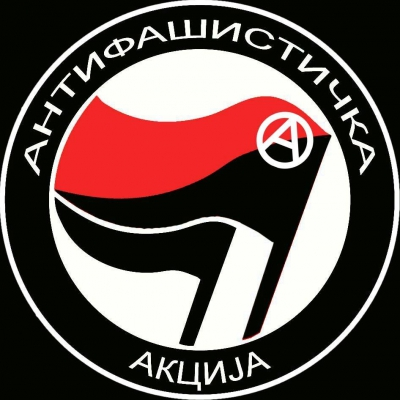
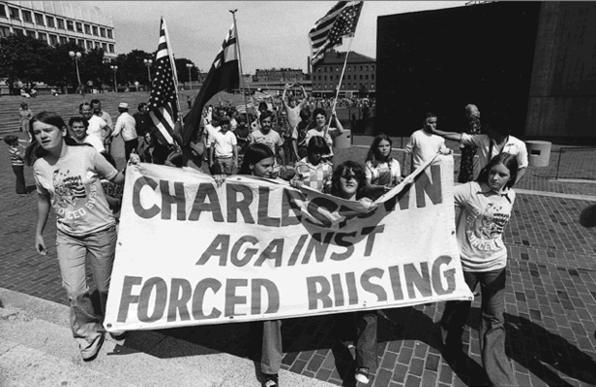
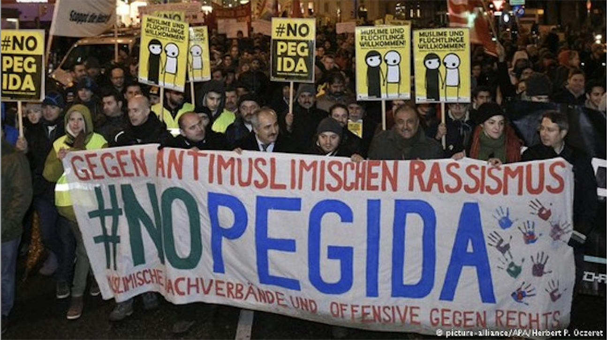
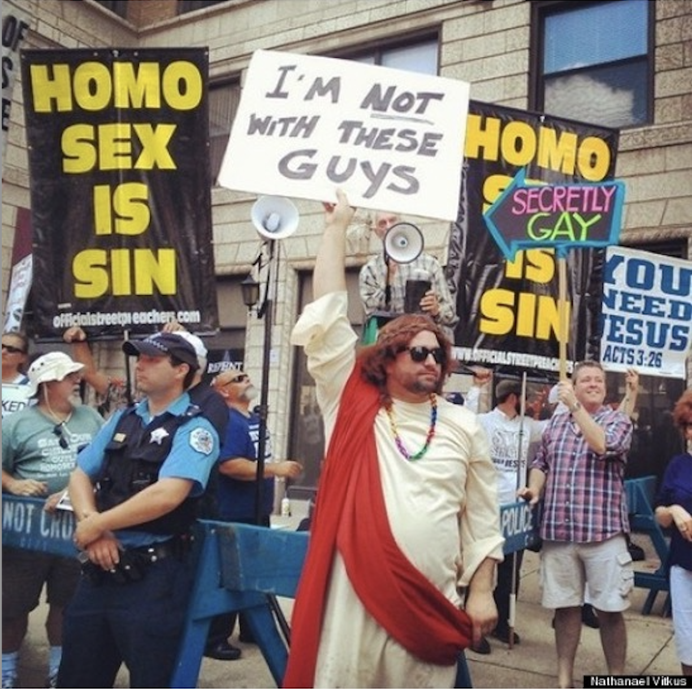
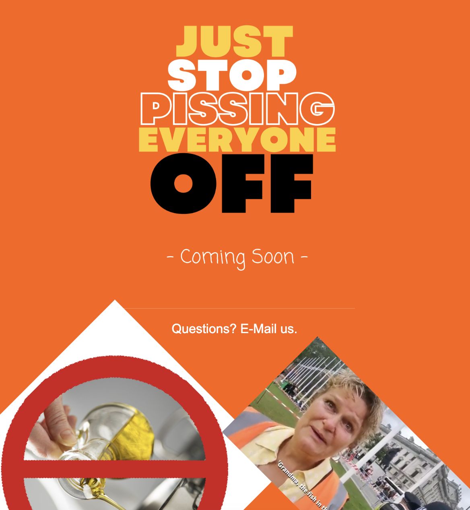
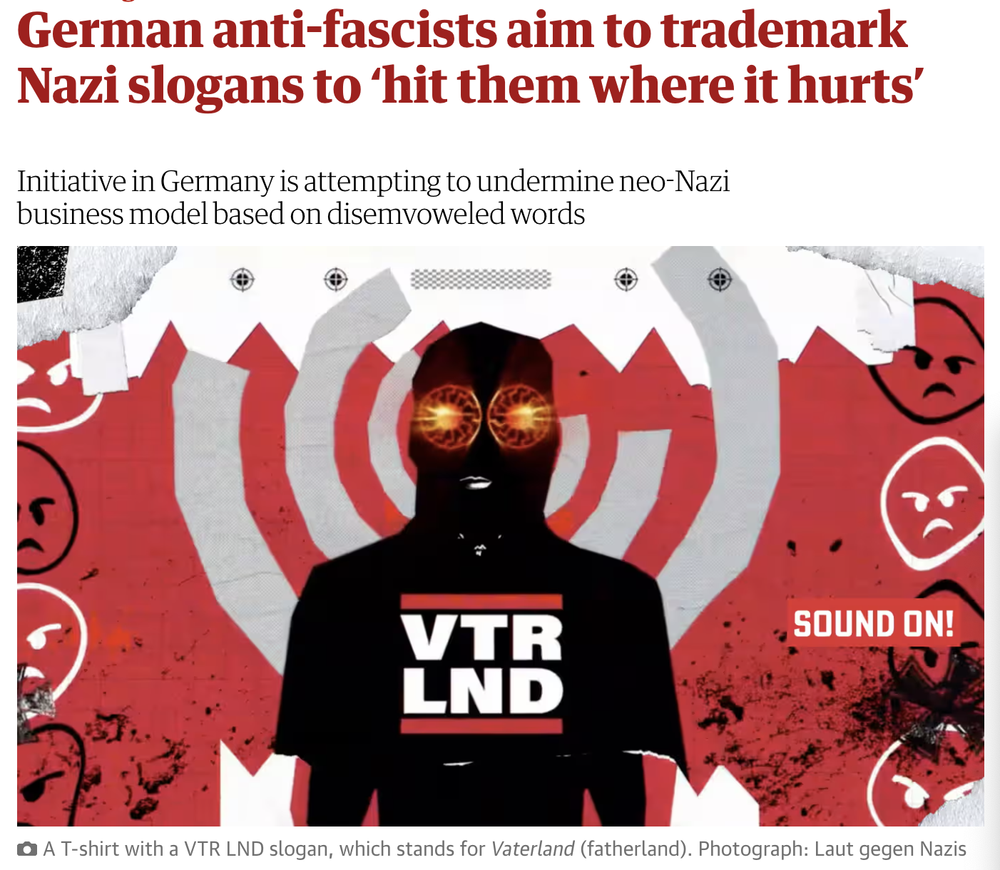

# Opening notes {background-color="#2c844c"}

::: {.tenor-gif-embed data-postid="14209777" data-share-method="host" data-aspect-ratio="1.94" data-width="70%"}
<div class="tenor-gif-embed" data-postid="14209777" data-share-method="host" data-aspect-ratio="1.94" data-width="100%"><a href="https://tenor.com/view/open-gif-14209777">Open Sticker</a>from <a href="https://tenor.com/search/open-stickers">Open Stickers</a></div> <script type="text/javascript" async src="https://tenor.com/embed.js"></script> 
:::

```{=html}
<script type="text/javascript" async src="https://tenor.com/embed.js"></script>
```

## Presentation groups

<!-- ::: panel-tabset -->
<!-- ## December -->

| Date    | Presenters                       | Method |
| -------:|:---------------------------------|:------:|
| 4 Dec:  | Daichi, Seongyeon, Jehyun        | TBD    | 
| 18 Dec: | Ayla, Tara, Theresa, Annabelle   | TBD    | 
| 15 Jan: | Luna, Emilene, Raffa             | TBD    | 

: Presentations line-up

<!-- | 11 Dec: |                                  | TBD    |  -->


<!-- ## January -->

<!-- | Date    | Presenters                       | Method | -->
<!-- | -------:|:---------------------------------|:------:| -->
<!-- | 15 Jan: | Luna, Emilene, Raffa             | TBD    |  -->

<!-- : Presentations line-up -->

<!-- | 8 Jan:  |                                  | TBD    |  -->
<!-- | 22 Jan: |                                  | TBD    |  -->
<!-- | 29 Jan: |                                  | TBD    |  -->

<!-- ::: -->

<!-- []{style="font-size:10px;"} -->

<!-- For a course on 'social movements' and a class on 'counter-mobilisation and countermovements', can you suggest some discussion questions to ask students? Ideally, the questions should have multiple choice responses, or yes/no/maybe responses, or strongly agree/agree/disagree/strongly disagree responses? -->

# Counter-mobilisation {background-color="#2c844c"}

:::: {.columns}
:::{.column width="50%"}
- opening questions
- The Sticker War 
<!-- - counter-mobilisation example from Germany  -->
- counter-mobilisation causes and effects

:::

::: {.column width="50%"}
<div class="tenor-gif-embed" data-postid="4361714" data-share-method="host" data-aspect-ratio="1.33333" data-width="100%"><a href="https://tenor.com/view/same-mirror-reflection-copying-mimicking-gif-4361714">Mirror, Mirror GIF</a>from <a href="https://tenor.com/search/same-gifs">Same GIFs</a></div> <script type="text/javascript" async src="https://tenor.com/embed.js"></script> 
:::
::::

## Opening questions

::: {style="text-align: center;"}
[What is counter-mobilisation? What is a countermovement?]{style="color:indigo; font-size:50px;"}
::: 

## The Sticker War {.smaller}
 
:::: {.columns}
:::{.column width="30%"}



    
:::

::: {.column width="70%" .right}
A Serbian antifa named Stefan waged a similar campaign on his own in 2012: When he came upon wheat-pasted posters from the fascist Serbian Action in his neighborhood of Belgrade, he immediately tore them down ... and noticed them back up again an hour later. He retaliated by plastering antifa stickers all over the Serbian Action posters ... only to find Serbian Action stickers in favor of “Traditional courtship in marriage” and other conservative slogans plastered on top of his stickers in response. Every day for six months Stefan battled with an anonymous fascist for control of his neighborhood. About four months into the conflict Stefan saw a guy putting up a sticker down the street as he got off the bus. The two locked eyes but Stefan wasn’t sure if this was his nemesis. In any event, Stefan persisted, and eventually the Serbian Action propaganda ceased to appear. He simply outlasted them.

[*p121*: The street art campaigns, whether posters or graffiti, ultimately serve to designate space as antifascist (Creasap 2016; Gerbaudo 2013; Waldner and Dobratz 2013). An antifascist tag or sticker in a dive bar signifies the space as welcoming to activists and hostile to fascists. Antifa posters or stickers on lamp posts or walls in a community show that at minimum there is an active militant antifascist group operating in the area.]{style="font-size:15px;"}

[Vysotsky, S. (2020). *American Antifa: The tactics, culture, and practice of militant antifascism*. Routledge.]{style="font-size:15px; color:orange;"}

:::
::::


## Opening questions

::: {style="text-align: center;"}
[What is counter-mobilisation? What is a countermovement?]{style="color:indigo; font-size:50px;"}
::: 

::: {style="text-align: center;"}
[Is 'countering' inherently disadvantaged/weaker by being reactive?]{style="color:indigo; font-size:50px;"}
::: 

. . . 

::: {style="text-align: center;"}
[What counter-mobilisation/countermovement (if any) exists in cases you know of?]{style="color:indigo; font-size:50px;"}
::: 


## counter-mobilisation causes and effects [@Reynolds-Stenson2018] {.smaller}

- using data from U.S. (*NYT*) between **1960** and **1995** and **[logistic regression]{style="color:blue;"}** techniques
    + [counterdemonstration is rare]{style="color:darkorange;"}: only at **_7 per cent_** of protests
    + counterdemonstration [more likely at big events]{style="color:darkorange;"} (>10,000 participants)
        * **awareness**/**attention** [mechanism]{style="color:blue;"} probably at work
    + [demos by movements that have recently held several protests are *more likely* to provoke counterdemonstration]{style="color:darkorange;"}
    + more media coverage and more SMOs involved in demo makes it *more likely* to provoke counterdemonstration
        * **awareness**/**attention** [mechanism]{style="color:blue;"} probably at work
    + when movements appear strong, counterprotests is *more likely*
        * **threat** [mechanisms]{style="color:blue;"} at work

- Recent study in Austria [@Weisskircher2023_ball] [counter-mobilisation at PEGIDA led to higher attendance]{style="color:darkorange;"}; and at the 'Akademikerball' led to greater sense of **[collective identity]{style="color:darkred;"}** (but [less participation]{style="color:darkorange;"}) ([complex causation]{style="color:blue;"})

<!-- ## Counter-mobilisation example in Germany -->

<!-- Corona demo and counter-protest in Freiburg -->

<!-- <https://www.youtube.com/watch?v=F0M_LwHoG_A> -->

## Less visible countering examples

__From the far right -- anti-far right *opposing movements* pair__

- Leeds United fans make fan [magazine]{style="color:red;"} (*Marching Altogether*) to supplant far-right magazine (*Bulldog*) [@Conlon2017-9-27]
- regular antifa [disruption]{style="color:red;"} causes Richard Spencer (US alt-right activist) to call speaking tour [@Lennard2018-3-17]
- SumOfUs pressured [Paypal]{style="color:red;"} to forbid Bündnis Pro Chemnitz from receiving funds via its service [@Kienzl2019-11-27]
- Graffiti removal/alteration in Cottbus [@Jetzt2019-12-9]
- *Zentrum für politische Schönheit* (ZPS) 
    + makes honey trap tool for far-right demonstrators to search if they were at Chemnitz; [doxxing]{style="color:red;"} exercise [@Jutrczenka2018]
    + got contract to distribute flyers for AfD; returned them to party two days before 2021 election [@Nasr2021-9-25]


# Countermovements {background-color="#2c844c"}

:::: {.columns}
:::{.column width="50%"}
- countermovement/opposing movement characteristics
- countermovement emergence
    + critical events; threats
    + example: Just Stop Oil
- countermovement campaign: *Laut gegen Nazis*
- triadic contention
- inherent disadvantage?

:::

::: {.column width="50%"}
<div class="tenor-gif-embed" data-postid="7921438966093719474" data-share-method="host" data-aspect-ratio="1.11675" data-width="100%"><a href="https://tenor.com/view/i-cast-counter-counterspell-counter-counterspell-counterspell-i-cast-wizard-gif-7921438966093719474">I Cast Counter Counterspell Wizard GIF</a>from <a href="https://tenor.com/search/i+cast+counter+counterspell-gifs">I Cast Counter Counterspell GIFs</a></div> <script type="text/javascript" async src="https://tenor.com/embed.js"></script> 
:::
::::

## Countermovement {.scrollable}

**[countermovement]{style="color:darkred;"}** (intuitively...) is 'a movement that makes contrary claims simultaneously to those of the original movement' [-@Meyer1996, p. 1631], involving **sustained [counter-mobilisation]{style="color:darkred;"}**

- countermovements are...
    + dynamically engaged with and related to an oppositional movement [@Lo2009; cf. @Mayer1995]
    + __*not*__ inherently reactionary (i.e., opposed to social change) [contrary to @TahiL.Mottl1980] --- they are 'reactive' but can be progressive or conservative or regressive
        * came from a misleading focus on 'conservative oppositional movements' [@Lo2009]
    + (at least initially) propelled by the example of an originating movement (e.g., strategies/tactics, symbols, exploited opportunities)
    + like other movements, in dynamic interaction with the state $\rightarrow$ triadic interaction [@Zald1987]

## Countermovement/Opposing movement characteristics {auto-animate=true}

:::: {.columns}
:::{.column width="50%"}
polarisation

dependency

:::

::: {.column width="50%" .right}
Manicheism 

imitation

:::
::::

## Countermovement/Opposing movement characteristics {auto-animate=true}

:::: {.columns}
:::{.column width="50%"}


dependency

:::

::: {.column width="50%" .right}
Manicheism 

imitation

:::
::::

::: {style="margin-top: 5px; font-size: 3em; color: darkred;"}
polarisation
:::

- most CM activities will be directed against the target movement and vice versa, aimed at "neutralizing, confronting or discrediting its corresponding countermovement" [@Zald1987, 148]
- e.g., [anti-immigration]{style="color:cadetblue;"} vs. [migrant rights]{style="color:orange;"} movements: rhetoric from both focused on the 'threats' posed by the other side

## Countermovement/Opposing movement characteristics {auto-animate=true}

:::: {.columns}
:::{.column width="50%"}
polarisation

dependency

:::

::: {.column width="50%" .right}
Manicheism 

imitation

:::
::::

## Countermovement/Opposing movement characteristics {auto-animate=true}

:::: {.columns}
:::{.column width="50%"}
polarisation


:::

::: {.column width="50%" .right}
Manicheism 

imitation

:::
::::

::: {style="margin-top: 5px; font-size: 3em; color: darkred;"}
dependency
:::

- mobilisation, and success on one side needing to be triggered by success and mobilisation on the other side, each movement thriving paradoxically on the good health of its opponent
- e.g., [climate change denial/resistance]{style="color:cadetblue;"} vs. [climate protection]{style="color:orange;"} movements: demonstrations, policy influence by one has typically spurred on responsive activity

## Countermovement/Opposing movement characteristics {auto-animate=true}

:::: {.columns}
:::{.column width="50%"}
polarisation

dependency

:::

::: {.column width="50%" .right}
Manicheism 

imitation

:::
::::

## Countermovement/Opposing movement characteristics {auto-animate=true}

:::: {.columns}
:::{.column width="50%"}
polarisation

dependency

:::

::: {.column width="50%" .right}
 

imitation

:::
::::

::: {style="margin-top: 5px; font-size: 3em; color: darkred;"}
Manicheism
:::

- us-them dynamic between opposed movements
- e.g., [fundamentalist Christian]{style="color:cadetblue;"} vs. [LGBTQ rights]{style="color:orange;"} movements: the former frame LGBTQ rights movement and its supporters as complete 'other', a moral and cultural threat to "traditional family values"; LGBTQ rights movements in turn frame fundamentalists as opponents of basic human rights and dignity
    + ['*In a racist society it is not enough to be non-racist, we must be anti-racist.*' (Angela Davis)]{style="font-size:25px;"}

## Countermovement/Opposing movement characteristics {auto-animate=true}

:::: {.columns}
:::{.column width="50%"}
polarisation

dependency

:::

::: {.column width="50%" .right}
Manicheism 

imitation

:::
::::

## Countermovement/Opposing movement characteristics {auto-animate=true}

:::: {.columns}
:::{.column width="50%"}
polarisation

dependency

:::

::: {.column width="50%" .right}
Manicheism 


:::
::::

::: {style="margin-top: 5px; font-size: 3em; color: darkred;"}
imitation
:::

- tendency to adopt elements of the other side's programme, tactics, etc.
- e.g., ['autonomist' nationalists]{style="color:cadetblue;"} vs. [left-wing/anarchist]{style="color:orange;"} movements: C. Worch tries to import 'black bloc' tactic into German extreme right in 2000s; CasaPound Italia uses 'squatting' tactic in activism in Rome

## Countermovement/Opposing movement characteristics {auto-animate=true}

:::: {.columns}
:::{.column width="50%"}
polarisation

dependency

:::

::: {.column width="50%" .right}
Manicheism 

imitation

:::
::::

## Countermovement/Opposing movement characteristics 

[polarisation]{style="color:darkred;"} - *most CM activities will be directed against the target movement and vice versa, aimed at "neutralizing, confronting or discrediting its corresponding countermovement"* [@Zald1987, 148]

[dependency]{style="color:darkred;"} - *mobilisation, and success on one side needing to be triggered by success and mobilisation on the other side, each movement thriving paradoxically on the good health of its opponent*

[Manicheism]{style="color:darkred;"} - *us-them dynamic between opposed movements*

[imitation]{style="color:darkred;"} - *tendency to adopt elements of the other side's programme, tactics, etc.*

. . . 

- @Mayer1995 examines these features in the case of Front National vs. SCALP, Ras l'Front, SOS, Le Manifeste contre le FN

## Countermovement emergence

Countermovements become more likely when...

1. an originating movement shows signs of success
2. that success includes threats to existing interests
3. (elite) allies are available to support counter-mobilisation



## Countermovement emergence

- An originating movement is successful when it...
    + gets issues on the public/political agenda
    + its narratives/frames are adopted in the media/public discourse
    + public policy changes

- @Meyer1996 suggest movement success and countermovement emergence is **[curvilinear]{style="color:blue;"}**: 
    + movements that achieve *some* success provoke countermovements
    + movements that achieve *no* or *little* success less likely to provoke countermovements
    + *complete* success also less likely to provoke counter- movements **[because that success often closes opportunities]{style="color:red;"}** (the issue is 'closed')

## Countermovement emergence

- **[divided governments/authorities]{style="color:darkorange;"}** are more likely to provoke [movement-countermovement contention]{style="color:darkorange;"} because ... **[???]{style="color:indigo;"}**
- **[federal systems]{style="color:darkorange;"}** are more likely to sustain [movement-countermovement contention]{style="color:darkorange;"} because ... **[???]{style="color:indigo;"}**

## Countermovement emergence

- **[divided governments/authorities]{style="color:darkorange;"}** are more likely to provoke [movement-countermovement contention]{style="color:darkorange;"} because they cannot decisively 'close' issues
- **[federal systems]{style="color:darkorange;"}** are more likely to sustain [movement-countermovement contention]{style="color:darkorange;"} because there are many other **[venues/arenas]{style="color:darkred;"}**

## Countermovement emergence - critical events

When movements create or exploit **[critical events]{style="color:darkred;"}**, they also encourage countermovements

- [critical events]{style="color:darkred;"}, for movements, can be government or state actions, accidents/incidents, large or conspicuous demonstrations 

- what were the [critical events]{style="color:darkred;"} for your movement?
- did they provoke [counter-mobilisation]{style="color:darkred;"} or [countermovement]{style="color:darkred;"}?



## Countermovement emergence - threats to interests

:::: {.columns}
:::{.column width="50%"}
- [countermovements]{style="color:darkred;"} are more likely to emerge when there is a *threat to interests*, especially of *large numbers of people and/or powerful persons or groups*
    + $\hookrightarrow$ that is, especially threats that run along [cleavages]{style="color:darkred;"}
         * e.g., abortion rights in religious countries (*religious-secular cleavage*)

:::

::: {.column width="50%"}


:::
::::

::: {style="margin-top: -30px;"} 
- **mass media** tends to seek out [opposing interests]{style="color:violet;"} to a movement's claims (for 'balanced coverage') $\rightarrow$ encourages countermovements
::: 

## a countermovement emerging?

:::: {.columns}
:::{.column width="50%"}


:::

::: {.column width="50%"}


:::
::::

## a countermovement emerging?

JSO - JSPEO: counter-mobilisation in July 2023, south London:

<!-- Aspect ratios include 1x1, 4x3, 16x9 (the default), and 21x9. -->
<!-- aspect-ratio="21x9"  -->


## a countermovement emerging?

JSO - JSPEO: counter-mobilisation in July 2023, south London:

- [might presage [countermovement]{style="color:darkred;"} (uniquely: mainly about [tactics]{style="color:darkred;"}?)]{style="color:indigo;"}
- [what do you notice about the activists and counter-activists in this video?]{style="color:indigo;"}

movement-countermovement conflict can continue over **very long periods** as sides trade-off victories and setbacks

<!-- Aspect ratios include 1x1, 4x3, 16x9 (the default), and 21x9. -->
<!-- aspect-ratio="21x9"  -->


## an active countermovement campaign, [LGN](https://www.theguardian.com/world/2024/jan/08/german-anti-fascists-aim-trademark-nazi-slogans-hit-where-hurts)

:::: {.columns}
:::{.column width="50%"}

- countering organisations: _[Laut gegen Nazis]{style="color:forestgreen;"}_ (with **Jung von Matt** advertising agency)
- campaign: '[Recht gegen Rechts](https://rechtgegenrechts.com/)' - a series of legal actions against right-wing extremists 
- action: file copyrights for neo-Nazis slogans
    + e.g., copyrighted "**VTR LND**"
- then, companies using the copyrighted material must (a) stop, (b) report past sales, (c) pay share of revenues or fine 

:::

::: {.column width="50%"}


<https://www.theguardian.com/world/2024/jan/08/german-anti-fascists-aim-trademark-nazi-slogans-hit-where-hurts> 

:::
:::: 

## Triadic contention

```{r, echo=FALSE, message=FALSE, warning=FALSE, engine = 'tikz'}

\begin{tikzpicture}[node distance=3cm]

\tikzstyle{BOX} = [rectangle, rounded corners, minimum width=2cm, minimum height=0.5cm,text centered, text width=2cm, draw=black, fill=red!30]
\tikzstyle{RECT} = [rectangle, minimum width=1cm, minimum height=0.5cm, text centered, text width=3cm, draw=black, fill=orange!30]
\tikzstyle{arrow} = [thick,->,>=stealth]

\node (STATE) [RECT] {STATE \linebreak AUTHORITIE\textcolor{red}{\textbf{S}}};
\node (move) [BOX, below of=STATE, xshift=-3cm, yshift=1.5cm] {movement};
\node (cmove) [BOX, below of=STATE, xshift=3cm, yshift=1.5cm] {countermovement};
\node [below of=STATE, yshift=1.75cm] {`opposing movements'};

\draw[line width=0.5mm, <->] (STATE) to (move);
\draw[line width=0.5mm, <->] (STATE) to (cmove);
\draw[line width=0.5mm, <->] (move) to (cmove);

\end{tikzpicture}

```

- movements and countermovements form part of the [opportunity structure]{style="color:darkred;"} of each other
    + constrains the **[strategy]{style="color:darkred;"}** and **[tactics]{style="color:darkred;"}** available to movements and countermovements: [demands]{style="color:darkred;"} (incl. *[frames]{style="color:darkred;"}*), [arenas]{style="color:darkred;"} (incl. *[targets]{style="color:darkred;"}* and *levels of action*), [tactics]{style="color:darkred;"} (*institutional*/*demonstrative* and/or *direct action*) [@Meyer2008]

## Triadic contention

```{r, echo=FALSE, message=FALSE, warning=FALSE, engine = 'tikz'}

\begin{tikzpicture}[node distance=3cm]

\tikzstyle{BOX} = [rectangle, rounded corners, minimum width=2cm, minimum height=0.5cm,text centered, text width=2cm, draw=black, fill=red!30]
\tikzstyle{RECT} = [rectangle, minimum width=1cm, minimum height=0.5cm, text centered, text width=3cm, draw=black, fill=orange!30]
\tikzstyle{arrow} = [thick,->,>=stealth]

\node (STATE) [RECT] {STATE \linebreak AUTHORITIE\textcolor{red}{\textbf{S}}};
\node (move) [BOX, below of=STATE, xshift=-3cm, yshift=1.5cm] {movement};
\node (cmove) [BOX, below of=STATE, xshift=3cm, yshift=1.5cm] {countermovement};
\node [below of=STATE, yshift=1.75cm] {`opposing movements'};

\draw[line width=0.5mm, <->] (STATE) to (move);
\draw[line width=0.5mm, <->] (STATE) to (cmove);
\draw[line width=0.5mm, <->] (move) to (cmove);

\end{tikzpicture}

```

- but **the state** is usually the most important creater of opportunity structure
    + which state authoritie**[s]{style="color:red;"}** are involved?
    + what are those authorities' posture?
        * passive or active? (is the state mediating?)
        * neutral or partial

## Countermovements - inherently disadvantaged?

One thesis has it that: **[countermovements]{style="color:darkred;"} are inherently disadvantaged**. This might be because...

- [movements]{style="color:red;"} can create ideology $\rightarrow$ (reactive) [countermovements]{style="color:red;"}: 'not this!'
    + **[justifying a negative]{style="color:violet;"}** often harder rhetorically than **[change/hope]{style="color:cadetblue;"}**
    + Problems of the '*broad church*': many opponents, many possible reasons for opposition
    + challenging the originating movement's **[frames]{style="color:darkred;"}**
        * (a) What’s the problem? (b) Who’s to blame? (c) How should it change? (d) Why should we care?

## Countermovements - inherently disadvantaged?

One thesis has it that: **[countermovements]{style="color:darkred;"} are inherently disadvantaged**. This might be because...

- [movements]{style="color:red;"} can create ideology $\rightarrow$ (reactive) [countermovements]{style="color:red;"}: 'not this!'
    + **[justifying a negative]{style="color:violet;"}** often harder rhetorically than **[change/hope]{style="color:cadetblue;"}**
    + Problems of the '*broad church*': many opponents, many possible reasons for opposition
    + challenging the originating movement's **[frames]{style="color:darkred;"}**
        * (a) What’s the problem? (b) Who’s to blame? (c) How should it change? (d) Why should we care?
        * [**refresher**: how are these **[frames]{style="color:darkred;"}** labelled?]{style="color:indigo;"}

# Any questions, concerns, feedback for this class? {background-color="#2c844c"}

Anonymous feedback here: <https://forms.gle/AjHt6fcnwZxkSg4X8>

Alternatively, please send me an email: [m.zeller\@lmu.de]{style="color:red;"}


```{r echo=FALSE, message=FALSE, warning=FALSE}
pagedown::chrome_print(file.path("..", "docs/slides", "slides_10.html"))
```


## References
