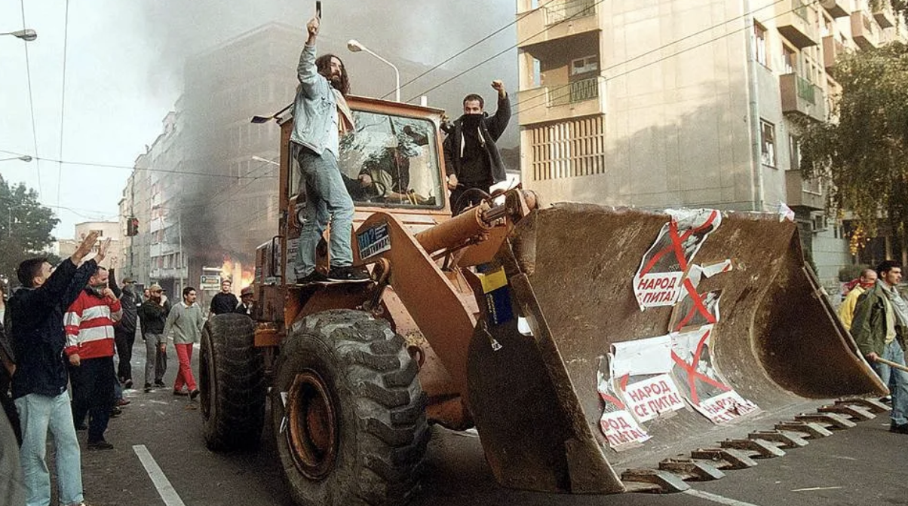
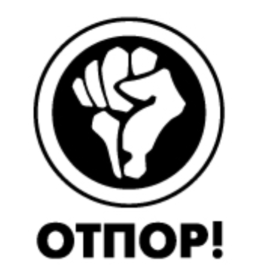
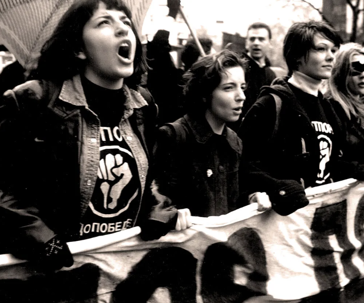
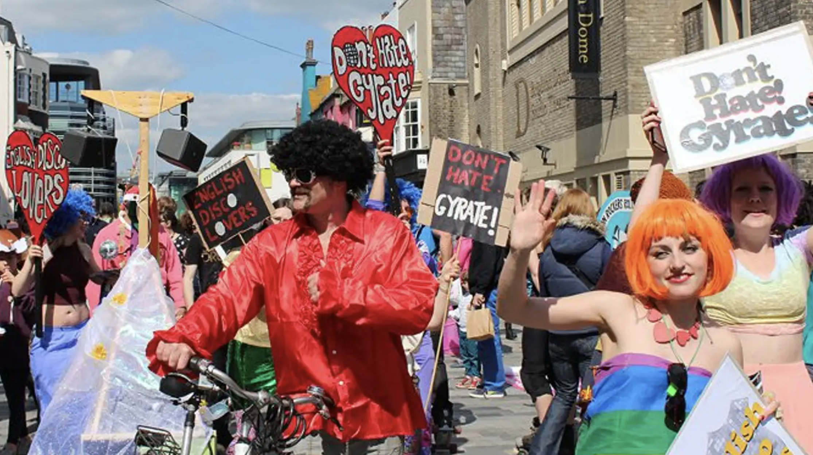
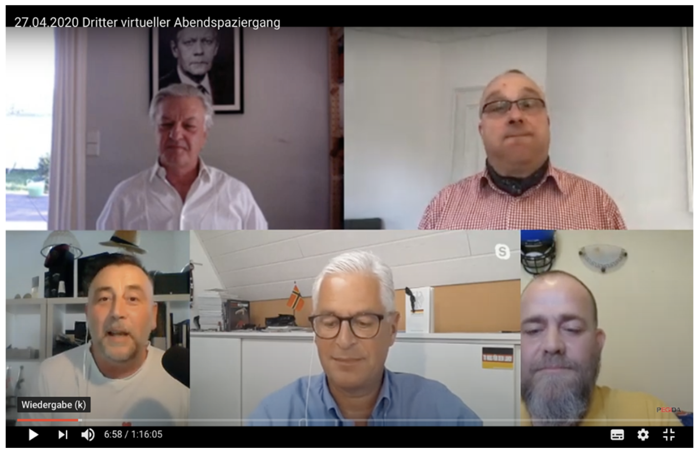

# Opening notes {background-color="#2c844c"}

::: {.tenor-gif-embed data-postid="14209777" data-share-method="host" data-aspect-ratio="1.94" data-width="70%"}
<div class="tenor-gif-embed" data-postid="14209777" data-share-method="host" data-aspect-ratio="1.94" data-width="100%"><a href="https://tenor.com/view/open-gif-14209777">Open Sticker</a>from <a href="https://tenor.com/search/open-stickers">Open Stickers</a></div> <script type="text/javascript" async src="https://tenor.com/embed.js"></script> 
:::

```{=html}
<script type="text/javascript" async src="https://tenor.com/embed.js"></script>
```

- **short synopsis** for final essay due **Friday (17 January)** (send to me via email)

## Presentation groups

<!-- ::: panel-tabset -->
<!-- ## December -->

| Date    | Presenters                       | Method |
| -------:|:---------------------------------|:------:|
| 4 Dec:  | Daichi, Seongyeon, Jehyun        | ethnography | 
| 8 Jan:  | Ayla, Tara, Theresa, Annabelle   | discourse analysis | 
| 15 Jan: | Luna, Emilene, Raffa, Sofia      | TBD    | 

: Presentations line-up

<!-- | 11 Dec: |                                  | TBD    |  -->


<!-- ## January -->

<!-- | Date    | Presenters                       | Method | -->
<!-- | -------:|:---------------------------------|:------:| -->
<!-- | 15 Jan: | Luna, Emilene, Raffa             | TBD    |  -->

<!-- : Presentations line-up -->

<!-- | 8 Jan:  |                                  | TBD    |  -->
<!-- | 22 Jan: |                                  | TBD    |  -->
<!-- | 29 Jan: |                                  | TBD    |  -->

<!-- ::: -->

<!-- []{style="font-size:10px;"} -->

<!-- For a course on 'social movements' and a class on 'social movements online', can you suggest some discussion questions to ask students? Ideally, the questions should have multiple choice responses, or yes/no/maybe responses, or strongly agree/agree/disagree/strongly disagree responses? -->

# Theses from an earlier age of the internet [@Diani2000] {background-color="#2c844c"}

:::: {.columns}
:::{.column width="50%"}
- 'computer mediated communication' (CMC)
- types of communication 
- features of internet tools
- different organisation types and CMC

:::

::: {.column width="50%"}
<div class="tenor-gif-embed" data-postid="12418525811703301139" data-share-method="host" data-aspect-ratio="2" data-width="100%"><a href="https://tenor.com/view/wlan-gif-12418525811703301139">Wlan GIF</a>from <a href="https://tenor.com/search/wlan-gifs">Wlan GIFs</a></div> <script type="text/javascript" async src="https://tenor.com/embed.js"></script> 
:::
::::

## @Diani2000 - CMC

['[computer mediated communication]{style="color:darkred;"}', **CMC**:]{style="font-size:40px;"} 

- [interpersonal communication through the use of computers or digital devices, now typically involving internet channels]{style="font-size:40px;"} 
    + [[then]{style="color:cadetblue;"}: (mass) email, message boards, instant messaging]{style="font-size:40px;"} 
    + [[now]{style="color:violet;"}: social media, encrypted messaging with different message types (photo, video, audio), AI-generated material, [other ways??]{style="color:indigo;"}]{style="font-size:40px;"} 

. . . 

- [sometimes [easing]{style="color:forestgreen;"} how people communicate; sometimes [changing]{style="color:goldenrod;"} it]{style="font-size:40px;"} 

## @Diani2000 - types of communication 

```{r echo=FALSE, message=FALSE, warning=FALSE}
library(kableExtra)
library(dplyr)
library(tibble)

df <- tribble(
  ~Var1,   ~Private, ~Public,
  "Direct", "--face-to-face between activists",        "--in public spaces (e.g., demos)",
  "",       "--message restricted to group boundaries","--communicating to person(s) (e.g., speeches, leafleting)",
  "",       "",                                        "--may overlap with attempts to attract media attention (i.e. ’public mediated’)",
  "Mediated","--messages within group boundaries but transmitted through tech","--all media-related communication (e.g., press releases, adverts, 'manipulation of media through spectacular events')",
  "",        "--(e.g., email, phone calls) with varying privacy", ""
)

df$Var1 <- as.factor(df$Var1)
df$Private <- as.factor(df$Private)
df$Public <- as.factor(df$Public)

# df_colored <- df %>%
#   mutate(
#     Private = cell_spec(Private, "html", background = c("red", "green", "", "")),
#     Public = cell_spec(Public,"html", background = c("blue", "gold", "", ""))
#   )

kable(df, booktabs = T,
      align = c("r", "l", "l"),
      col.names = c(" ", "Private", "Public")) %>%
  kable_paper("striped", full_width = FALSE, font_size = 32) %>% 
  column_spec(1, bold=T) %>% 
  column_spec(2, width="20cm") %>%
  column_spec(3, width="20cm") %>% 
  row_spec(1:3, bold = F, color = "black", background = "pink") %>% 
  row_spec(4:5, bold = F, color = "black", background = "seagreen1")

```

## Features and facets of internet tools {.smaller}

- [Accessibility]{style="color:red;"}: public *or* 'private'
    + open access or restricted 
        * also, 'digital divide': many have no/less access to modern digital communication tools
- [Temporality]{style="color:red;"}: asynchronous *or* synchronous 
    + real-time, live *or* delayed
    + temporary *or* permanent
- [Identity]{style="color:red;"}: 'in-real-life' identity / anonymity / pseudonymity 
    + same social stigmas as elsewhere *or* disinhibition 
- [Algorithmic effects]{style="color:red;"}: present *or* not (and in what degree)
    + amplification / suppression / no role
    + trending? 
    + echo chambers? filter bubbles? 
- [Platform regulation]{style="color:red;"}: present *or* not (and in what degree) 
    + platform policies and content moderation 
    + state/regulator requirements
- [other features?]{style="color:indigo;"}

## @Diani2000 - organisations and communication

some hypotheses about CMC and different movement organisations

```{r echo=FALSE, message=FALSE, warning=FALSE}
diani <- data.frame(
  Organisation_type = c("Orgs. focusing on professional resources", 
                        "Orgs. mobilising participatory resources", 
                        "Orgs. mobilising participatory resources", 
                        "Transnational networks"),
  Importance_of_CMC = c("high", "moderate/low", "moderate/low", "moderate"),
  Effects = c("CMC supports professionalised groups that sometimes require large mobilisation (e.g., Greenpeace), helping to 'get the word out'", 
              "CMC reinforces already existing ties; these orgs. remain reliant on direct, face-to-face interactions to recruit, build collective identity, and maintain commitment", 
              "\"Sustained collective action is unlikely to originate from purely virtual ties if they are not sustained by previous interaction\"", 
              "CMC helps link (especially former) activists and militants (individuals and groups) to promote shared values, but little consequential effect for organising")
)

kable(diani, booktabs = TRUE,
      col.names = c("Organisation type", "Importance of CMC", "Effects?")) %>%
  kable_styling(font_size = 26) %>%
  column_spec(1, width = "5cm") %>%
  column_spec(2, width = "5cm") %>%
  column_spec(3, width = "20cm")
```

## @Diani2000 - theses of an earlier internet age

Broadly, internet tools ('computer mediated communication', **CMC**) allow...

. . . 

- greater [speed]{style="color:cadetblue;"} (and [accuracy]{style="color:cadetblue;"}) of communication

. . . 

- [less cost]{style="color:violet;"} of communication

. . . 

- greater [connectivity across distances]{style="color:goldenrod;"}
    +  unifying different national or regional parts of a movement

. . . 

::: {style="text-align: center;"}
[Are these assertions still 'as true' as they were in 2000?]{style="color:indigo; font-size:60px;"}
::: 

## @Diani2000 - theses of an earlier internet age

[Can CMC create new types of communities (if so, what kinds)? Can they create collective identity and enable **durable**/**sustained** activism?]{style="color:indigo;"}

. . . 

- [can that happen with online anonymity?]{style="color:indigo;"}

> most examples of personal interaction in electronic discussion groups actually miss some of the requirements usually associated with the idea of community. Participants in those lists often hide their personal identity, participate occasionally, are not tied in any sort of committed relationship and **[are mostly involved in dyadic or at most triadic interactions]{style="color:cadetblue;"}**

# Poll: Movements online {background-color="#2c844c"}

:::: {.columns}
:::{.column width="35%"}
{fig-alt="A QR code for the survey."}

:::

::: {.column width="65%" .center}
<!-- go to <https://www.qr-code-generator.com/>, add the link, and screen shot the QR code -->
Take the survey at **<https://forms.gle/xwWefHu7eDAmyzvv9>**

- most important online tool for SMs?
- online organising more democratic? 
- online movements more individualised?
- platforms amplify movements of the marginalised?

:::
:::: 

- platforms not so useful since algorithms favour sensationalism?
- online movement activity often encourages a "slacktivism"
- movements online face greater censorship and surveillance? 
- should online platforms be more regulated to prevent movements (and other actors) from spreading misinformation?

<!-- What do you think is the most important online tool (e.g., a platform, a programme, a way of engaging in activism) for contemporary social movements? -->
<!-- OPEN RESPONSE -->

<!-- Online organising is inherently more democratic because it allows anyone with internet access to join a movement. -->
<!-- strongly agree/agree/disagree/strongly disagree -->

<!-- Online social movement activity tends to have a stronger focus on individual action (e.g., signing petitions, sharing posts) than collective action (e.g., protests, direct action) -->
<!-- strongly agree/agree/disagree/strongly disagree -->

<!-- Do online platforms amplify the voices of social movements representing marginalised groups? -->
<!-- y/n/m -->

<!-- Social media platforms are not useful vehicles for achieving movement goals since algorithms prioritise sensational content that impede movement goals. -->
<!-- strongly agree/agree/disagree/strongly disagree -->

<!-- Online social movement activity often encourages a "slacktivism" mentality, where people feel like they’ve contributed just by liking or sharing posts? -->
<!-- strongly agree/agree/disagree/strongly disagree -->

<!-- Do social movements online face greater challenges of censorship and surveillance compared to (earlier) movements that were/are less reliant on digital tools? -->
<!-- y/n/m -->

<!-- Should online platforms be more regulated to prevent movements (and other actors) from spreading misinformation? -->
<!-- y/n/m -->

--- 

```{ojs}
md`## Poll results (Respondents: ${respondentCount})`
```


```{ojs}

import { liveGoogleSheet } from "@jimjamslam/live-google-sheet";
import { aq, op } from "@uwdata/arquero";

// UPDATE THE LINK FOR A NEW POLL
surveyResults = liveGoogleSheet(
  "https://docs.google.com/spreadsheets/d/e/" +
    "2PACX-1vR7--DC-gLwhLrMYBIvigczwsp5vMxC5A93sY7PDai0NdSIBFSvjTOjKUZxxtLpl9KWTxiyxKPAGtUD/" +
    "pub?gid=2023133127&single=true&output=csv",
  10000, 1, 9); // adjust the last number to select all relevant columns 

respondentCount = surveyResults.length;

```


:::: {.columns}
:::{.column width="50%"}
online organising more democratic? 

```{ojs}
more_democraticCounts = aq.from(surveyResults)
  .select("more_democratic")
  .groupby("more_democratic")
  .count()
  .derive({ measure: d => "" })

// Calculate the maximum count from your dataset
more_democratic_maxCountRE = Math.max(...more_democraticCounts.objects().map(d => d.count));

plot_more_democratic = Plot.plot({
  marks: [
    Plot.barY(more_democraticCounts, {
      x: "more_democratic",
      y: "count",
      fill: "more_democratic",
      stroke: "black",
      strokeWidth: 1
    }),
    Plot.ruleY([respondentCount], { stroke: "#ffffff99" })
  ],
  color: {
    domain: [
      "Strongly disagree",
      "Disagree",
      "Neutral",
      "Agree",
      "Strongly agree"
    ],
    range: [
      "red",
      "pink",
      "lightgrey",
      "lightgreen",
      "forestgreen"
    ]
  },
  marginBottom: 180,
  x: { label: "", tickSize: 2, tickRotate: -45,
    domain: ["Strongly disagree", "Disagree", "Neutral", "Agree", "Strongly agree"]
  },  
  y: {
    label: "",
    tickSize: 10,
    tickFormat: d => d,
    tickValues: Array.from(
      new Set(more_democraticCounts.objects().map(d => d.count))
    ).sort((a, b) => a - b),
    domain: [0, more_democratic_maxCountRE]
  },
  facet: { data: more_democraticCounts, x: "measure", label: "" },
  marginLeft: 140,
  style: {
    width: 1350,
    height: 500,
    fontSize: 30,
  }
});

```

:::

::: {.column width="50%"}
online movement activity more individualised?

```{ojs}
individualisedCounts = aq.from(surveyResults)
  .select("individualised")
  .groupby("individualised")
  .count()
  .derive({ measure: d => "" })

// Calculate the maximum count from your dataset
individualised_maxCountRE = Math.max(...individualisedCounts.objects().map(d => d.count));

plot_individualised = Plot.plot({
  marks: [
    Plot.barY(individualisedCounts, {
      x: "individualised",
      y: "count",
      fill: "individualised",
      stroke: "black",
      strokeWidth: 1
    }),
    Plot.ruleY([respondentCount], { stroke: "#ffffff99" })
  ],
  color: {
    domain: [
      "Strongly disagree",
      "Disagree",
      "Neutral",
      "Agree",
      "Strongly agree"
    ],
    range: [
      "red",
      "pink",
      "lightgrey",
      "lightgreen",
      "forestgreen"
    ]
  },
  marginBottom: 180,
  x: { label: "", tickSize: 2, tickRotate: -45,
    domain: ["Strongly disagree", "Disagree", "Neutral", "Agree", "Strongly agree"]
  },  
  y: {
    label: "",
    tickSize: 10,
    tickFormat: d => d,
    tickValues: Array.from(
      new Set(individualisedCounts.objects().map(d => d.count))
    ).sort((a, b) => a - b),
    domain: [0, individualised_maxCountRE]
  },
  facet: { data: individualisedCounts, x: "measure", label: "" },
  marginLeft: 140,
  style: {
    width: 1350,
    height: 500,
    fontSize: 30,
  }
});

```

:::
:::: 

## Poll results 

:::: {.columns}
:::{.column width="50%"}
platforms amplify movements of the marginalised?

```{ojs}
amplifyCounts = aq.from(surveyResults)
  .select("amplify")
  .groupby("amplify")
  .count()
  .derive({ measure: d => "" })

// Calculate the maximum count from your dataset
amplify_maxCountRE = Math.max(...amplifyCounts.objects().map(d => d.count));

plot_amplify = Plot.plot({
  marks: [
    Plot.barY(amplifyCounts, {
      x: "amplify",
      y: "count",
      fill: "amplify",
      stroke: "black",
      strokeWidth: 1
    }),
    Plot.ruleY([respondentCount], { stroke: "#ffffff99" })
  ],
  color: {
    domain: [
      "Yes",
      "No",
      "Maybe"
    ],
    range: [
      "forestgreen",
      "darkred",
      "goldenrod"
    ]
  },
  marginBottom: 80,
  x: { label: "", tickSize: 2, tickRotate: -1, padding: 0.2,
    domain: ["Yes", "No", "Maybe"]
  },  
  y: {
    label: "",
    tickSize: 10,
    tickFormat: d => d,
    tickValues: Array.from(
      new Set(amplifyCounts.objects().map(d => d.count))
    ).sort((a, b) => a - b),
    domain: [0, amplify_maxCountRE]
  },
  facet: { data: amplifyCounts, x: "measure", label: "" },
  marginLeft: 60,
  style: {
    width: 1600,
    height: 500,
    fontSize: 40,
  },
});

```

:::

::: {.column width="50%"}
platforms not so useful since algorithms favour sensationalism?

```{ojs}
algorithmsCounts = aq.from(surveyResults)
  .select("algorithms")
  .groupby("algorithms")
  .count()
  .derive({ measure: d => "" })

// Calculate the maximum count from your dataset
algorithms_maxCountRE = Math.max(...algorithmsCounts.objects().map(d => d.count));

plot_algorithms = Plot.plot({
  marks: [
    Plot.barY(algorithmsCounts, {
      x: "algorithms",
      y: "count",
      fill: "algorithms",
      stroke: "black",
      strokeWidth: 1
    }),
    Plot.ruleY([respondentCount], { stroke: "#ffffff99" })
  ],
  color: {
    domain: [
      "Strongly disagree",
      "Disagree",
      "Neutral",
      "Agree",
      "Strongly agree"
    ],
    range: [
      "red",
      "pink",
      "lightgrey",
      "lightgreen",
      "forestgreen"
    ]
  },
  marginBottom: 180,
  x: { label: "", tickSize: 2, tickRotate: -45,
    domain: ["Strongly disagree", "Disagree", "Neutral", "Agree", "Strongly agree"]
  },  
  y: {
    label: "",
    tickSize: 10,
    tickFormat: d => d,
    tickValues: Array.from(
      new Set(algorithmsCounts.objects().map(d => d.count))
    ).sort((a, b) => a - b),
    domain: [0, algorithms_maxCountRE]
  },
  facet: { data: algorithmsCounts, x: "measure", label: "" },
  marginLeft: 140,
  style: {
    width: 1350,
    height: 500,
    fontSize: 30,
  }
});

```

:::
:::: 

## Poll results 

online movement activity often encourages a "slacktivism"

```{ojs}
slacktivismCounts = aq.from(surveyResults)
  .select("slacktivism")
  .groupby("slacktivism")
  .count()
  .derive({ measure: d => "" })

// Calculate the maximum count from your dataset
slacktivism_maxCountRE = Math.max(...slacktivismCounts.objects().map(d => d.count));

plot_slacktivism = Plot.plot({
  marks: [
    Plot.barY(slacktivismCounts, {
      x: "slacktivism",
      y: "count",
      fill: "slacktivism",
      stroke: "black",
      strokeWidth: 1
    }),
    Plot.ruleY([respondentCount], { stroke: "#ffffff99" })
  ],
  color: {
    domain: [
      "Strongly disagree",
      "Disagree",
      "Neutral",
      "Agree",
      "Strongly agree"
    ],
    range: [
      "red",
      "pink",
      "lightgrey",
      "lightgreen",
      "forestgreen"
    ]
  },
  marginBottom: 180,
  x: { label: "", tickSize: 2, tickRotate: -45,
    domain: ["Strongly disagree", "Disagree", "Neutral", "Agree", "Strongly agree"]
  },  
  y: {
    label: "",
    tickSize: 10,
    tickFormat: d => d,
    tickValues: Array.from(
      new Set(slacktivismCounts.objects().map(d => d.count))
    ).sort((a, b) => a - b),
    domain: [0, slacktivism_maxCountRE]
  },
  facet: { data: slacktivismCounts, x: "measure", label: "" },
  marginLeft: 140,
  style: {
    width: 1350,
    height: 500,
    fontSize: 30,
  }
});

```

## Poll results 

:::: {.columns}
:::{.column width="50%"}
should online platforms be more regulated to prevent movements (and other actors) from spreading misinformation?

```{ojs}
regulationCounts = aq.from(surveyResults)
  .select("regulation")
  .groupby("regulation")
  .count()
  .derive({ measure: d => "" })

// Calculate the maximum count from your dataset
regulation_maxCountRE = Math.max(...regulationCounts.objects().map(d => d.count));

plot_regulation = Plot.plot({
  marks: [
    Plot.barY(regulationCounts, {
      x: "regulation",
      y: "count",
      fill: "regulation",
      stroke: "black",
      strokeWidth: 1
    }),
    Plot.ruleY([respondentCount], { stroke: "#ffffff99" })
  ],
  color: {
    domain: [
      "Yes",
      "No",
      "Maybe"
    ],
    range: [
      "forestgreen",
      "darkred",
      "goldenrod"
    ]
  },
  marginBottom: 80,
  x: { label: "", tickSize: 2, tickRotate: -1, padding: 0.2,
    domain: ["Yes", "No", "Maybe"]
  },  
  y: {
    label: "",
    tickSize: 10,
    tickFormat: d => d,
    tickValues: Array.from(
      new Set(regulationCounts.objects().map(d => d.count))
    ).sort((a, b) => a - b),
    domain: [0, regulation_maxCountRE]
  },
  facet: { data: regulationCounts, x: "measure", label: "" },
  marginLeft: 60,
  style: {
    width: 1600,
    height: 500,
    fontSize: 40,
  },
});

```

:::

::: {.column width="50%"}
movements online face greater censorship and surveillance? 

```{ojs}
challengesCounts = aq.from(surveyResults)
  .select("challenges")
  .groupby("challenges")
  .count()
  .derive({ measure: d => "" })

// Calculate the maximum count from your dataset
challenges_maxCountRE = Math.max(...challengesCounts.objects().map(d => d.count));

plot_challenges = Plot.plot({
  marks: [
    Plot.barY(challengesCounts, {
      x: "challenges",
      y: "count",
      fill: "challenges",
      stroke: "black",
      strokeWidth: 1
    }),
    Plot.ruleY([respondentCount], { stroke: "#ffffff99" })
  ],
  color: {
    domain: [
      "Yes",
      "No",
      "Maybe"
    ],
    range: [
      "forestgreen",
      "darkred",
      "goldenrod"
    ]
  },
  marginBottom: 80,
  x: { label: "", tickSize: 2, tickRotate: -1, padding: 0.2,
    domain: ["Yes", "No", "Maybe"]
  },  
  y: {
    label: "",
    tickSize: 10,
    tickFormat: d => d,
    tickValues: Array.from(
      new Set(challengesCounts.objects().map(d => d.count))
    ).sort((a, b) => a - b),
    domain: [0, challenges_maxCountRE]
  },
  facet: { data: challengesCounts, x: "measure", label: "" },
  marginLeft: 60,
  style: {
    width: 1600,
    height: 500,
    fontSize: 40,
  },
});

```

:::
:::: 

## Poll results {.scrollable}

most important online tool for SMs?

```{ojs}

// Access and print the values from the 'most_important_tool' column
ImportantTools = aq.from(surveyResults)
  .select("most_important_tool")
  .filter(d => d.most_important_tool) // to exclude empty ("") strings, 0s, FALSEs, nulls, etc

ImportantTools.array("most_important_tool")

```


# Movements changed by the Internet {background-color="#2c844c"}

:::: {.columns}
:::{.column width="50%"}
- [Internet has changed both]{style="color:yellow;"}
    + [how individuals participate]{style="color:yellow;"}, and 
    + [how movement organisations operate]{style="color:yellow;"} 

:::

::: {.column width="50%"}
<div class="tenor-gif-embed" data-postid="23449279" data-share-method="host" data-aspect-ratio="1.77778" data-width="100%"><a href="https://tenor.com/view/looking-around-animal-muppets-gif-23449279">Looking Around GIF</a>from <a href="https://tenor.com/search/looking-gifs">Looking GIFs</a></div> <script type="text/javascript" async src="https://tenor.com/embed.js"></script> 
:::
::::

- Examples: 
    + Otpor, Slobodan Milosevic, and the Bulldozer revolution
    + Google bombing 
- Democratising impact?
    + Hong Kong 

## Otpor, Milosevic, and the Bulldozer revolution {.smaller} 

:::: {.columns}
:::{.column width="70%"}
([bulldozers were used by protesters in one action against the state's media agency]{style="color:forestgreen;"})

- USAID provides funding to opposition groups in Serbia
    + especially to buy mobile phones and computers
- the 'Democratic Opposition of Serbia' and Otpor! ('Resistance'), use tech to...
    + **recruit and train** election monitors,
    + **spread awareness**, 
    + **coordinate** between groups and different parts of the country

{width="300"}

{.absolute bottom=1 left=320 width="400"}


:::

::: {.column width="30%"} 
::: {style="margin-top: -20px;"}

:::

::: {style="margin-top: -20px;"} 

:::


:::
:::: 

## Google bombing 

:::: {.columns}
:::{.column width="40%"}

:::

::: {.column width="60%"}
- [manipulating a search enginge algorithm to rank highly certain websites]{style="color:goldenrod;"} 
- Examples:

:::
::::

## Google bombing 

:::: {.columns}
:::{.column width="40%"}

::: {style="margin-top: -20px;"}
{width="300"}
:::

:::

::: {.column width="60%"}
- [manipulating a search enginge algorithm to rank highly certain websites]{style="color:goldenrod;"} 
- Examples:
    + in 2006, Google searches for "[failure]{style="color:violet;"}" returned sites for George W. [Bush's biography]{style="color:forestgreen;"}

:::
::::

## Google bombing 

:::: {.columns}
:::{.column width="40%"}

::: {style="margin-top: -20px;"}
{width="300"}
:::

::: {style="margin-top: -40px;"}
{width="400"}
:::

:::

::: {.column width="60%"}
- [manipulating a search enginge algorithm to rank highly certain websites]{style="color:goldenrod;"} 
- Examples:
    + in 2006, Google searches for "[failure]{style="color:violet;"}" returned sites for George W. [Bush's biography]{style="color:forestgreen;"}
    + in 2012, UK activists got search results for "[EDL]{style="color:violet;"}" to return, instead of *English Defence League*, pages for the *[English Disco Lovers]{style="color:forestgreen;"}*

:::
::::

## Google bombing 

:::: {.columns}
:::{.column width="40%"}

::: {style="margin-top: -20px;"}
{width="300"}
:::

::: {style="margin-top: -40px;"}
{width="400"}
:::

::: {style="margin-top: -40px;"}
{width="300"}
:::

:::

::: {.column width="60%"}
- [manipulating a search enginge algorithm to rank highly certain websites]{style="color:goldenrod;"} 
- Examples:
    + in 2006, Google searches for "[failure]{style="color:violet;"}" returned sites for George W. [Bush's biography]{style="color:forestgreen;"}
    + in 2012, UK activists got search results for "[EDL]{style="color:violet;"}" to return, instead of *English Defence League*, pages for the *[English Disco Lovers]{style="color:forestgreen;"}*
    + in 2018, search results for "[idiot]{style="color:violet;"}" returned images of [Donald Trump]{style="color:forestgreen;"}

:::
::::


## @Diani2000 - CMC's democratizing impact

> the **overall democratizing impact of CMC may be severely hampered** by [two types of resource constraints]{style="color:cadetblue;"}: while its contribution to networking among citizens’ organizations is undeniable, its contribution to the **[operations of social control agencies]{style="color:red;"}**, the military, governments and corporations is – at least quantitatively – much greater; and [access to CMC]{style="color:red;"} is at least for the time being [heavily correlated to class and status]{style="color:red;"}

. . . 

[What do you think? Is CMC a democratizing tool?]{style="color:indigo;"}

. . . 

The case of Hong Kong... 

## @Diani2000 - CMC's democratizing impact

<!-- Aspect ratios include 1x1, 4x3, 16x9 (the default), and 21x9. -->
<!-- aspect-ratio="21x9"  -->


# Online replacing offline activism {background-color="#2c844c"}

:::: {.columns}
:::{.column width="50%"}
- @volk2021PoliticalPerformancesControl - Political Performances of Control During COVID-19: Controlling and Contesting Democracy in Germany
    + research design
        * brief intro to interpretivism 
    + PEGIDA online 
    + findings 
- discussion topic from the news 

:::

::: {.column width="50%"}
<div class="tenor-gif-embed" data-postid="21887509" data-share-method="host" data-aspect-ratio="1.56863" data-width="100%"><a href="https://tenor.com/view/boburnham-inside-netflix-internet-computer-gif-21887509">Boburnham Inside GIF</a>from <a href="https://tenor.com/search/boburnham-gifs">Boburnham GIFs</a></div> <script type="text/javascript" async src="https://tenor.com/embed.js"></script> 
:::
::::

## @volk2021PoliticalPerformancesControl research design

> [explores how political actors in Germany performed control during the first wave of the COVID-19 pandemic, comparing the performances of control by two institutional actors and one counter-institutional grassroots actor]{style="font-size:42px;"}

- data generated through **[qualitative-interpretive methodology]{style="color:blue;"}** ([familiar with this?]{style="color:indigo;"})
    + online ethnography 
    + comparative analysis
    + observation of in-person an “anti-lockdown” demonstration and [virtual protest](https://www.opendemocracy.net/en/countering-radical-right/under-lockdown-germanys-pegida-goes-to-youtube/)

## A *very* brief introduction to interpretive research {.scrollable} 

- **[Interpretivism]{style="color:blue;"}** - philosophical perspective that *[reality and knowledge are socially constructed]{style="color:cadetblue;"}*
    + cf. (post-)positivist perspectives: there is an 'objective reality' that can be measured and tested
        * Galileo Galilei: '*Count what is countable, measure what is measurable and what is not measurable, make measurable*.'
    + has **[epistemological consequences]{style="color:blue;"}**: i.e., if reality is socially constructed, in what ways can we obtain knowledge about it?
        * ANSWER: techniques to identify and assess the **[meanings that people attach to events, actions, etc.]{style="color:red;"}**

- **interpretivist** findings dependent on researcher's interpretation
    + problematic (according to some): difficulty of *[replicability]{style="color:blue;"}*, easy for '*[bias]{style="color:blue;"}*' to slant interpretation, difficult to *[generalise]{style="color:blue;"}*

## @volk2021PoliticalPerformancesControl - PEGIDA 'virtueller Abendspaziergang'



## @volk2021PoliticalPerformancesControl - findings (1) 

```{r}
volk <- data.frame(
  Cases = c("Merkel", "Kretschmer", "PEGIDA"),
  Habitus = c("informer of the people",
              "Interlocutor of the people",
              "Enlightened leader of the people"),
  Communication_modes = c("monological, unidirectional",
                          "Dialogical, multidirectional",
                          "Monological and plurilogical, unidirectional"),
  Emotional_tone = c(
    "<span style='color:red; font-weight:bold;'>Empathic, caring</span>",
    "<span style='color:red; font-weight:bold;'>Engaged, brave</span>",
    "<span style='color:red; font-weight:bold;'>Enraged, mocking</span>"
  ),
  Intended_audience = c(
    "National media audience",
    "Local immediate audience; regional and national media audience",
    "Regional, national, and transnational media audience"
  ),
  Transmission_mode = c(
    "Conventional media",
    "New media; partially immediate",
    "New media"
  )
)

volk_tab1 <- kable(volk, "html", escape = FALSE,
      col.names = c("Cases", "Habitus", "Communication modes",
                    "Emotional tone", "Intended audience",
                    "Transmission mode")) %>%
  kable_styling(full_width = FALSE, bootstrap_options = c("striped"), font_size = 24) %>%
  column_spec(2, width = "1.8cm") %>%
  column_spec(3, width = "2cm") %>%
  column_spec(4, width = "1.4cm") %>%
  column_spec(5, width = "2cm") %>%
  column_spec(6, width = "2cm") %>%
  add_header_above(c(" " = 1,
                     "Style" = 3,
                     "Intended audience" = 1,
                     "Transmission mode" = 1))
volk_tab1
```

## @volk2021PoliticalPerformancesControl - findings (1) 

[how (if at all) do you recall Merkel's televised address at the start of the pandemic?]{style="color:indigo;"} (<https://www.youtube.com/watch?v=4YS20YQbVE4&pp=ygUXbWVya2VsIGNvcm9uYSBhbnNwcmFjaGU%3D>)

```{r}
volk_tab1
```

## @volk2021PoliticalPerformancesControl - findings (2) 

Styles of communication align with implicit and/or explicit understanding of democracy:

```{r}
volk2 <- data.frame(
  Cases = c("Merkel", "Kretschmer", "PEGIDA"),
  Dominant_meaning = c("Openness of the decision-making procedures", 
                       "Civil rights, especially freedom of speech", 
                       "Civil rights, especially freedom of speech; Rule of law"),
  Hierarchical_dynamics = c("Top-down", "Bottom-up", "Bottom-up"),
  Safeguarded_by = c("Governmental accountability and transparency", 
                     "Dialogue between elected representatives and citizens", 
                     "Citizens’ activism and protest")
)

# Create kable table
kable(volk2, 
      col.names = c("Cases", "Dominant meaning", "Hierarchical dynamics", "Safeguarded by"),
      format = "pipe") %>% 
  kable_styling(full_width = FALSE, bootstrap_options = c("striped"), font_size = 26) %>%
  column_spec(1, width = "1.8cm") %>%
  column_spec(2, width = "7cm") %>%
  column_spec(3, width = "2cm") %>%
  column_spec(4, width = "7cm") %>%
  add_header_above(c(" " = 1,
                     "Floating meanings of 'democracy'" = 3))
```

## @volk2021PoliticalPerformancesControl - key assertions

1. Political performances of control in Germany during the COVID-19 pandemic were characterised by constant appeals to the **[idea(l) of democracy]{style="color:goldenrod;"}**. 

2. Control is something that needs to be constantly (re-)articulated in political performances. 

3. Performances are carefully staged and purposefully disseminated discursive events that aim to articulate political meaning.

## Discussion point from the news

::: {style="text-align: center;"}
**[Meta (Facebook, Instagram, Threads---3 billion users worldwide) '[drastically reduces factcheckers and recommends more political content](https://www.theguardian.com/technology/2025/jan/07/meta-facebook-instagram-threads-mark-zuckerberg-remove-fact-checkers-recommend-political-content)']{style="font-size:45px;"}** 
:::

- Zuckerberg intended to "_dramatically reduce the amount of **censorship**_" ([framing contest]{style="color:darkred;"}: 'censorship' vs. 'content moderation')
- Zuckerberg to "_work with President Trump to push back on governments around the world that are going after American companies and pushing to censor more_". He cited Europe as a place with "_an ever-increasing number of laws institutionalising censorship and making it difficult to build anything innovative_"

## Reconnecting online activism to (offline) impact

Zeynep Tufekci (UNC Chapel Hill): How online social movements translate to offline results

<!-- Aspect ratios include 1x1, 4x3, 16x9 (the default), and 21x9. -->
<!-- aspect-ratio="21x9"  -->


## Two recent findings from research on online movement activity

- influencers on social media can have a massive impact on elections and other political events (e.g., Rezo anti-CDU video in 2019: @kluver2024SocialInfluencersElection)
- deplatforming from mainstream social media platforms has a major impact on movement actors and activists [e.g., @rauchfleisch2024ImpactDeplatformingFar]

# Any questions, concerns, feedback for this class? {background-color="#2c844c"}

Anonymous feedback here: <https://forms.gle/AjHt6fcnwZxkSg4X8>

Alternatively, please send me an email: [m.zeller\@lmu.de]{style="color:red;"}


<!-- ```{r echo=FALSE, message=FALSE, warning=FALSE} -->
<!-- pagedown::chrome_print(file.path("..", "docs/slides", "slides_11.html")) -->
<!-- ``` -->


## References
