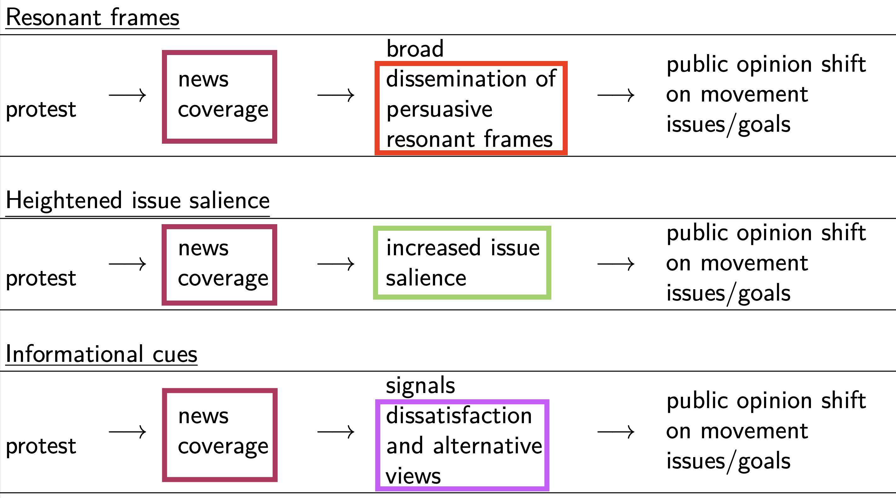
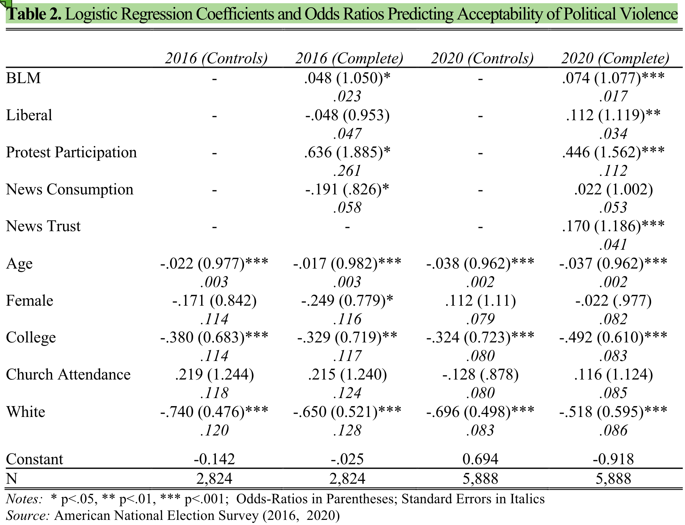
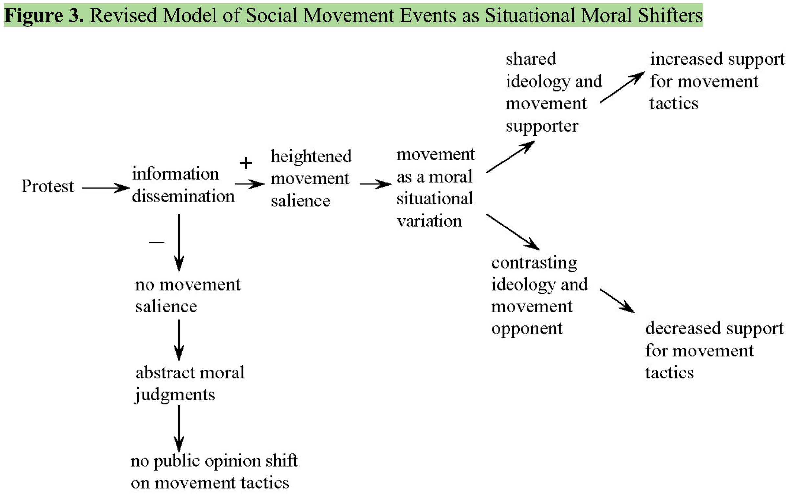

# Opening notes {background-color="#2c844c"}

::: {.tenor-gif-embed data-postid="14209777" data-share-method="host" data-aspect-ratio="1.94" data-width="70%"}
<div class="tenor-gif-embed" data-postid="14209777" data-share-method="host" data-aspect-ratio="1.94" data-width="100%"><a href="https://tenor.com/view/open-gif-14209777">Open Sticker</a>from <a href="https://tenor.com/search/open-stickers">Open Stickers</a></div> <script type="text/javascript" async src="https://tenor.com/embed.js"></script> 
:::

```{=html}
<script type="text/javascript" async src="https://tenor.com/embed.js"></script>
```

- **short synopsis** for final essay due **Friday (17 January)** (send to me via email)

## Presentation groups

<!-- ::: panel-tabset -->
<!-- ## December -->

| Date    | Presenters                       | Method |
| -------:|:---------------------------------|:------:|
|         |                                  |        | 

: Presentations line-up

<!-- | 11 Dec: |                                  | TBD    |  -->


<!-- ## January -->

<!-- | Date    | Presenters                       | Method | -->
<!-- | -------:|:---------------------------------|:------:| -->
<!-- | 15 Jan: | Luna, Emilene, Raffa             | TBD    |  -->

<!-- : Presentations line-up -->

<!-- | 8 Jan:  |                                  | TBD    |  -->
<!-- | 22 Jan: |                                  | TBD    |  -->
<!-- | 29 Jan: |                                  | TBD    |  -->

<!-- ::: -->

<!-- []{style="font-size:10px;"} -->

<!-- For a course on 'social movements' and a class on 'social movements online', can you suggest some discussion questions to ask students? Ideally, the questions should have multiple choice responses, or yes/no/maybe responses, or strongly agree/agree/disagree/strongly disagree responses? -->


## Course feedback {background-color="#2c844c"}

Please take a few minutes to fill in the course feedback survey (check your LMU email).

If have an opinion on these points in the comments:

- Would you have preferred getting a specific [assigned movement]{style="color:violet;"} to independently study in depth? [Yes]{style="color:blue;"}/[No]{style="color:red;"}
- Would you have liked more [structured discussions]{style="color:violet;"} (e.g., set debates on class topics)? [Yes]{style="color:blue;"}/[No]{style="color:red;"}
- Would you rather that class readings are drawn from [textbook(s)]{style="color:violet;"} than journal articles? [Yes]{style="color:blue;"}/[No]{style="color:red;"}
- changes or additions to the course website?


# Types of impact {background-color="#2c844c"}

:::: {.columns}
:::{.column width="50%"}
- opening questions 
- overview of types of impact 
    + individual, organisational, political, cultural 
- example: Me Too movement 
- individual impact 
- organisational impact 
- political impact 
- cultural impact 

:::

::: {.column width="50%"}
<div class="tenor-gif-embed" data-postid="7482489960103160617" data-share-method="host" data-aspect-ratio="1.8018" data-width="100%"><a href="https://tenor.com/view/merry-madagascar-private-brace-for-impact-impact-penguins-of-madagascar-gif-7482489960103160617">Merry Madagascar Private GIF</a>from <a href="https://tenor.com/search/merry+madagascar-gifs">Merry Madagascar GIFs</a></div> <script type="text/javascript" async src="https://tenor.com/embed.js"></script> 
:::
::::

<!-- <div class="tenor-gif-embed" data-postid="25859127" data-share-method="host" data-aspect-ratio="1" data-width="100%"><a href="https://tenor.com/view/impact-security-impact-security-services-cctv-cctv-bedfordshire-gif-25859127">Impact Security Impact Sticker</a>from <a href="https://tenor.com/search/impact+security-stickers">Impact Security Stickers</a></div> <script type="text/javascript" async src="https://tenor.com/embed.js"></script> -->

## Opening questions

::: {style="text-align: center;"}
[How have movements you know of had an impact on society?]{style="color:indigo; font-size:50px;"}
::: 

- [Where and how can social movements have an impact? (Think in terms of categories or arenas of activism)]{style="color:indigo;"}
- [How might we differentiate between degrees of impact?]{style="color:indigo;"}

## Movement impacts {auto-animate=true}


:::: {.columns}
:::{.column width="25%"}

:::

::: {.column width="25%" .center}

:::

::: {.column width="25%" .center}

:::

::: {.column width="25%" .center}

:::

::::


## Movement impacts {auto-animate=true}

::: footer
[[icons created by Flaticon](https://www.flaticon.com/free-icons/)]{style="font-size:20px;"}
<!-- <a href="https://www.flaticon.com/free-icons/" title="Flaticon">icons created by Freepik - Flaticon</a> -->
:::

:::: {.columns}
:::{.column width="25%"}
[cultural]{style="color:darkred;"}

{width=100%}
:::

::: {.column width="25%" .center}

:::

::: {.column width="25%" .center}

:::

::: {.column width="25%" .center}

:::

::::

## Movement impacts {auto-animate=true}

::: footer
[[icons created by Flaticon](https://www.flaticon.com/free-icons/)]{style="font-size:20px;"}
<!-- <a href="https://www.flaticon.com/free-icons/" title="Flaticon">icons created by Freepik - Flaticon</a> -->
:::

:::: {.columns}
:::{.column width="25%"}
[political]{style="color:darkred;"}

{width=100%}
:::

::: {.column width="25%" .center}
[cultural]{style="color:darkred;"}

{width=100%}

:::

::: {.column width="25%" .center}


:::

::: {.column width="25%" .center}


:::

::::

## Movement impacts {auto-animate=true}

::: footer
[[icons created by Flaticon](https://www.flaticon.com/free-icons/)]{style="font-size:20px;"}
<!-- <a href="https://www.flaticon.com/free-icons/" title="Flaticon">icons created by Freepik - Flaticon</a> -->
:::

:::: {.columns}
:::{.column width="25%"}
[organisational]{style="color:darkred;"}

{width=100%}
:::

::: {.column width="25%" .center}
[political]{style="color:darkred;"}

{width=100%}
:::

::: {.column width="25%" .center}
[cultural]{style="color:darkred;"}

{width=100%}

:::

::: {.column width="25%" .center}


:::

::::

## Movement impacts {auto-animate=true}

::: footer
[[icons created by Flaticon](https://www.flaticon.com/free-icons/)]{style="font-size:20px;"}
<!-- <a href="https://www.flaticon.com/free-icons/" title="Flaticon">icons created by Freepik - Flaticon</a> -->
:::

:::: {.columns}
::: {.column width="25%" .center}
[individual]{style="color:darkred;"}

{width=100%}
:::

:::{.column width="25%"}
[organisational]{style="color:darkred;"}

{width=100%}
:::

::: {.column width="25%" .center}
[political]{style="color:darkred;"}

{width=100%}
:::

::: {.column width="25%" .center}
[cultural]{style="color:darkred;"}

{width=100%}

:::

::::

## Movement impacts - individual {auto-animate=true}

:::: {.columns}
::: {.column width="35%" .right}
[individual]{style="color:darkred;"}

{width=100%}
:::

::: {.column width="65%" .right}
- did people who participated change? how?
    + interpersonal connections (likely future movement participation)
- did people who encountered the movement change? how?
    + different issue attention/focus? different attitudes? 

:::
::::

. . . 

- [participants]{style="color:red;"}, [attitudinally]{style="color:cadetblue;"}: radicalised? disillusioned? [behaviourally]{style="color:cadetblue;"}: more extreme? burnout?
- [onlookers responses]{style="color:red;"}: on immigration, culture? support/oppose?

## Movement impacts - individual {auto-animate=true}

:::: {.columns}
::: {.column width="35%" .right}
[individual]{style="color:darkred;"}

{width=100%}
:::

::: {.column width="65%" .right}
- more likely to be recruited into other movement activism [e.g., -@Gundelach2019]
- shapes how individuals think of movement participation ('habitus') [e.g., -@Shoshan2018]
- strengthened attitudes around issues (even after *[disengagement]{style="color:darkred;"}*) [e.g., -@GaudetteETAL2022]
- 'only' momentary participation [e.g., -@Carty2015]---participants might return to 'normal' life
- **despair** and **[disengagement]{style="color:darkred;"},** e.g., -@Al-Anani2019 ... <!-- also Honari2018 -->

:::
::::

. . . 

::: {style="margin-top: -55px;"} 
> [The **[high cost of protesting]{style="color:red;"}** and political participation **[coupled with frustration]{style="color:red;"}** from the Brotherhood’s **[incapable leadership]{style="color:red;"}** disenchanted several members who not only **[broke ties]{style="color:red;"}** with the Brotherhood but also with politics as a whole.]{style="font-size:29px;"}  

:::

## Movement impacts {auto-animate=true}

::: footer
[[icons created by Flaticon](https://www.flaticon.com/free-icons/)]{style="font-size:20px;"}
<!-- <a href="https://www.flaticon.com/free-icons/" title="Flaticon">icons created by Freepik - Flaticon</a> -->
:::

:::: {.columns}
::: {.column width="25%" .center}
[individual]{style="color:darkred;"}

{width=100%}
:::

:::{.column width="25%"}
[organisational]{style="color:darkred;"}

{width=100%}
:::

::: {.column width="25%" .center}
[political]{style="color:darkred;"}

{width=100%}
:::

::: {.column width="25%" .center}
[cultural]{style="color:darkred;"}

{width=100%}

:::

::::

## Movement impacts - organisational {auto-animate=true}

:::: {.columns}
::: {.column width="35%" .right}
[organisational]{style="color:darkred;"}

{width=100%}
:::

::: {.column width="65%" .right}
- a targeted organisation?
    + changed behaviour? organisational decline?
- the movement's own (or connected) organisation(s)?
    + professionalisation, institutionalisation
    + new affiliate organisations (perhaps parties, businesses)

:::
::::

. . . 

- [targeted organisation]{style="color:red;"}: e.g., changed (political) financing activity, policies (as with platforms content moderation), hindered org.'s activity

## Movement impacts {auto-animate=true}

::: footer
[[icons created by Flaticon](https://www.flaticon.com/free-icons/)]{style="font-size:20px;"}
<!-- <a href="https://www.flaticon.com/free-icons/" title="Flaticon">icons created by Freepik - Flaticon</a> -->
:::

:::: {.columns}
::: {.column width="25%" .center}
[individual]{style="color:darkred;"}

{width=100%}
:::

:::{.column width="25%"}
[organisational]{style="color:darkred;"}

{width=100%}
:::

::: {.column width="25%" .center}
[political]{style="color:darkred;"}

{width=100%}
:::

::: {.column width="25%" .center}
[cultural]{style="color:darkred;"}

{width=100%}

:::

::::

## Movement impacts - political {auto-animate=true}

:::: {.columns}
::: {.column width="35%" .right}
[political]{style="color:darkred;"}

{width=100%}
:::

::: {.column width="65%" .right}
- have debates/discourse changed? ([agenda setting]{style="color:cadetblue;"})
- have policies or laws changed? ([legislative content; implementation/interpretation]{style="color:violet;"})
- have dynamics between political actors changed? have new political actors emerged because of the movement? ([political competition]{style="color:goldenrod;"})

- see @Tilly1999, @Amenta1999, @Amenta2010 
:::
::::

## Movement impacts - political {auto-animate=true}

:::: {.columns}
::: {.column width="35%" .right}
[political]{style="color:darkred;"}

{width=100%}
:::

::: {.column width="65%" .right}

::: {style="margin-top: -40px;"} 
- gaining 'new advantages'
    + voting rights [e.g., @Gamson1990]
    + pension/welfare benefits [e.g., @Amenta2005]
- formation of a new political party [e.g., Schwartz 2000]
    + (*Europe*) Green parties; (*US*) Tea Party $\rightarrow$ Republican party __[@Madestam2013]__; (*DE*) Basis party
- winning office
    + representatives *may* push for movements issues

:::

:::
::::

## Movement impacts {auto-animate=true}

::: footer
[[icons created by Flaticon](https://www.flaticon.com/free-icons/)]{style="font-size:20px;"}
<!-- <a href="https://www.flaticon.com/free-icons/" title="Flaticon">icons created by Freepik - Flaticon</a> -->
:::

:::: {.columns}
::: {.column width="25%" .center}
[individual]{style="color:darkred;"}

{width=100%}
:::

:::{.column width="25%"}
[organisational]{style="color:darkred;"}

{width=100%}
:::

::: {.column width="25%" .center}
[political]{style="color:darkred;"}

{width=100%}
:::

::: {.column width="25%" .center}
[cultural]{style="color:darkred;"}

{width=100%}

:::

::::

## Movement impacts - cultural {auto-animate=true}

:::: {.columns}
::: {.column width="35%" .right}
[cultural]{style="color:darkred;"}

{width=100%}
:::

::: {.column width="65%" .right}

- have cultural/societal norms changed because of the movement? how?
    + are certain ideas, behaviours now acceptable *or* no longer acceptable in:
        * public opinion, lifestyle trends
        * media and popular culture
        * non-political institutions (e.g., research and education, religion)

- see @AmentaPolletta2019

:::
::::

. . . 

::: {style="margin-top: -20px;"} 
- e.g., immigration views compared to two/three decades ago; acceptance of certain political rhetoric; approval of 'strong man' leadership in Western democracies 
::: 

## Movement impacts - cultural {auto-animate=true}

:::: {.columns}
::: {.column width="35%" .right}
[cultural]{style="color:darkred;"}

{width=100%}
:::

::: {.column width="65%" .right}

::: {style="margin-top: -40px;"} 
- [changing attitudes]{style="color:cadetblue;"} 
    + e.g., BLM and acceptability of violence; MeToo and social/sexual norms 
    + often mediated by news coverage 

:::

::: {style="margin-top: -40px;"} 
- [changing behaviour]{style="color:cadetblue;"} 
    + consumer purchasing behaviour 
        * veganism 
        * buying sustainably 
        * digital detoxification/minimalism 
    + moral commitments 
        * e.g., *abstinence pledge* effect (likelier to delay sex; but less effect in homogeneous local community) 

::: 

:::
::::

## Movement impacts {auto-animate=true}

::: footer
[[icons created by Flaticon](https://www.flaticon.com/free-icons/)]{style="font-size:20px;"}
<!-- <a href="https://www.flaticon.com/free-icons/" title="Flaticon">icons created by Freepik - Flaticon</a> -->
:::

:::: {.columns}
::: {.column width="25%" .center}
[individual]{style="color:darkred;"}

{width=100%}
:::

:::{.column width="25%"}
[organisational]{style="color:darkred;"}

{width=100%}
:::

::: {.column width="25%" .center}
[political]{style="color:darkred;"}

{width=100%}
:::

::: {.column width="25%" .center}
[cultural]{style="color:darkred;"}

{width=100%}

:::

::::

## Movement impacts summarised {.scrollable} 

::: {style="margin-top: -40px;"} 

1. *[individual]{style="color:darkred;"}* 
    + did the people who participated change? how?  
    + did people who encountered the movement change? how?
2. *[organisational]{style="color:darkred;"}* 
    + a targeted organisation? 
    + the movement’s own (or connected) organisation? 
3. *[cultural]{style="color:darkred;"}* 
    + has the movement changed societal norms? how? 
        * ideas, modes of behaviour no longer acceptable or (conversely) now expected?
4. *[political]{style="color:darkred;"}* 
    + have debates/discourse changed? 
    + have policies or laws changed? 
    + have dynamics between political actors changed? 
    + have new political actors emerged because of the movement?

::: 

## Movement impacts summarised {.scrollable} 

::: {style="text-align: center;"}
[for all of these: there is potential for [backlash effects]{style="color:darkred;"} ... including led by countermovements]{style="color:red; font-size:40px;"} 
::: 

::: {style="margin-top: -40px;"} 

1. *[individual]{style="color:darkred;"}* 
    + did the people who participated change? how?  
    + did people who encountered the movement change? how?
2. *[organisational]{style="color:darkred;"}* 
    + a targeted organisation? 
    + the movement’s own (or connected) organisation? 
3. *[cultural]{style="color:darkred;"}* 
    + has the movement changed societal norms? how? 
        * ideas, modes of behaviour no longer acceptable or (conversely) now expected?
4. *[political]{style="color:darkred;"}* 
    + have debates/discourse changed? 
    + have policies or laws changed? 
    + have dynamics between political actors changed? 
    + have new political actors emerged because of the movement?

::: 

## Example: the Me Too movement (1/2)

<!-- Aspect ratios include 1x1, 4x3, 16x9 (the default), and 21x9. -->
<!-- aspect-ratio="21x9"  --> <!-- start="1" -->


## Example: the Me Too movement (2/2)

<!-- Aspect ratios include 1x1, 4x3, 16x9 (the default), and 21x9. -->
<!-- aspect-ratio="21x9"  -->


# Open data - Campaign outcomes {background-color="#ffe0b2"}

::: panel-tabset
### Visualisation

```{r warning=FALSE, message=FALSE}
library(readxl)
library(dplyr)
library(plotly)

navco <- read_excel("../resources/data/NAVCO_files/NAVCO2-1_ForPublication.xls", guess_max = 20000)

campaigns <- navco %>%
  group_by(id, camp_name) %>%
  summarise(
    start_year     = first(start_year),
    end_year       = first(end_year),
    camp_duration  = first(camp_duration),
    prim_meth      = first(prim_meth),
    success        = max(success, na.rm = TRUE),
    total_part     = first(total_part),
    target_country = first(target_country),
    .groups = "drop"
  ) %>%
  mutate(
    method  = recode(as.character(prim_meth), "0" = "Violent campaign", "1" = "Nonviolent campaign"),
    outcome = recode(as.character(success), "0" = "Not successful", "1" = "Successful"),
    total_part = ifelse(total_part < 0, NA, total_part),
    tooltip = paste0(
      camp_name, " (", target_country, ")<br>",
      start_year, "-", end_year, " - ", method, "<br>",
      "Outcome: ", outcome,
      ifelse(!is.na(total_part), paste0("<br>Participants: ", format(total_part, big.mark = ",")), "")
    )
  )

plot_ly(
  campaigns,
  x = ~start_year,
  y = ~camp_duration,
  type = "scatter",
  width = "100%",
  height = "100%",
  mode = "markers",
  color = ~method,
  colors = c("Nonviolent campaign" = "#2166ac", "Violent campaign" = "#b2182b"),
  symbol = ~outcome,
  symbols = c("Successful" = "circle", "Not successful" = "x"),
  size = ~total_part,
  sizes = c(30, 800),
  marker = list(sizemode = "area", opacity = 0.65, line = list(width = 0.5, color = "white")),
  text = ~tooltip,
  hoverinfo = "text"
) %>%
  layout(
    title = "Onset, duration and outcome of resistance campaigns, 1945-2013 (NAVCO 2.1)",
    xaxis = list(
      title = list(
        text = "Campaign start year",
        font = list(size = 20)
      ),
      tickfont = list(size = 18)
    ),
    yaxis = list(
      title = list(
        text = "Campaign duration (years)",
        font = list(size = 18)
      ),
      tickfont = list(size = 18)
    ),
    legend = list(
      orientation = "h", y = -0.3,
      font = list(size = 16)
    ),
    hoverlabel = list(
      font = list(size = 18)
    )
  )

```

### Explanatory note

Data source: NAVCO2-1_ForPublication.xls (Chenoweth & Shay, NAVCO 2.1 - campaign-year panel, 1945-2013). Unlike the earlier dygraphs/bar charts/maps, this is a plotly bubble scatter: x = when the campaign started, y = how long it lasted, colour = nonviolent vs. violent, marker shape = successful vs. not, and bubble size = total participants. Students can see that non-violent campaigns succeed faster and more often, and hover any point for the campaign name and country.

### Data download 

::: {.callout-note collapse="true" style="margin-top: -15px;"}
#### Data download

```{r echo = F, collapse = TRUE, comment = "#>", message = FALSE, warning=FALSE}
library(downloadthis)

campaigns %>% download_this(
    output_name = "NAVCO_campaigns",
    output_extension = ".csv",
    button_label = "Download dataset as csv",
    button_type = "warning",
    has_icon = TRUE,
    icon = "fa fa-save"
  )
```

:::

::: 


# Poll: impacts {background-color="#2c844c"}

:::: {.columns}
:::{.column width="35%"}
{fig-alt="A QR code for the survey."}

:::

::: {.column width="65%" .center}
<!-- go to <https://www.qr-code-generator.com/>, add the link, and screen shot the QR code -->
Take the survey at **<https://forms.gle/Xcu29yvCx8CSDiWg8>**

- how influential has the movement been? 
- has participation in the movement had lasting effects on participants' lives?
- has the movement inspired the formation of new organisations or initiatives? 

:::
::::

- which political area has been most affected by the movement? 
- which cultural impact has been most significant? 
- which factor best explains this movement's success? 

---

```{ojs}
md`## Poll results (Respondents: ${respondentCount})`
```


```{ojs}

import { liveGoogleSheet } from "@jimjamslam/live-google-sheet";
import { aq, op } from "@uwdata/arquero";

// UPDATE THE LINK FOR A NEW POLL
surveyResults = liveGoogleSheet(
  "https://docs.google.com/spreadsheets/d/e/" +
    "2PACX-1vR1eGKrmbNabBVKR-Kq4hC-bQ_irz5nLt9YJyv81r8B1I8_NORLAe0-ws1w_u4KZzKEicuyc7ks2TMS/" +
    "pub?gid=1583580867&single=true&output=csv",
  10000, 1, 8); // adjust the last number to select all relevant columns

respondentCount = surveyResults.length;

likertOrder = [
  "Strongly disagree",
  "Disagree",
  "Neutral",
  "Agree",
  "Strongly agree"
];

ynmOrder = [
  "Yes",
  "No",
  "Maybe"
];

movementOrder = [
  "Antifa",
  "FFF",
  "LG",
  "PEGIDA",
  "Identitarians",
  "Querdenker"
];

movementColors = [
  "black",
  "green",
  "darkorange",
  "red",
  "gold",
  "purple"
];

```


overall, how influential has the movement been? 
<!-- other -->

```{ojs}
// need to replace 'm_influence_overall'

m_influence_overallCounts = aq.from(surveyResults)
  .groupby("m_influence_overall", "movement")
  .count()
  .objects();

plot_m_influence_overall = Plot.plot({
  marks: [
    Plot.frame({
      fill: "#f7f7f7",
      stroke: "black",
      strokeWidth: 1
    }),
    
    Plot.barY(m_influence_overallCounts, {
      fx: "m_influence_overall",
      x: "movement",
      y: "count",
      fill: "movement",
      stroke: "white"
    })
  ],

  color: {
    domain: movementOrder,
    range: movementColors,
    legend: true,
    style: { fontSize: "20px" }
  },

  fx: {
    // domain: likertOrder,
    label: "",
    tickRotate: -45
  },

  x: {
    domain: movementOrder,
    axis: null, // clears the entire x-axis (ticks and labels)
    // tickFormat: () => "",
    label: ""
  },

  y: {
    label: ""
  },

  marginBottom: 250,
  style: {
    width: 900,
    height: 500,
    fontSize: 20
  }
});


```

## Movement responses - individuals and orgs.

:::: {.columns}
:::{.column width="48%"}

has the movement had lasting effects on participants' lives?
<!-- likert -->

```{ojs}
// need to replace 'm_effects_on_participants'

m_effects_on_participantsCounts = aq.from(surveyResults)
  .groupby("m_effects_on_participants", "movement")
  .count()
  .objects();

plot_m_effects_on_participants = Plot.plot({
  marks: [
    Plot.frame({
      fill: "#f7f7f7",
      stroke: "black",
      strokeWidth: 1
    }),
    
    Plot.barY(m_effects_on_participantsCounts, {
      fx: "m_effects_on_participants",
      x: "movement",
      y: "count",
      fill: "movement",
      stroke: "white"
    })
  ],

  color: {
    domain: movementOrder,
    range: movementColors,
    legend: true,
    style: { fontSize: "20px" }
  },

  fx: {
    domain: likertOrder,
    label: "",
    tickRotate: -55
  },

  x: {
    domain: movementOrder,
    axis: null, // clears the entire x-axis (ticks and labels)
    // tickFormat: () => "",
    label: ""
  },

  y: {
    label: ""
  },

  marginBottom: 140,
  style: {
    width: 900,
    height: 500,
    fontSize: 20
  }
});

```


:::

:::{.column width="4%"}
<div style="height: 600px; border-left: 2px solid #999; margin: 0 auto;"></div>
:::

::: {.column width="48%"}

has movement inspired new organisations or initiatives? 
<!-- ynm -->

```{ojs}
// need to replace 'm_inspired_new_orgs'

m_inspired_new_orgsCounts = aq.from(surveyResults)
  .groupby("m_inspired_new_orgs", "movement")
  .count()
  .objects();

plot_m_inspired_new_orgs = Plot.plot({
  marks: [
    Plot.frame({
      fill: "#f7f7f7",
      stroke: "black",
      strokeWidth: 1
    }),
    
    Plot.barY(m_inspired_new_orgsCounts, {
      fx: "m_inspired_new_orgs",
      x: "movement",
      y: "count",
      fill: "movement",
      stroke: "white"
    })
  ],

  color: {
    domain: movementOrder,
    range: movementColors,
    legend: true,
    style: { fontSize: "20px" }
  },

  fx: {
    domain: ynmOrder,
    label: "",
    tickRotate: 0
  },

  x: {
    domain: movementOrder,
    axis: null, // clears the entire x-axis (ticks and labels)
    // tickFormat: () => "",
    label: ""
  },

  y: {
    label: ""
  },

  marginBottom: 130,
  style: {
    width: 900,
    height: 500,
    fontSize: 20
  }
});

``` 


:::
::::

## Movement responses - political area effect 

which political area has been most affected by the movement? 
<!-- other -->


```{ojs}
// need to replace 'm_political_area_effect'

m_political_area_effectCounts = aq.from(surveyResults)
  .groupby("m_political_area_effect", "movement")
  .count()
  .objects();

plot_m_political_area_effect = Plot.plot({
  marks: [
    Plot.frame({
      fill: "#f7f7f7",
      stroke: "black",
      strokeWidth: 1
    }),
    
    Plot.barY(m_political_area_effectCounts, {
      fx: "m_political_area_effect",
      x: "movement",
      y: "count",
      fill: "movement",
      stroke: "white"
    })
  ],

  color: {
    domain: movementOrder,
    range: movementColors,
    legend: true,
    style: { fontSize: "20px" }
  },

  fx: {
    // domain: likertOrder,
    label: "",
    tickRotate: -45
  },

  x: {
    domain: movementOrder,
    axis: null, // clears the entire x-axis (ticks and labels)
    // tickFormat: () => "",
    label: ""
  },

  y: {
    label: ""
  },

  marginBottom: 250,
  style: {
    width: 900,
    height: 500,
    fontSize: 20
  }
});


```

## Movement responses - cultural impact 

which cultural impact has been most significant? 
<!-- other -->

```{ojs}
// need to replace 'm_cultural_area_effect'

m_cultural_area_effectCounts = aq.from(surveyResults)
  .groupby("m_cultural_area_effect", "movement")
  .count()
  .objects();

plot_m_cultural_area_effect = Plot.plot({
  marks: [
    Plot.frame({
      fill: "#f7f7f7",
      stroke: "black",
      strokeWidth: 1
    }),
    
    Plot.barY(m_cultural_area_effectCounts, {
      fx: "m_cultural_area_effect",
      x: "movement",
      y: "count",
      fill: "movement",
      stroke: "white"
    })
  ],

  color: {
    domain: movementOrder,
    range: movementColors,
    legend: true,
    style: { fontSize: "20px" }
  },

  fx: {
    // domain: likertOrder,
    label: "",
    tickRotate: -45
  },

  x: {
    domain: movementOrder,
    axis: null, // clears the entire x-axis (ticks and labels)
    // tickFormat: () => "",
    label: ""
  },

  y: {
    label: ""
  },

  marginBottom: 250,
  style: {
    width: 900,
    height: 500,
    fontSize: 20
  }
});


```

## Movement responses - explaining impact 

which factor best explains this movement's success? 
<!-- other -->

```{ojs}
// need to replace 'm_explains_impact'

m_explains_impactCounts = aq.from(surveyResults)
  .groupby("m_explains_impact", "movement")
  .count()
  .objects();

plot_m_explains_impact = Plot.plot({
  marks: [
    Plot.frame({
      fill: "#f7f7f7",
      stroke: "black",
      strokeWidth: 1
    }),
    
    Plot.barY(m_explains_impactCounts, {
      fx: "m_explains_impact",
      x: "movement",
      y: "count",
      fill: "movement",
      stroke: "white"
    })
  ],

  color: {
    domain: movementOrder,
    range: movementColors,
    legend: true,
    style: { fontSize: "20px" }
  },

  fx: {
    // domain: likertOrder,
    label: "",
    tickRotate: -45
  },

  x: {
    domain: movementOrder,
    axis: null, // clears the entire x-axis (ticks and labels)
    // tickFormat: () => "",
    label: ""
  },

  y: {
    label: ""
  },

  marginBottom: 250,
  style: {
    width: 900,
    height: 500,
    fontSize: 20
  }
});


```


# Determinants of impact {background-color="#2c844c"}

:::: {.columns}
:::{.column width="50%"}
- what influences chances of impact?
    + summarising determinants from previous classes
- Ex: Just Stop Oil
- @setter2022HowSocialMovemenst
    + background 
- a coda

:::

::: {.column width="50%"}
<div class="tenor-gif-embed" data-postid="25859127" data-share-method="host" data-aspect-ratio="1" data-width="100%"><a href="https://tenor.com/view/impact-security-impact-security-services-cctv-cctv-bedfordshire-gif-25859127">Impact Security Impact Sticker</a>from <a href="https://tenor.com/search/impact+security-stickers">Impact Security Stickers</a></div> <script type="text/javascript" async src="https://tenor.com/embed.js"></script> 
:::
::::


## Movement impacts summarised 

::: {style="text-align: center;"}
[What influences if movements impact these areas?]{style="color:indigo; font-size:45px;"} 
::: 

::: {style="margin-top: -40px;"} 

1. *[individual]{style="color:darkred;"}* 
    (a) did the people who participated change? how?; (b) did people who encountered the movement change? how?
2. *[organisational]{style="color:darkred;"}* 
    (a) a targeted organisation?; (b) movement’s own (or related) org.? 
3. *[cultural]{style="color:darkred;"}* 
    + has movement changed societal (ideas, behaviours) norms? 
4. *[political]{style="color:darkred;"}* 
    (a) have debates/discourse changed?; (b) have policies or laws changed?; (c) have dynamics between political actors changed?; (d) have new political actors emerged because of the movement?

::: 

## *How* movements have an impact, summary

[(a lot falls under the headings of **[resources]{style="color:darkred;"}** or **[opportunities]{style="color:darkred;"}**, but let's be more specific than that...)]{style="font-size:25px;"} 

- **[organisational attributes]{style="color:cadetblue;"}** that facilitate coherent, sustained activism and getting attention
    + *professionalisation* (e.g., a media department)
    + (a minimum degree of) *hierarchy*
    + competent *leadership*
- **sound [strategy]{style="color:darkred;"}**
    + *coherence* between [goals]{style="color:darkred;"}, [frames]{style="color:darkred;"}, and actions/[tactics]{style="color:darkred;"}
        * [well done]{style="color:forestgreen;"}: U.S. civil rights (political, economic equality)
        * [not so well done]{style="color:violet;"}: Stop Oil and Letzte Generation...
    + (perceived) *moderateness* of goals/demands

## *How* movements have an impact, summary

[(a lot falls under the headings of **[resources]{style="color:darkred;"}** or **[opportunities]{style="color:darkred;"}**, but let's be more specific than that...)]{style="font-size:25px;"} 

- **[frame resonance]{style="color:darkred;"}** (i.e., ideas get broader/influential support)
    + *[issue salience]{style="color:darkred;"}*
    + *substantive agreement*
    + mediated by news coverage and social media
- **[elite allies]{style="color:darkred;"}** (i.e., individuals in key positions to help a movement)
    + favourable partisan context (e.g., Roe v. Wade [*good* context for feminist activists], then Equal Rights Amendment [changed to *bad* context for feminist activists])
- **mass support** (i.e., too big to ignore by targets of mobilisation)
- absence of a strong **[countermovement]{style="color:darkred;"}**/**[opposing movement]{style="color:darkred;"}**

## *How* movements have an impact, summary

@AmentaPolletta2019[p. 292]:

> While movements’ ability to effect change depends in part on how **[organized, resourced, and strategic]{style="color:goldenrod;"}** they are, the real practical acumen comes in **[matching tactics to the institutional context]{style="color:cadetblue;"}** in which movements operate. Whether the decision is to focus on raising consciousness or raising money, to lobby legislators or take to the streets, to tell stories or present statistics, the right choice depends both on **[features of the movement]{style="color:forestgreen;"}** and on **[features of the institution]{style="color:violet;"}**.

## *How* movements have an impact, a question

::: {style="text-align: center;"}
[How might this movement (be aiming to) have an impact?]{style="color:indigo; font-size:40px;"} 
::: 

<!-- Aspect ratios include 1x1, 4x3, 16x9 (the default), and 21x9. -->
<!-- aspect-ratio="21x9"  -->


<!-- <https://www.theguardian.com/uk-news/2025/jan/13/just-stop-oil-activists-spray-paint-charles-darwin-grave> -->


## A study of impact - @setter2022HowSocialMovemenst

at the intersection of *[individual]{style="color:darkred;"}* and *[cultural]{style="color:darkred;"}* impact: **[public opinion]{style="color:red;"}**

## background on the George Floyd protests 

- a short summary of the background to the movement:

<!-- "Why did George Floyd die? The history of police brutality in the U.S. - BBC" -->

<!-- Aspect ratios include 1x1, 4x3, 16x9 (the default), and 21x9. -->
<!-- aspect-ratio="21x9"  -->


::: {style="margin-top: -60px;"} 

[a longer history summary (*Channel 4*): <https://www.youtube.com/watch?v=YG8GjlLbbvs>]{style="font-size:26px;"}  

::: 

<!-- - what are the most important points to know from this context and catalysing event? -->

## @setter2022HowSocialMovemenst - design

- RQ: *When such events happen, how does this shape citizens’ views on politically-oriented violence?*
- Context: 
    + 'U.S. citizens [expect protesters to conduct themselves nonviolently]{style="color:red;"}...' (p. 430)
    + YET - "people find violence more acceptable when traditional political methods are incapable of adequately addressing social injustices"
- Data:
    + from the **American National Election Study’s (ANES)** [2016]{style="color:blue;"} and [2020]{style="color:blue;"} samples

## how SMs influence public opinion - [-@setter2022HowSocialMovemenst]


## how SMs influence public opinion - [-@setter2022HowSocialMovemenst]



## support for political violence (%) - [-@setter2022HowSocialMovemenst]

:::: {.columns}
:::{.column width="50%"}

```{r}
library(kableExtra)
library(tidyr)

data <- data.frame(
  Demographic = c("Sample Overall", "Extremely Liberal", "Liberal", "Slightly Liberal", "Moderate", "Slightly Conservative", "Conservative", "Extremely Conservative",
                  "White", "Black", "Men", "Women", "Age 18-29", "Age 30-39", "Age 40-49", "Age 50-59", "Age 60-69", "Age 70-79", "Age 80+", "Attends Church", "Does Not Attend Church"),
  `2016` = c(15.28, 14.55, 10.02, 16.83, 15.93, 14.84, 9.24, 12.71, 11.79, 24.37, 16.45, 14.17, 28.40, 16.42, 14.54, 13.12, 9.86, 9.35, 15.03, 16.10, 14.00),
  `2020` = c(14.34, 30.79, 17.36, 16.23, 16.30, 8.59, 5.45, 8.22, 10.89, 24.41, 14.13, 14.63, 30.42, 21.13, 16.85, 10.76, 7.15, 7.57, 6.02, 12.82, 15.81)
)

setter_reg_tab <- kable(data, format = "html", 
      col.names = c("Demographic", "2016", "2020"), 
      align = c("r", "c", "c")) %>% 
  kable_styling(full_width = FALSE, font_size = 16) %>%
  row_spec(0, bold = TRUE)
setter_reg_tab

```

:::

::: {.column width="50%"}
[any numbers that you think are noteworthy?]{style="color:indigo;"}

:::
::::

## support for political violence (%) - [-@setter2022HowSocialMovemenst]

:::: {.columns}
:::{.column width="50%"}

```{r}
library(dplyr)

setter_reg_tab %>% 
  column_spec(3, 
              color = "black", 
              bold = T,
              background = case_when(
                data$X2020 == 17.36 | data$X2020 == 30.79 ~ "red",
                data$X2020 == 8.59 | data$X2020 == 5.45 ~ "pink",
                data$X2020 == 30.42 | data$X2020 == 21.13 ~ "red",
                data$X2020 == 10.76 | data$X2020 == 7.15 | data$X2020 == 7.57 ~ "pink",
                TRUE ~ "white"
              )) %>% 
  column_spec(2, 
              color = "black", 
              bold = T,
              background = case_when(
                data$X2020 == 17.36 | data$X2020 == 30.79 ~ "pink",
                data$X2020 == 8.59 | data$X2020 == 5.45 ~ "red",
                data$X2020 == 30.42 | data$X2020 == 21.13 ~ "pink",
                data$X2020 == 10.76 | data$X2020 == 7.15 | data$X2020 == 7.57 ~ "red",
                TRUE ~ "white"
              ))
                
```

:::

::: {.column width="50%"}
- "[liberals became much more likely]{style="color:darkorange;"} to find political violence acceptable ... [conservatives became much less likely]{style="color:darkorange;"} to find themselves in support of violence..."
- "[Younger respondents were more likely]{style="color:darkorange;"} to support political violence in 2020 ... while their [older counterparts were more opposed]{style="color:darkorange;"} than before"

:::
::::

## support for political violence (%) - [-@setter2022HowSocialMovemenst] 

:::: {.columns}
:::{.column width="30%"}

```{r}
setter_reg_tab %>% 
  column_spec(2, color = "black", bold = T,
              background=ifelse(data$X2016 == 15.03, "lightblue", "white"))
```

:::

::: {.column width="70%"}
> One strange outlier is the 2016 survey’s proportion of 80+ year-olds who find political violence acceptable. We have checked the coding on this variable multiple times to ensure that there is nothing wrong with it, and it has remained accurate every time. Either the 2016 ANES just happened to capture a particularly rowdy set of senior citizens, or there was some cohort effect among that sample’s oldest respondents that was not shared among the 2020 cohort—such as lingering memories of WWII or the 1960s movements.

:::
::::

## @setter2022HowSocialMovemenst - findings



## @setter2022HowSocialMovemenst - findings

- support for Black Lives Matter is [significantly correlated]{style="color:darkorange;"} with support for political violence.
- "The [impact of age intensified between 2016 and 2020]{style="color:darkorange;"}. In the 2016 model, each additional year of age corresponds to a .2% lower likelihood of supporting political violence. In 2020, each additional year corresponds to a decrease of .4%, two times the impact of the previous model. In other words, [in 2016, a fifty-year-old respondent would be 6% less likely to support political violence than a twenty-year-old respondent]{style="color:darkorange;"}, net of all other factors. In 2020, by contrast, they would be 12% less likely to support political violence, net of all other factors."
- significance of higher education: [having a college degree decreases support for political violence by 3.4%]{style="color:darkorange;"}.

## @setter2022HowSocialMovemenst - findings, revised model



## @setter2022HowSocialMovemenst - findings

> the George Floyd riots functioned as a new “**[situational variation]{style="color:cadetblue;"}**” that shifted people’s attitudes, increasing the proportion of liberals and ardent BLM movement supporters who felt that the political violence was justifiable."

- "**people may shift their attitudes about political violence yet again when a different movement poses a new situational variation. In one instance, people can be supportive of political violence and then, in a different instance, be morally opposed to it. The key factor shaping beliefs in any particular moment is how a person feels about the movement that is using political violence.**"

## *How* movements have an impact, a coda

From @mueller2022CrowdCohesionProtest 

- there is the '[illusion of cohesion]{style="color:violet;"}' among protesters---who in fact represent a diverse array of views
- protesters can enhance their odds of success by coordinating around a unified message
    + may clash with some activists’ preferences for "intersectional" messages

> a compromise would be to voice specific demands sequentially, so that each protest event has a cohesive theme (and a decent shot at success) but every issue eventually has it moment in the spotlight

<!-- The results imply that protesters can enhance their odds of success by coordinating around a unified message. This strategy may clash with some activists’ preferences for “intersectional” messages that address the interests of multiple constituencies all at once. For example, Black Lives Matter spokespersons have sometimes argued that it is wrong to seek justice for Black Americans without simultaneously pursuing justice for women, trans people, and other marginalized communities. A compromise would be to voice specific demands sequentially, so that each protest event has a cohesive theme (and a decent shot at success) but every issue eventually has it moment in the spotlight. -->


# Any questions, concerns, feedback for this class? {background-color="#2c844c"}

Anonymous feedback here: <https://forms.gle/AjHt6fcnwZxkSg4X8>

Alternatively, please send me an email: [m.zeller\@lmu.de]{style="color:red;"}


<!-- ```{r echo=FALSE, message=FALSE, warning=FALSE} -->
<!-- pagedown::chrome_print(file.path("..", "docs/slides", "slides_12.html")) -->
<!-- ``` -->

<hr>

[Questions about movements next meeting]{style="color:violet;"}: (1) How would you describe the movement's current level of mobilisation? (2) Has the movement successfully recovered after periods of decline? (3) What has been the most important demobilising pressure? (4) Has the movement become more institutionalised over time? (5) Even if mobilisation has declined, do the movement's ideas remain influential?

## References
