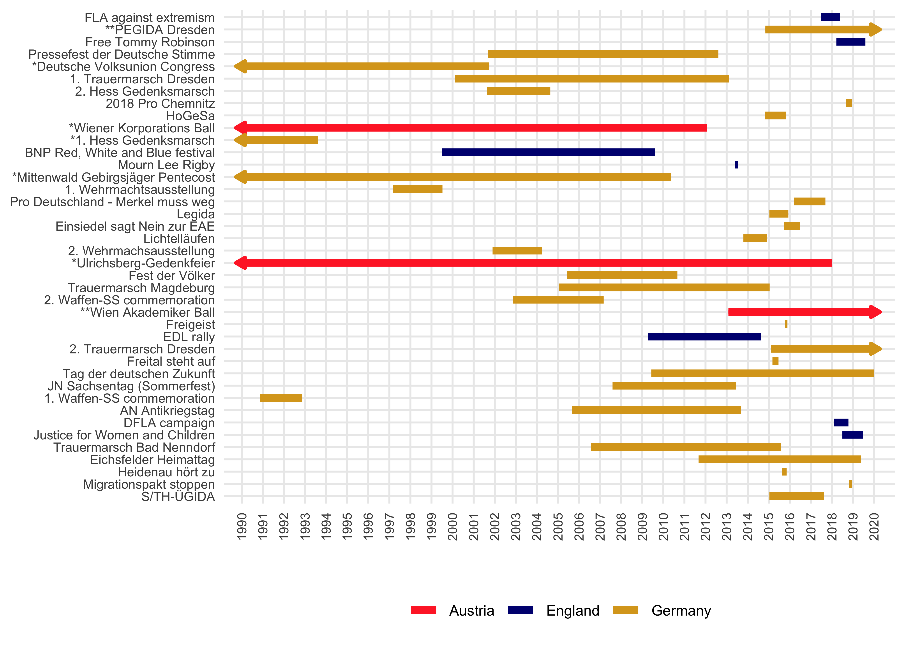
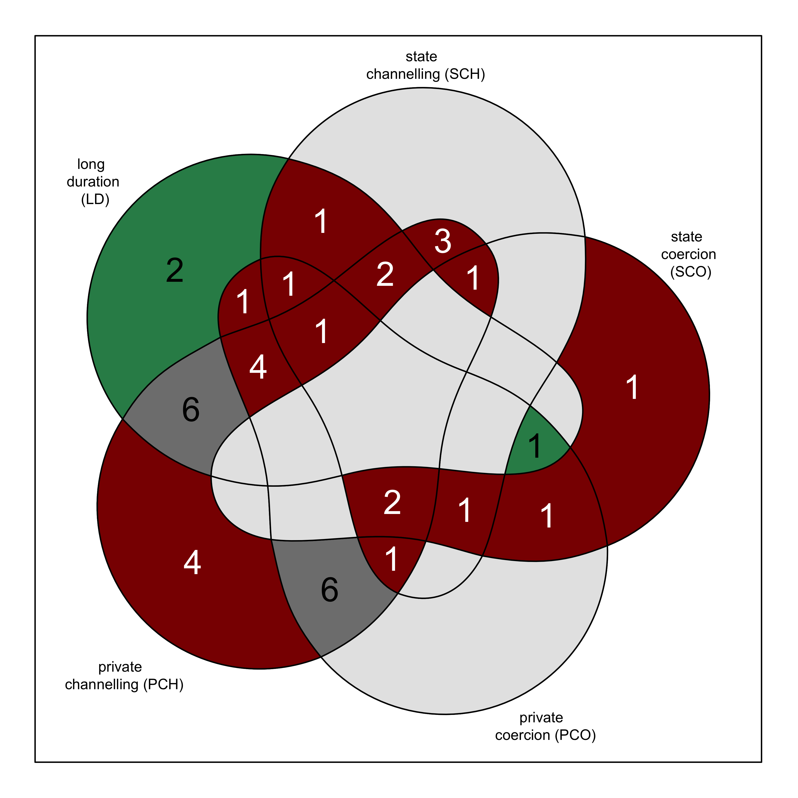
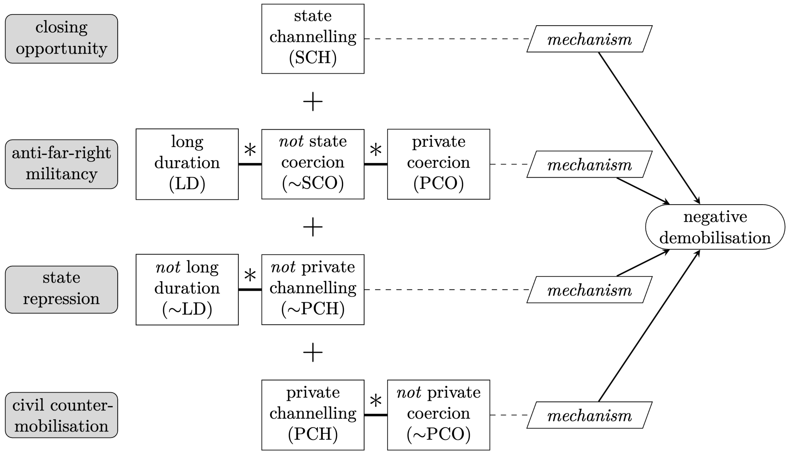
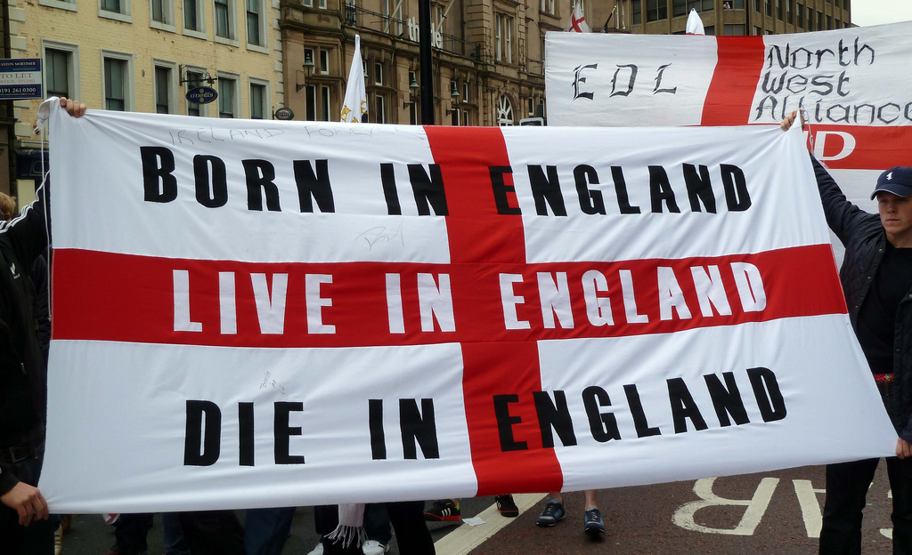
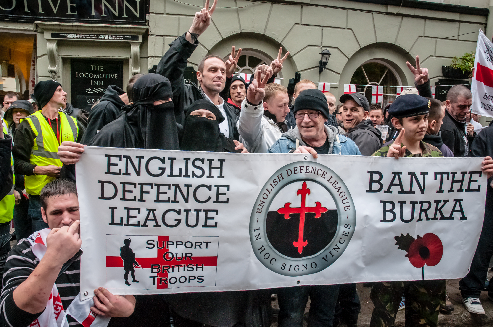
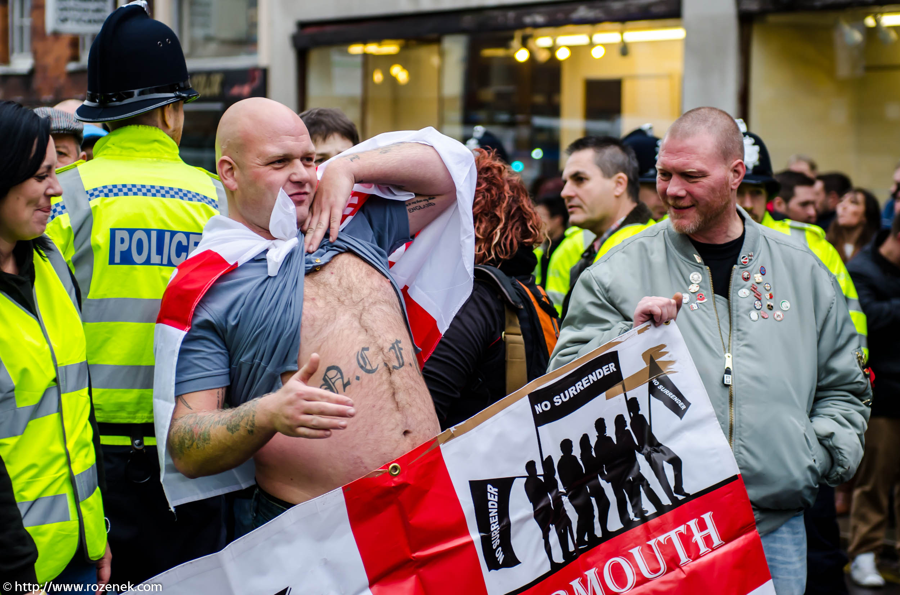

# Opening notes {background-color="#2c844c"}

::: {.tenor-gif-embed data-postid="14209777" data-share-method="host" data-aspect-ratio="1.94" data-width="70%"}
<div class="tenor-gif-embed" data-postid="14209777" data-share-method="host" data-aspect-ratio="1.94" data-width="100%"><a href="https://tenor.com/view/open-gif-14209777">Open Sticker</a>from <a href="https://tenor.com/search/open-stickers">Open Stickers</a></div> <script type="text/javascript" async src="https://tenor.com/embed.js"></script> 
:::

```{=html}
<script type="text/javascript" async src="https://tenor.com/embed.js"></script>
```


## Presentation groups

<!-- ::: panel-tabset -->
<!-- ## December -->

| Date    | Presenters                       | Method |
| -------:|:---------------------------------|:------:|
| 4 Dec:  | Daichi, Seongyeon, Jehyun        | ethnography | 
| 8 Jan:  | Ayla, Tara, Theresa, Annabelle   | discourse analysis | 
| 15 Jan: | Luna, Emilene, Raffa, Sofia      | TBD    | 

: Presentations line-up

<!-- | 11 Dec: |                                  | TBD    |  -->


<!-- ## January -->

<!-- | Date    | Presenters                       | Method | -->
<!-- | -------:|:---------------------------------|:------:| -->
<!-- | 15 Jan: | Luna, Emilene, Raffa             | TBD    |  -->

<!-- : Presentations line-up -->

<!-- | 8 Jan:  |                                  | TBD    |  -->
<!-- | 22 Jan: |                                  | TBD    |  -->
<!-- | 29 Jan: |                                  | TBD    |  -->

<!-- ::: -->

<!-- []{style="font-size:10px;"} -->

<!-- For a course on 'social movements' and a class meeting on 'social movements demobilization' (i.e., the decline and end of movements), can you suggest some discussion questions to ask students? Ideally, the questions should have multiple choice responses, or yes/no/maybe responses, or strongly agree/agree/disagree/strongly disagree responses? -->


# Key concepts review {background-color="#2c844c"}

:::: {.columns}
:::{.column width="50%"}
- social movements - [collections of people that mobilise, coordinate, and campaign for some objective]{style="color:yellow;"} 
- essay question example 
- concepts from previous class meetings 

:::

::: {.column width="50%"}
<div class="tenor-gif-embed" data-postid="9543307" data-share-method="host" data-aspect-ratio="1.84932" data-width="100%"><a href="https://tenor.com/view/shine-text-share-the-flip-side-sharetheflipsidegifs-stress-exams-gif-9543307">Studying GIF</a>from <a href="https://tenor.com/search/shine+text-gifs">Shine Text GIFs</a></div> <script type="text/javascript" async src="https://tenor.com/embed.js"></script> 
:::
::::

## Klausur essay question example  

:::: {.columns}
:::{.column width="25%"}
1. Broad introduction 
:::

:::{.column width="25%"}
2. Elaborate in detail  
:::

:::{.column width="25%"}
3. Describe examples 
:::

:::{.column width="25%"}
4. Concluding summary 
:::
::::

*What sort of impacts can social movements have? Discuss with examples*


## Theories of social movements, conceptual origins

```{r echo=FALSE, message=FALSE, warning=FALSE}
library(kableExtra)
library(dplyr)

df <- data.frame(
  Parent_Scholarship = c(
    "Marx and Engels, class conflict", 
    "structuralist (leaves little room for the mechanisms that actually draw individuals in collective action)",
    "legacy for SMS: class forces and other cleavages spurring collective action", 
    "Lenin and resource mobilisation", 
    "vanguardism", 
    "legacy for SMS: focus on leaders/organisers (mobilising interests) and organisations", 
    "Gramsci and cultural hegemony", 
    "counterculture of working class can overcome bourgeois hegemonic culture", 
    "legacy for SMS: constructivism, prefiguration, and movement impact on culture", 
    "Tilly's Polity Model", 
    "the structure of the state/polity", 
    "legacy for SMS: repertoires of contention, WUNC (worthiness, unity, numbers, committed)"
    ),
  SMS = c(
    "Collective behaviour theory", 
    "(grievances, [relative] deprivation)", 
    "", 
    "Resource mobilisation theory", 
    "",
    "leadership, organisations, and various resources", 
    "Framing and Collective identity theories", 
    "'cultural turn' (from anthropology, sociology)", 
    "forming consensus in movements", 
    "Political process theory", 
    "opportunities, constraints, and the structure of contentious politics", 
    ""
  )
)

df$Parent_Scholarship <- as.factor(df$Parent_Scholarship)
df$SMS <- as.factor(df$SMS)

kable(df, booktabs = T,
      align = c("l", "l"),
      col.names = c("Parent Scholarship", "Social Movement Studies (SMS)")) %>%
  kable_paper("striped", full_width = FALSE, font_size = 23) %>% 
  row_spec(1:3, bold = F, color = "white", background = "#D7261E") %>% 
  row_spec(4:6, bold = F, color = "black", background = "pink") %>% 
  row_spec(7:9, bold = F, color = "black", background = "gold") %>% 
  row_spec(10:12, bold = F, color = "white", background = "dodgerblue2")

```

## Theories of social movements, conceptual origins

- **[Collective behaviour theory]{style="color:teal;"}**: why is movement activity happening?
    + movements as consequences and manifestations of *strain*, *[deprivation]{style="color:darkred;"}*, and *[grievance]{style="color:darkred;"}*
- **[Resource mobilisation theory]{style="color:teal;"}**: how is movement activity happening?
    + focus on organisations: how they mobilise and campaign in strategic
pursuit of goals
    + types of [resources]{style="color:darkred;"}, including: material, human, organisational, moral
- **[Political process theory]{style="color:teal;"}**: what makes/shapes movement activity?
    + movements are products of the political environment in which they emerge, responding to socio-political changes ([opportunity/threat]{style="color:darkred;"}) and being met with (broadly) [facilitation]{style="color:darkred;"} or [repression]{style="color:darkred;"} or [disregard]{style="color:darkred;"}

## Key concepts (1) 

- **[opportunities]{style="color:darkred;"}** [@Tarrow2011, p. 32]: “consistent – but not necessarily formal, permanent, or national – sets of clues that encourage people to engage in contentious politics.”
<!-- - **threats** [@Tarrow2011, p. 32]: “those factors – repression, but also the capacity of authorities to present a solid front to insurgents – that discourage contention.” -->

- **[political opportunity structure]{style="color:darkred;"}** [@Kitschelt1986, p. 58] - “are comprised of specific configurations of resources, institutional arrangements and historical precedents for social mobilisation, which facilitate the development of protest movements in some instances and constrain them in others”
    + concept formation of POS should be specific to a given movement

**3 POS effects on movements**

1. What resources (‘coercive, normative, remunerative and informational’) can an emergent movement draw upon?
2. How can movements access the public sphere and political decision-making? (what laws regulate such access)
3. Are there other movements that model (and ease) mobilisation and movement emergence?

## Key concepts (2)

[discursive opportunity structure]{style="color:darkred;"} [@Koopmans2004, pp. 202-205]: *aspects of the public discourse that determine a message’s chances of diffusion in the public sphere*

```{r echo=FALSE, message=FALSE, warning=FALSE}
library(kableExtra)
library(dplyr)

df <- data.frame(
  DOS = c(
    "Visibility", 
    "",
    "", 
    "", 
    "Resonance", 
    "", 
    "Legitimacy", 
    ""
    ),
  Descript = c(
    "in public sphere, messages > available space (thus, competition)", 
    "claim makers aim to get messages into public discourse",
    "gatekeepers select, shape, amplify, or diminish messages", 
    "Is the message visible? - a necessary condition to influence discourse", 
    "Does the message provoke reactions from others in public sphere?", 
    "Is the message supported? (consonance) --- Is the message opposed? (dissonance) (either can help replicate the message)", 
    "to what degree is the message supported (vs. opposed) in the public sphere?", 
    "highly legitimate messages may have no resonance at all because they are uncontroversial, while highly illegitimate messages may have strong resonance"
  )
)

df$DOS <- as.factor(df$DOS)
df$Descript <- as.factor(df$Descript)

kable(df, booktabs = T,
      align = c("l", "l"),
      col.names = c("Discursive opportunity", "Description")) %>%
  kable_paper("striped", full_width = FALSE, font_size = 26) %>% 
  row_spec(1:4, bold = F, color = "black", background = "pink") %>% 
  row_spec(5:6, bold = F, color = "black", background = "seagreen1") %>% 
  row_spec(7:8, bold = F, color = "black", background = "gold")

```


## Key concepts (3)

- **[framing]{style="color:darkred;"}** ('ideology') - the meanings individuals or groups attach to events, developments, activities, and other individuals/groups
    + types of frames: [diagnostic]{style="color:darkred;"}, [prognostic]{style="color:darkred;"}, [motivational]{style="color:darkred;"};
        * *[injustice frames]{style="color:darkred;"}* - When problems are attributed to individuals’ or groups’ ignorance, indifference, or malice, the result is a sense of injustice
    + [master frame]{style="color:darkred;"}: an overarching frame that smaller/sub-issue frames fit into
    + [counter frame]{style="color:darkred;"}: a frame opposed to another group’s frame (**framing contest**)

## Key concepts (4)

- **[frame bridging]{style="color:darkred;"}** - linking of two or more ideologically congruent but structurally unconnected frames regarding a particular issue or problem
- **[frame amplification]{style="color:darkred;"}** - idealization, embellishment, clarification, or invigoration of existing values or beliefs
- **[frame extension]{style="color:darkred;"}** - depicting an SMO’s interests and frame(s) as extending beyond its primary interests to include issues and concerns that are presumed to be of importance to potential adherents
- **[frame transformation]{style="color:darkred;"}** - changing old understandings and meanings and/or generating new ones

- **[credibility]{style="color:darkred;"}**? **[salience]{style="color:darkred;"}**?

## Key concepts (5) {.scrollable}

- **[social networks]{style="color:darkred;"}** - all belong to multiple netz; some informal, others formal
    + facilitate **[mobilisation]{style="color:darkred;"}** (the process of initiating collective action), share information, coordinate activity
    + collective action reshapes networks
- **[collective action problem]{style="color:darkred;"}** - challenge of bringing people together in collective action when conflicting interests discourage collective action
- **[movement organisations]{style="color:darkred;"}** - the components of *movements*, with more or less defined structure
    + bureaucratic organisations vs. grassroots organisations
    + exclusve affiliations vs. multiple affiliations
- **[collective identity]{style="color:darkred;"}** - an *individual’s* cognitive, moral and emotional connection with a broader community, category, practice, or institution’; and a *shared* definition of a *group* derived from members’ common interests, experience, and solidarity
    + identity is our understanding of who we are and who other people are (personal identity, social identity) - *intersectionality*
    + components of collective identity: boundaries, consciousness, negotiation
    + group identification bridges social identity with collective identity -- (*explaining why people participate in protest*)

## Key concepts (6)

```{r, echo=FALSE, message=FALSE, warning=FALSE, engine = 'tikz'}

\begin{tikzpicture}[node distance=4cm]

\tikzstyle{BOX} = [rectangle, rounded corners, minimum width=2cm, minimum height=0.5cm,text centered, text width=3cm, draw=black, fill=red!30]
\tikzstyle{TRAPE} = [rectangle, minimum width=2cm, minimum height=0.5cm, text centered, text width=7cm, draw=black, fill=blue!30]
\tikzstyle{RECT} = [rectangle, minimum width=1cm, minimum height=0.5cm, text centered, text width=8cm, draw=black, fill=orange!30]
\tikzstyle{arrow} = [thick,->,>=stealth]

\node (macro) [BOX] {macro level};
\node (meso)  [BOX, below of=macro] {meso level};
\node (micro) [BOX, below of=meso] {micro level};

\node (macro1) [RECT, right of=macro, xshift=3cm] {cleavages and other divisions in society \linebreak political/discursive opportunity structures for collective action};
\node (meso1) [TRAPE, right of=meso, xshift=3cm] {collective identity \linebreak (boundaries, consciousness, negotiation)};
\node (micro1) [RECT, right of=micro, xshift=3cm] {personal and social identities, bases of group identification};

\draw[line width=0.5mm, ->] (macro1) to [bend right=30] (meso1) node [midway, left, xshift=6.0cm, yshift=-1.7cm] (Text1) {contextual impact};
\draw[line width=0.5mm, ->] (macro1) to [bend right=30] (meso1) node [midway, left, xshift=6.0cm, yshift=-2.3cm] (Text2) {on identity};
\draw[line width=0.5mm, ->] (meso1) to [bend right=30] (macro1) node [midway, right, xshift=8.0cm, yshift=-2.0cm] (Text3) {action mobilisation};

\draw[line width=0.5mm, ->] (meso1) to [bend right=30] (micro1) node [midway, left, xshift=6.0cm, yshift=-5.75cm] (Text4) {consensus};
\draw[line width=0.5mm, ->] (meso1) to [bend right=30] (micro1) node [midway, left, xshift=6.0cm, yshift=-6.25cm] (Text5) {mobilisation};
\draw[line width=0.5mm, ->] (micro1) to [bend right=30] (meso1) node [midway, right, xshift=8.0cm, yshift=-5.75cm] (Text6) {group identfication};
\draw[line width=0.5mm, ->] (micro1) to [bend right=30] (meso1) node [midway, right, xshift=8.0cm, yshift=-6.25cm] (Text7) {and participation};

\end{tikzpicture}

```

## Key concepts (7)

- **[strategy]{style="color:darkred;"}** - a combination of a claim (or demand), a tactic, and a site (or venue); alternatively, consisting of 3 elements: 
    1. *[Targeting]{style="color:darkred;"}* - who/what is being acted upon by tactics
    2. *[Tactics]{style="color:darkred;"}* - types of collective action and manner of their performance
    3. *[Timing]{style="color:darkred;"}* - some moments present greater opportunity than others
    + Remember: strategy is a product of (rational) choice, BUT also a part of collective identity involving moral and emotional committments
    + demonstration vs. direct action
        * *[Demonstrations]{style="color:darkred;"}* inconvenience or embarrass authorities and establish the movement’s social support but never themselves attain the collective goal
        * *[Direct action]{style="color:darkred;"}* seize resources to satisfy their demands or take  action to resolve a grievance; seeks itself to achieve collective goals

## Key concepts (8)

- @Gamson1990 found that violent social movements (incl. 'strikes and disruptive techniques') are more likely than nonviolent to achieve their goal
    + more effective in attracting attention and imposing costs on targets/opponents - similarly found by @Cress2000
- @Chenoweth2011: non-violent more than twice as likely to achieve full or partial success compared to violent cases 
    + nonviolent campaigns elicit broad and diverse support, create more opposition defections, have more tactical options, often maintain discipline

## Key concepts (9)

- **[social control hypothesis]{style="color:darkred;"}** [e.g., @Piven1979]
    + disruptive protests/tactics allow movements to win concessions in exchange for ending protests/tactics (*coercion* mechanism)
- **[mass mobilisation/social pressure hypothesis]{style="color:darkred;"}** [e.g., @Chenoweth2011]
    + gaining enough (visible) support to pressure decision-makers into concessions (*consensus/demonstrative/persuasion* mechanisms)
        * implicit appeal to democratic norms
- **[radical flank effects]{style="color:darkred;"}** - dynamics between (relatively) moderate and (relatively) radical parts of a movement and their target(s)
    + *positive* effect - compels target/authorities to accept moderate demands
    + *negative* effect - spooks potential elite allies

## Key concepts (10)

- @McAdam1983: tactical interaction
    + movements *disrupt* as they mount a challenge
    + authorities/targets *adapt* to tactics, dulling their impact
    + movements *innovate* tactics to maintain effective strategy
    + **this cycle places high demands on movements**

## Key concepts (11)

- **[coalitions]{style="color:darkred;"}** - may be enduring, may be short-term
    + factors critical to coalition formation: social ties, conducive org. structures, ideology/culture/identity, institutional environment, resouces
    + help build/enhance networks, increase resource availability, expand tactical repertoires

- **[media]{style="color:darkred;"}** 
    + plays *gatekeeper* role
    + factors affective media coverage: day of week, other events, weather, celebrities, size/violence/counterdemo of event
\vspace{-2mm}
- **[astroturfing]{style="color:darkred;"}** - manipulation of public sphere (media, information, movement scene)

## Key concepts (12)

- **party responses to movements**: *[dismissive]{style="color:darkred;"}*, *[accommodative]{style="color:darkred;"}*, *[adversarial/oppose]{style="color:darkred;"}* 
- **state responses to movements**: ignore/dismiss, oppose (close opportunities, channel, repress), accommodate (encourage institutionalisation, engage in policymaking processes, change policy)

## Key concepts (13)

- dimensions of [repression]{style="color:darkred;"}:

```{r}
library(tidyr)
library(kableExtra)

table_data <- tribble(
  ~a, ~b, ~c, ~d,
  "Identity of repressive agent", "State agents tightly connected with national political elites (e.g., military units)", "State agents loosely connected with national political elites (e.g., local police departments)",  "Private agents (e.g., counter-demonstrators)",
  
  "Character of repressive action", "Coercion (e.g., use of tear gas and rubber bullets)", "Channelling (e.g., restrictions on registered organisations)", "", 
  
  "Whether repressive action is observable", "Observable (i.e., overt; e.g., Tiananmen Square)", "Unobserved (i.e., covert or latent; e.g., COINTELPRO)", "",
)

kable(table_data, "html", escape = FALSE,
      col.names = c("", "", "", "")) %>%
  kable_styling(bootstrap_options = c("striped", "hover", "responsive"), font_size = 28) %>%
  column_spec(1, bold = TRUE)

```

## Key concepts (14)

- **[countermovement]{style="color:darkred;"}** ('opposing movements') - a movement that makes contrary claims simultaneously to those of the original movement
    + involve sustained counter-mobilisation
    + characterised by *polarisation*, *dependency*, *Manicheism*, *imitation*
    + more likely to appear when... (a) originating movement shows signs of success, (b) that success includes threats to existing interests, (c) (elite) allies are available to support counter-mobilisation
    + divided governments/authorities are more likely to provoke movement-countermovement contention because they cannot decisively ‘close’ issues
    + federal systems are more likely to sustain movement-countermovement contention because there are venues/arenas
    + movements and countermovements form part of the opportunity structure of each other

- **[critical events]{style="color:darkred;"}**, for movements, can be government or state actions, accidents/incidents, large or conspicuous demonstrations

## Key concepts (15)

- *internet tools* allow movements...
    + (+) greater speed (and accuracy) of communication, less cost of communication, greater connectivity across distances
    + (-) to scale up without building strong organisation

- **[movement impact]{style="color:darkred;"}**
    + on individuals, on organisations, on cultures, on politics
        * positive, negative (backlash), null impacts

## Tips for preparing for Klausur

- review class slides
- reread your notes from readings
    * maybe (re-)read a couple of the required readings
- think through cases you know of 
- think through other cases we discussed (through readings or your peers' expertise)

- **[don't panic]{style="color:cadetblue;"}**


# Demobilisation and disengagement {background-color="#2c844c"}

:::: {.columns}
:::{.column width="50%"}
- demobilisation and disengagement defined 
- factors influencing demobilisation 

:::

::: {.column width="50%"}
<div class="tenor-gif-embed" data-postid="4915243" data-share-method="host" data-aspect-ratio="1.05042" data-width="100%"><a href="https://tenor.com/view/break-car-fall-apart-broken-ride-gif-4915243">Break Car GIF</a>from <a href="https://tenor.com/search/break-gifs">Break GIFs</a></div> <script type="text/javascript" async src="https://tenor.com/embed.js"></script> 
:::
::::

## Demobilisation and disengagement defined

[Demobilisation]{style="color:darkred;"} [@Zeller2026CUP; cf. @Davenport2015]

> the [process]{style="color:blue;"} whereby [collective action]{style="color:red;"}, whether in the form of campaigns, organisations, or even whole movements, [decreases]{style="color:cadetblue;"} and ultimately [ends]{style="color:cadetblue;"}

. . . 

::: {style="margin-top: -30px;"} 
- *positive* demob. - after movement success 
- *negative* demob. - with goals still unachieved 
::: 

. . . 

::: {style="margin-top: -30px;"} 
[Disengagement]{style="color:darkred;"} [cf. @GaudetteETAL2022; @Fillieule2009; @Fillieule2015]

> the [process]{style="color:blue;"} by which an [individual]{style="color:red;"} leaves their associated extremist group or movement

:::

. . . 

Note that these definitions cover *decline* and *cessation* of activity

## Factors influencing demobilisation 
    
```{r}
library(kableExtra)
library(tidyverse)

## https://haozhu233.github.io/kableExtra/awesome_table_in_html.html

table_data <- data.frame(
  LP = c("*Burnout/exhaustion* (inability to continue participation)", 
                 "*Lost commitment* (unwillingness to continue participation)", 
                 "", 
                 ""),
  OF = c("*Membership loss* (failure to recruit/retain members)", 
                 "*Factionalisation* (internal splitting of organisations or coalitions)", 
                 "*Rigidity* (failure to adapt according to new circumstances)", 
                 ""),
  SC1 = c("(1) *Identity of", 
          "State agents (actors representing state institutions)", 
           "(2) *Character of", 
           "Coercion (direct repression; the threat or use of force)"),
  SC2 = c("repressive agent*",
          "Private agents (actors not representing state institutions)", 
          "repressive action*", 
          "Channelling (indirect repression, such as resource deprivation, problem depletion)")
)

table_data <- data.frame(
  LP = c("Burnout/exhaustion", 
         "(inability to continue participation)",
         "Lost commitment", 
         "(unwillingness to continue participation)", 
         "",
         ""),
  OF = c("Membership loss", 
         "(failure to recruit/retain members)",
         "Factionalisation",
         "(internal splitting of organisations or coalitions)", 
         "Rigidity", 
         "(failure to adapt according to new circumstances)"),
  SC1 = c("(1) Identity of", 
          "State agents (actors representing state institutions)", 
           "(2) Character of", 
           "Coercion (direct repression; the threat or use of force)",
          "",
         ""),
  SC2 = c("repressive agent",
          "Private agents (actors not representing state institutions)", 
          "repressive action", 
          "Channelling (indirect repression, such as resource deprivation, problem depletion)",
          "",
          "")
)

p <- kable(table_data, col.names = c("Lost Participation (individual level)", "Organisational Failure (group level)", "Social control", "(two dimensions)"), 
      align = c("l", "l", "r", "l")) %>%
  add_header_above(header = c("Internal" = 2, "External" = 2)) %>% 
  kable_minimal() %>%
  kable_styling(bootstrap_options = "striped", font_size = 24) %>% 
  # kable_classic_2(full_width = F) %>% 
  # column_spec(1:ncol(table_data), hline_after=F) %>% 
  column_spec(1, border_right=T) %>% 
  column_spec(2, border_right=T) %>% 
  row_spec(0, bold = T, background = "grey80", hline_after = F) %>% 
  row_spec(1, italic = T, color="darkred") %>% 
  row_spec(3, italic = T, color="darkred") %>% 
  row_spec(5, italic = T, color="darkred")
p

```

## Factors influencing demobilisation 

*causes overlap and interact in different __demobilisation [processes]{style="color:blue;"}__*

```{r}
p
```

## Factors influencing demobilisation 

applicable to [campaigns]{style="color:goldenrod;"}, [organisations]{style="color:violet;"}, whole [movement sectors]{style="color:teal;"}

```{r}
p
```


# Poll: Movement demobilisation {background-color="#2c844c"}

:::: {.columns}
:::{.column width="35%"}
{fig-alt="A QR code for the survey."}

:::

::: {.column width="65%" .center}
<!-- go to <https://www.qr-code-generator.com/>, add the link, and screen shot the QR code -->
Take the survey at **<https://forms.gle/cjgvb56HWrfWRzAL7>**

- what to do if demands are met, goals achieved?
- most common factor that leads to the decline of movements? 
- achieved goals = demobilisation is likely?

::: 
:::: 

- movements that fail to institutionalise are destined to demobilise sooner or later?
- movement institutionalisation makes for more effective pursuit of goals?


<!-- What should activists / movements do if their demands are met, goals achieved? -->
<!-- OPEN RESPONSE -->
<!-- (continue organising; declare victory and disband; depends on the specific goals and circumstances) -->

<!-- What is the most common factor that leads to the decline of social movements? -->
<!-- - opposition from elites  -->
<!-- - movement splits  -->
<!-- - loss of support  -->
<!-- - weak leadership  -->
<!-- - other  -->

<!-- Once a social movement has achieved its primary goals, it is likely to experience demobilisation. -->
<!-- strongly agree/agree/disagree/strongly disagree -->

<!-- Movement institutionalisation (e.g., through political representation or organisations) ultimately makes for more effective pursuit of goals. -->
<!-- strongly agree/agree/disagree/strongly disagree -->

<!-- Movements that fail to institutionalise (e.g., through political representation or organisations) are destined to demobilise sooner or later? -->
<!-- yes/no/maybe -->
<!-- (abeyance, MTST [long-running movements]) -->


--- 

```{ojs}
md`## Poll results (Respondents: ${respondentCount})`
```


```{ojs}

import { liveGoogleSheet } from "@jimjamslam/live-google-sheet";
import { aq, op } from "@uwdata/arquero";

// UPDATE THE LINK FOR A NEW POLL
surveyResults = liveGoogleSheet(
  "https://docs.google.com/spreadsheets/d/e/" +
    "2PACX-1vQB00gFW5PK3umIX_FBaWj_WrSsHXqIjv-U94Qmuez5vcGupISgymKVq2Z61BWofmyFrRXPuUvMuHZN/" +
    "pub?gid=624052779&single=true&output=csv",
  10000, 1, 6); // adjust the last number to select all relevant columns 

respondentCount = surveyResults.length;

```

What should activists / movements do if their demands are met, goals achieved?

```{ojs}

// Access and print the values from the 'demands_met' column
MetDemands = aq.from(surveyResults)
  .select("demands_met")
  .filter(d => d.demands_met) // to exclude empty ("") strings, 0s, FALSEs, nulls, etc

MetDemands.array("demands_met")

```

## Poll results 

:::: {.columns}
:::{.column width="50%"}
with achieved goals, demobilisation is likely? 

```{ojs}
likely_demobCounts = aq.from(surveyResults)
  .select("likely_demob")
  .groupby("likely_demob")
  .count()
  .derive({ measure: d => "" })

// Calculate the maximum count from your dataset
likely_demob_maxCountRE = Math.max(...likely_demobCounts.objects().map(d => d.count));

plot_likely_demob = Plot.plot({
  marks: [
    Plot.barY(likely_demobCounts, {
      x: "likely_demob",
      y: "count",
      fill: "likely_demob",
      stroke: "black",
      strokeWidth: 1
    }),
    Plot.ruleY([respondentCount], { stroke: "#ffffff99" })
  ],
  color: {
    domain: [
      "Strongly disagree",
      "Disagree",
      "Neutral",
      "Agree",
      "Strongly agree"
    ],
    range: [
      "red",
      "pink",
      "lightgrey",
      "lightgreen",
      "forestgreen"
    ]
  },
  marginBottom: 180,
  x: { label: "", tickSize: 2, tickRotate: -45,
    domain: ["Strongly disagree", "Disagree", "Neutral", "Agree", "Strongly agree"]
  },  
  y: {
    label: "",
    tickSize: 10,
    tickFormat: d => d,
    tickValues: Array.from(
      new Set(likely_demobCounts.objects().map(d => d.count))
    ).sort((a, b) => a - b),
    domain: [0, likely_demob_maxCountRE]
  },
  facet: { data: likely_demobCounts, x: "measure", label: "" },
  marginLeft: 140,
  style: {
    width: 1350,
    height: 500,
    fontSize: 30,
  }
});

```

:::

::: {.column width="50%"}
most common factor that leads to the decline of movements? 

```{ojs}
common_factorCounts = aq.from(surveyResults)
  .select("common_factor")
  .groupby("common_factor")
  .count()
  .derive({ measure: d => "" })

// Calculate the maximum count from your dataset
common_factor_maxCountRE = Math.max(...common_factorCounts.objects().map(d => d.count));

plot_common_factor = Plot.plot({
  marks: [
    Plot.barY(common_factorCounts, {
      x: "common_factor",
      y: "count",
      fill: "common_factor",
      stroke: "black",
      strokeWidth: 1
    }),
    Plot.ruleY([respondentCount], { stroke: "#ffffff99" })
  ],
  color: {
    domain: [
      "weak leadership", 
      "movement splits", 
      "opposition from elites", 
      "loss of public support",
      "other"
    ],
    range: [
      "goldenrod",
      "cadetblue",
      "darkorange",
      "forestgreen",
      "violet"
    ]
  },
  marginBottom: 400,
  x: { label: "", tickSize: 2, tickRotate: -40, padding: 0.2,
    domain: ["weak leadership", "movement splits", "opposition from elites", "loss of public support", "other"]
  },  
  y: {
    label: "",
    tickSize: 10,
    tickFormat: d => d,
    tickValues: Array.from(
      new Set(common_factorCounts.objects().map(d => d.count))
    ).sort((a, b) => a - b),
    domain: [0, common_factor_maxCountRE]
  },
  facet: { data: common_factorCounts, x: "measure", label: "" },
  marginLeft: 60,
  style: {
    width: 1600,
    height: 500,
    fontSize: 40,
  },
});

```

:::
:::: 

## Poll results - institutionalisation 

:::: {.columns}
:::{.column width="50%"}
movements that fail to institutionalise are destined to demobilise sooner or later? 

```{ojs}
fail_instCounts = aq.from(surveyResults)
  .select("fail_inst")
  .groupby("fail_inst")
  .count()
  .derive({ measure: d => "" })

// Calculate the maximum count from your dataset
fail_inst_maxCountRE = Math.max(...fail_instCounts.objects().map(d => d.count));

plot_fail_inst = Plot.plot({
  marks: [
    Plot.barY(fail_instCounts, {
      x: "fail_inst",
      y: "count",
      fill: "fail_inst",
      stroke: "black",
      strokeWidth: 1
    }),
    Plot.ruleY([respondentCount], { stroke: "#ffffff99" })
  ],
  color: {
    domain: [
      "Yes",
      "No",
      "Maybe"
    ],
    range: [
      "forestgreen",
      "darkred",
      "goldenrod"
    ]
  },
  marginBottom: 80,
  x: { label: "", tickSize: 2, tickRotate: -1, padding: 0.2,
    domain: ["Yes", "No", "Maybe"]
  },  
  y: {
    label: "",
    tickSize: 10,
    tickFormat: d => d,
    tickValues: Array.from(
      new Set(fail_instCounts.objects().map(d => d.count))
    ).sort((a, b) => a - b),
    domain: [0, fail_inst_maxCountRE]
  },
  facet: { data: fail_instCounts, x: "measure", label: "" },
  marginLeft: 60,
  style: {
    width: 1600,
    height: 500,
    fontSize: 40,
  },
});

```

::: {style="margin-top: -100px;"} 
(cf. [abeyance]{style="color:darkred;"} [@Taylor1989], 'staying militant' [e.g., MTST])
::: 

:::

::: {.column width="50%"}
movement institutionalisation makes for more effective pursuit of goals? 

```{ojs}
inst_more_effectiveCounts = aq.from(surveyResults)
  .select("inst_more_effective")
  .groupby("inst_more_effective")
  .count()
  .derive({ measure: d => "" })

// Calculate the maximum count from your dataset
inst_more_effective_maxCountRE = Math.max(...inst_more_effectiveCounts.objects().map(d => d.count));

plot_inst_more_effective = Plot.plot({
  marks: [
    Plot.barY(inst_more_effectiveCounts, {
      x: "inst_more_effective",
      y: "count",
      fill: "inst_more_effective",
      stroke: "black",
      strokeWidth: 1
    }),
    Plot.ruleY([respondentCount], { stroke: "#ffffff99" })
  ],
  color: {
    domain: [
      "Strongly disagree",
      "Disagree",
      "Neutral",
      "Agree",
      "Strongly agree"
    ],
    range: [
      "red",
      "pink",
      "lightgrey",
      "lightgreen",
      "forestgreen"
    ]
  },
  marginBottom: 180,
  x: { label: "", tickSize: 2, tickRotate: -45,
    domain: ["Strongly disagree", "Disagree", "Neutral", "Agree", "Strongly agree"]
  },  
  y: {
    label: "",
    tickSize: 10,
    tickFormat: d => d,
    tickValues: Array.from(
      new Set(inst_more_effectiveCounts.objects().map(d => d.count))
    ).sort((a, b) => a - b),
    domain: [0, inst_more_effective_maxCountRE]
  },
  facet: { data: inst_more_effectiveCounts, x: "measure", label: "" },
  marginLeft: 140,
  style: {
    width: 1350,
    height: 500,
    fontSize: 30,
  }
});

```


:::
:::: 


# Demobilisation cases {background-color="#2c844c"}

:::: {.columns}
:::{.column width="50%"}
- campaigns 
    + campaigns defined 
    + far-right movement campaigns examples [@Zeller2026CUP]
    + process tracing EDL case [@Morrow2018]
<!-- - organisations  -->
<!-- - movement sectors  -->

:::

::: {.column width="50%"}
<div class="tenor-gif-embed" data-postid="20582408" data-share-method="host" data-aspect-ratio="0.75" data-width="100%"><a href="https://tenor.com/view/dominos-falling-gif-20582408">Dominos Falling GIF</a>from <a href="https://tenor.com/search/dominos-gifs">Dominos GIFs</a></div> <script type="text/javascript" async src="https://tenor.com/embed.js"></script> 
:::
::::

## Social movement campaigns

- [Campaigns]{style="color:darkred;"} consist of four elements [@dellaPortaRucht2002; @Staggenborg2009]
    1. a consistent organising actor (an activist[s], an organisation[s]),
    2. temporal boundedness,
    3. strategically linked actions, and
    4. the intention to advance goals

. . . 

- Campaigns...
    + are means for collective action to achieve [objectives]{style="color:cadetblue;"}
    + shape [collective identities]{style="color:darkred;"} [@PollettaJasper2001; @Doherty2018, pp. 272, 278]
    + alter political opportunities and models of contention [@Tilly2008]

## Far-right demonstration campaigns (AT, DE, UK) 

::: footer 
[[@Zeller2026CUP]]{style="font-size:15px;"}
:::

::: {.r-hstack}

:::

## Far-right demonstration campaigns [@Zeller2026CUP]  {auto-animate=true}

::: {style="text-align: center;"}
**[What might cause these campaigns to (negatively) demobilise?]{style="color:indigo; font-size:60px;"}** 
:::

## Far-right demonstration campaigns [@Zeller2026CUP]  {auto-animate=true}

::: {style="text-align: center;"}
**[What might cause these campaigns to (negatively) demobilise?]{style="color:indigo; font-size:60px;"}** 
:::

- concentrated state channelling (*SCH*)

## Far-right demonstration campaigns [@Zeller2026CUP]  {auto-animate=true}

::: {style="text-align: center;"}
**[What might cause these campaigns to (negatively) demobilise?]{style="color:indigo; font-size:60px;"}** 
:::

- concentrated state coercion (*SCO*)
- concentrated state channelling (*SCH*)

## Far-right demonstration campaigns [@Zeller2026CUP]  {auto-animate=true}

::: {style="text-align: center;"}
**[What might cause these campaigns to (negatively) demobilise?]{style="color:indigo; font-size:60px;"}** 
:::

- concentrated private channelling (*PCH*)
- concentrated state coercion (*SCO*)
- concentrated state channelling (*SCH*)

## Far-right demonstration campaigns [@Zeller2026CUP]  {auto-animate=true}

::: {style="text-align: center;"}
**[What might cause these campaigns to (negatively) demobilise?]{style="color:indigo; font-size:60px;"}** 
:::

- concentrated private coercion (*PCO*)
- concentrated private channelling (*PCH*)
- concentrated state coercion (*SCO*)
- concentrated state channelling (*SCH*)

## Far-right demonstration campaigns [@Zeller2026CUP]  {auto-animate=true}

::: {style="text-align: center;"}
**[What might cause these campaigns to (negatively) demobilise?]{style="color:indigo; font-size:60px;"}** 
:::

- long duration (*LD*) [on temporality, see @Grzymala-Busse2011]
- concentrated private coercion (*PCO*)
- concentrated private channelling (*PCH*)
- concentrated state coercion (*SCO*)
- concentrated state channelling (*SCH*)


## Far-right demobilisation patterns [@Zeller2026CUP] {.smaller}

```{r}
#| echo: false

grouping_data <- data.frame(
  Grouping = c("closing opportunity", "state repression", "civil counter-mobilisation", "anti-far-right militancy", ""),
  SolutionTerm = c("SCH", 
                   "~LD* ~PCH", 
                   "~PCO* PCH", 
                   "LD* ~SCO* PCO",
                   "Solution"),
  InclS = c("0.977", "1", "0.925", "1", "0.949"),
  PRI = c("0.977", "1", "0.923", "1", "0.948"),
  CovS = c("0.408", "0.136", "0.475", "0.214", "0.893"),
  CovU = c("0.097", "0.087", "0.243", "0.146", " "),
  Cases = c("HoGeSa, Pressefest der Deutsche Stimme, Eichsfelder Heimattag; AN Antikriegstag; 2. Hess Gedenksmarsch; 1. Hess Gedenksmarsch; 2. Waffen-SS commemoration, Heidenau hört zu; Ulrichsbergfeier; Freital steht auf, 2018 Pro Chemnitz; Tag der deutschen Zukunft; Trauermarsch Bad Nenndorf", 
            "Freigeist; Sachsentag; 1. Waffen-SS commemoration; 1. Hess Gedenksmarsch", 
            "Lichtelläufen Schneeberg, Free Tommy Robinson, FLA against extremism, Justice for Women and Children; HoGeSa, Pressefest der Deutsche Stimme, Eichsfelder Heimattag; 2. Hess Gedenksmarsch; Deutsche Volksunion Congress, PEGIDA Dresden, Legida, EDL rally, Migrationspakt stoppen, S/TH-ÜGIDA; Freital steht auf, 2018 Pro Chemnitz", 
            "2. Wehrmachtsausstellung; Trauermarsch Magdeburg, BNP Red, White and Blue festival, Wiener Korporations Ball, 1. Trauermarsch Dresden; Tag der deutschen Zukunft; Trauermarsch Bad Nenndorf",
            " ")
)

kable(grouping_data, format = "html", escape = FALSE, 
      col.names = c(" ", " ", "inclS", "PRI", "covS", "covU", "cases")) %>%
  kable_styling("striped", full_width = FALSE,
                font_size = 20) # %>%column_spec(1, width = "2cm") %>%
  # column_spec(2, width = "2cm") %>%
  # column_spec(7, width = "3cm")
```

## Far-right demobilisation patterns [@Zeller2026CUP]

:::: {.columns}
:::{.column width="65%"}


:::

::: {.column width="35%" .right}
[[(negative) demobilisation]{style="color: white;"}]{style="background-color: darkred;"}

[non-demobilisation]{style="background-color: seagreen;"}

[mixed outcomes]{style="background-color: gray;"}

[no cases]{style="background-color: gray90;"}

:::
::::

## FR demobilisation *processes* [@Zeller2026CUP]



## Example of the EDL [@Morrow2018] {background-color="#2c844c"}

English Defence League (EDL)

:::: {.columns}
:::{.column width="65%"}


:::

::: {.column width="35%" .right}


:::
::::

- important case: return to street politics, lots of successors (FLA, DFLA, Free Tommy Robinson, Justice for Women and Children)

## Example of the EDL [@Morrow2018]

:::: {.columns}
:::{.column width="50%"}


:::

::: {.column width="50%" .right}


:::
::::

> rejection of pluralism and minority rights means [EDL] can properly be considered 'far right' (p545) [cf. @Mudde2019]

## EDL [@Morrow2018]

<style>
svg[id^="mermaid-"] { min-width: 950px; max-width: 1300px; }
</style>

```{mermaid}
%%flowchart LR
%%  A["`EDL 
%%  campaign
%%  kjaasdafjkjagk`"]:::greenBox --> B[reactive<br/>policing]:::yellowBox
%%  A --> C[counter-<br/>protest]:::yellowBox 
%%  B --> D[public<br/>disorder,<br/>arrests]
%%  C --> D
%%  D --> E[preventative<br/>policing]:::yellowBox
%%  E --> F[EDL<br/>benefits<br/>reduced]

flowchart LR
  A[EDL<br/>campaign:<br/>violence,<br/>increased<br/>self-worth,<br/>solidarity]:::greenBox --> B[heavy,<br/>reactive<br/>policing]:::yellowBox
  A --> C[counter-<br/>demonstration<br/>activity]:::yellowBox 
  B --> D[public disorder<br/>and numerous<br/>arrests]
  C --> D
  D --> E[policing<br/>adaptation:<br/>preventative]:::yellowBox
  E --> F[benefits to<br/>members esp.<br/>violence and<br/>group solidarity<br/>reduced]


  %% Style definitions - classDef blueBox fill:#d0e6ff,stroke:#003366,stroke-width:2px;
  %% classDef greenBox fill:#d4edda,height:150,width:160;
  %% classDef yellowBox fill:#fff3cd,height:100,width:70;
  classDef blueBox fill:#d0e6ff;
  classDef greenBox fill:#d4edda;
  classDef greyBox fill:#e2e3e5;
  classDef redBox fill:#f8d7da;
  classDef yellowBox fill:#fff3cd;
```

> From 2012, the police more effectively kept EDL and counter-demonstrations apart, and routed protests away from potential flashpoints such as Islamic centres


# Any questions, concerns, feedback for this class? {background-color="#2c844c"}

Anonymous feedback here: <https://forms.gle/AjHt6fcnwZxkSg4X8>

Alternatively, please send me an email: [m.zeller\@lmu.de]{style="color:red;"}


```{r echo=FALSE, message=FALSE, warning=FALSE}
pagedown::chrome_print(file.path("..", "docs/slides", "slides_13.html"))
```


## References
